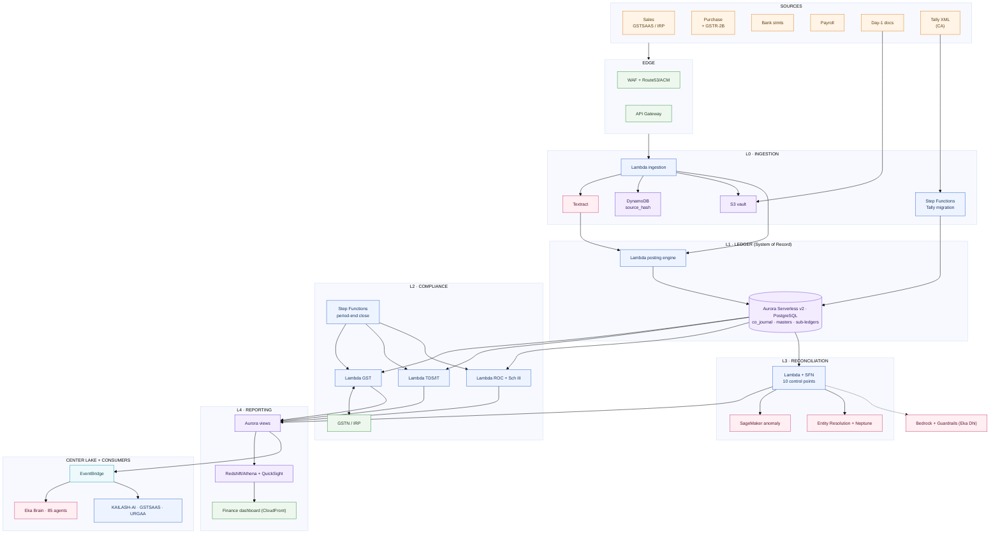
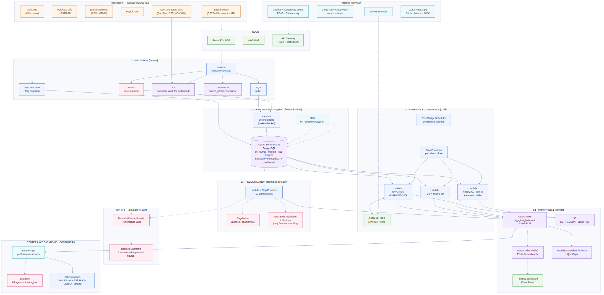
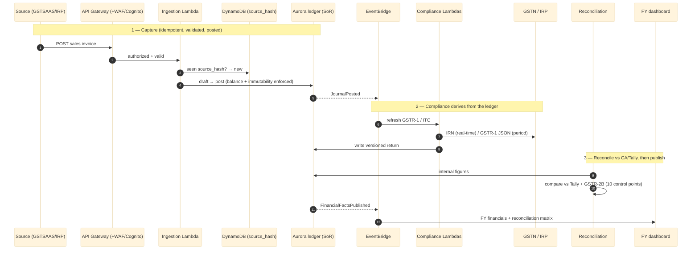
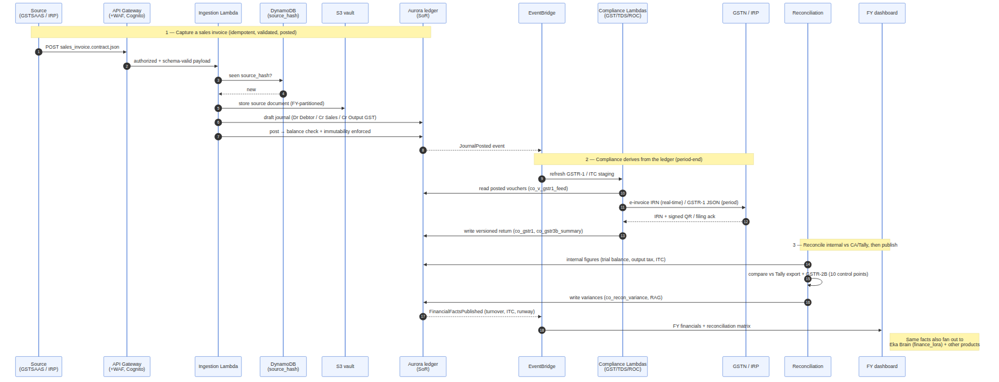

# Kailash — "Company" Segment: Backend Architecture on AWS

## How the financial system-of-record runs on the Go4Garage stack

| Field | Value |
|---|---|
| **Scope** | Backend for the **Company finance segment** of the Kailash data core (the internal corporate books) |
| **Builds on** | `Company_Segment_Technical_Specification.md` (the L0–L4 design + double-entry schema) |
| **Stack source of truth** | `go4garagebackendarchitectureperproduct.md` + the backend-reference catalogue |
| **Design locks (carried over)** | Full **double-entry system-of-record**; migrate from and **reconcile against the CA's Tally** books |
| **Guiding rule** | Reuse what the platform has already decided — add nothing the other seven products don't already run |

---

## 1. Where this sits (and a naming clarification)

The Company segment is **internal financial infrastructure** — the company's own general ledger, GST, TDS, ROC and financial statements. It is one of the four chambers of **Kailash, the data core** ("the heart" in your Center Lake model). It is **not** a customer-facing product.

Two names in your docs are easy to conflate, so to be explicit:

- **Kailash (data core)** — the central data heart with four segments (Product, Sprint, **Company**, Goal). *This document is about the Company segment of that core.*
- **KAILASH-AI (PRO-KAI)** — a *product* in your per-product doc whose users are the internal ops/eng/**finance** teams. Its finance-facing AI features (anomaly detection, forecasting, a support/finance copilot) are natural **consumers** of the Company segment, they don't replace it.
- **GSTSAAS (PRO-GST)** — a *product* you sell to workshops to manage *their* GST. It is a different tenant of the same patterns: your own doc already puts its ledger on **Aurora Serverless v2** because "GST invoices, tax line items, and the accounting ledger need real joins and transactions." The Company segment is the same shape pointed at **your own books**, so it reuses that GST-computation code and the GSTN integration rather than inventing them.

The key consequence: **almost everything the Company segment needs is already in your stack.** The double-entry ledger is an Aurora schema, the engines are Lambdas, orchestration is Step Functions + EventBridge, documents are S3 + Textract, the AI touchpoints are Bedrock/Eka Dhi. There is very little net-new infrastructure.

---

## 2. Stack mapping at a glance

Every capability of the Company segment maps to a service your platform has already committed to (or, for the few marked 🆕, one implied by requirements you already have):

| Capability (from the spec) | AWS service | Status in your docs |
|---|---|---|
| Double-entry ledger / system-of-record | **Aurora Serverless v2 (PostgreSQL)** | Already decided (Aurora for the ledger) |
| Business logic — posting engine, engines | **AWS Lambda** | Already decided (default compute) |
| Multi-step flows — period-end close, Tally migration | **Step Functions** | Already decided |
| Event backbone (Center Lake routing) | **EventBridge** (+ **EventBridge Scheduler** for the compliance calendar) | Already decided |
| Document vault (Day-1 docs, invoices, statements, generated returns) | **Amazon S3** (FY-partitioned prefixes) | Already decided |
| Extract data from uploaded documents | **Amazon Textract** | Already decided (KAILASH-AI Document AI) |
| Fast operational state — idempotency, dashboard cache, error queue | **DynamoDB** | Already decided |
| Sub-second FY dashboard reads | **ElastiCache (Redis)** | Decided for URGAA; reused here |
| Analytics / dashboards (FY financials, employee analytics) | **Redshift Serverless / Athena + QuickSight** | Already decided |
| Grounded AI (doc validation, variance narratives) | **Bedrock (Claude Sonnet) + KB = Eka Dhi** | Already decided |
| No-guessed-figures guarantee on AI output | **Bedrock Guardrails + abstention layer** | Already decided (Eka Dhi hardening) |
| Party/GSTIN entity resolution | **AWS Entity Resolution + Neptune** (Eka-Brain graph) | Already decided (Eka Dhi) |
| Classical ML — anomaly detection, cash-flow forecast | **SageMaker** | Already decided |
| Auth — finance team, CA read-only, service-to-service | **Cognito + IAM Identity Center + IAM roles** | Already decided |
| API surface | **API Gateway (REST + WebSocket)** | Already decided |
| GST e-invoicing + return filing | **GSTN API / IRP integration** 🆕 | New, but already flagged as required for GSTSAAS |
| Secrets (GSTN keys, bank creds) | **AWS Secrets Manager** 🆕 | Already flagged new in your shared foundation |
| Edge protection + DNS/cert | **WAF + Route 53 + ACM** 🆕 | Already flagged new in your shared foundation |
| PII encryption (PAN/Aadhaar/bank) | **AWS KMS** | Standard; implied by REQ-15 |
| Audit trail | **CloudTrail + CloudWatch** (complementing the ledger's own `co_audit_log`) | Already decided (REQ-15) |
| IaC + CI/CD | **CDK (TypeScript) + GitHub Actions + OIDC** | Already decided |

There is **no new database engine, no new compute model, no new orchestration tool** to introduce. The only genuinely new integrations — GSTN/IRP, Secrets Manager, WAF/Route 53 — are ones your own foundation doc already lists as required platform-wide.

---

## 3. Architecture

*(Rendered diagrams: [architecture](company-segment/docs/aws/architecture.png) · [data flow](company-segment/docs/aws/dataflow.png) — sources and SVGs in [`company-segment/docs/aws/`](company-segment/docs/aws/).)*

---

## 4. Layer by layer

### L0 — Ingestion (Bronze)

Public and internal sources reach a single **API Gateway** front door behind **WAF**, authorised by **Cognito**. An **ingestion Lambda** per source type validates the typed contract (the `sales_invoice.contract.json` shape and its siblings), deduplicates on `source_hash` against a **DynamoDB** table (idempotency — re-sending a document is a no-op), stores the raw document in the **S3 vault** under an FY-partitioned prefix, and drops anything malformed into a DynamoDB **error queue** rather than losing it. **Textract** extracts fields from image/PDF sources (vendor bills, bank statements, NOCs) — the same capability your doc already specifies for KAILASH-AI's Document AI Validation. Higher-volume feeds buffer through **SQS** so a burst never overruns the posting path.

**Tally migration** is a batch branch: the CA's Tally XML lands in S3, a **Step Functions** workflow stages it in Aurora, applies the `co_map_tally` mapping (Tally ledgers/parties/items → Kailash masters), posts the opening-balance journal as of cut-over, and hands off to reconciliation to prove the trial balance ties to Tally before Tally is retired as the book of record.

### L1 — Core Ledger — System of Record (Silver)

This is the one place relational integrity is non-negotiable, and your own architecture already routes exactly this kind of data to **Aurora Serverless v2 (PostgreSQL)**. That decision is what makes the migration painless: **the `company` schema from the spec — `co_journal`/`co_journal_line`, the masters, the balance-enforcing and immutability triggers, the FY range-partitioning, the `co_v_*` views — is PostgreSQL and drops onto Aurora Serverless v2 unchanged** (it's already been executed and tested against PostgreSQL 16). A **posting-engine Lambda** owns the only write path into the ledger: draft → maker-checker → post, with the database rejecting any unbalanced or post-hoc-edited voucher. **KMS** provides column-level encryption for PAN/Aadhaar/bank fields; the ledger sits in a private VPC subnet reachable only by the segment's Lambdas via RDS Proxy (to survive Lambda connection storms).

### L2 — Compute & Compliance (Gold)

Each engine is a **Lambda** (or small set of Lambdas) that reads the ledger and writes versioned statutory artefacts — never mutating L1:

- **GST engine** — builds GSTR-1 sections, GSTR-3B (auto-populated), ITC from GSTR-2B, GSTR-9/9C; pushes **e-invoice IRN in real time and GSTR-1 JSON per period to the GSTN/IRP** using credentials from **Secrets Manager**. This is the same computation code path as GSTSAAS, packaged as a shared CDK construct/library and pointed at the company's own GSTIN(s).
- **TDS + income-tax engine** — section-wise TDS (24Q/26Q/27Q), advance-tax schedule, 3CD data set.
- **ROC + statement builder** — rolls the trial balance into Schedule III P&L / Balance Sheet / Cash-Flow and prepares the data behind AOC-4, MGT-7, DPT-3, MSME-1.

**Step Functions** runs the multi-step **period-end close** (lock period → build returns → build statements → run reconciliation → publish). **EventBridge Scheduler** fires the **compliance calendar** (the CSV in the scaffold) so every GST/TDS/IT/ROC due date raises a timed alert, including the 3-year GST time-bar.

### L3 — Reconciliation (internal vs CA/Tally)

A **Lambda + Step Functions** runner executes the ten control points (FY sales, output tax, GSTR-1-vs-3B, ITC-vs-2B, net profit, closing balances, TDS-vs-26AS, bank BRS, …), writing variances and RAG status to `co_recon_variance`. **AWS Entity Resolution + Neptune** (your Eka-Brain graph) resolve the same vendor/customer across GSTINs/PANs so "party mismatches" aren't false positives. **SageMaker** scores variances for anomaly/priority so the finance team looks at the material ones first. This is the subsystem that makes your "cross-check employee dashboards against the CA's audited figures" requirement real.

### L4 — Reporting & Export

The FY financials — the "visible result" you asked for — are served from the **Aurora `co_v_*` views** through API Gateway to the finance dashboard (fronted by **CloudFront**, cached in **ElastiCache** for sub-second FY switches). **Redshift Serverless / Athena + QuickSight** power the heavier analytical dashboards (trends, employee/cost-centre analytics, the reconciliation matrix). Generated statutory files (GSTR-1 JSON, Schedule III PDFs, the CA trial-balance export) are versioned back into **S3**.

---

## 5. End-to-end data flow

The narrative: a sales invoice arrives (from GSTSAAS or the e-invoice IRP), is validated and deduped, and is posted as a balanced voucher the database will not let anyone later edit. Posting emits a `JournalPosted` event; the GST engine updates the return staging and, at period end, files. Reconciliation independently compares Kailash's figures to the CA's Tally export and GSTR-2B. Finally the segment **publishes clean financial facts** onto the EventBridge bus, where the FY dashboard, Eka Brain's `finance_lora`, and the other products all read the *same* numbers — realising the Center Lake rule that data routes into Kailash first, then out.

---

## 6. Center Lake integration & the AI touchpoints

**EventBridge is the Center Lake backbone.** Nothing reads the raw ledger directly; the segment **publishes** typed events (`JournalPosted`, `ReturnFiled`, `FinancialFactsPublished`) and exposes read APIs over the `co_v_*` views. Consumers:

- **Eka Brain / the 85 agents** — the `finance_lora` model in `eka-brain/models/` reads *published facts* (turnover, ITC position, runway), never the ledger tables.
- **Other products** — KAILASH-AI's finance AI features, GSTSAAS, and URGAA subscribe to the facts they need through scoped IAM roles.

Every AI touchpoint routes through **Eka Dhi** with **Bedrock Guardrails + an abstention layer**, and this matters more here than anywhere else in the platform: **an AI surface must never invent a financial number.** When Bedrock is used to validate a document or narrate a variance, the abstention layer returns "no verified data" rather than guessing — the honest version of "zero hallucinations" your Eka Dhi hardening already calls for. Numbers on the dashboard always come from the Aurora ledger, not from a model.

---

## 7. Security, PII & audit

The Company segment carries the platform's strictest controls because it holds money and legal identity:

- **AuthZ** — Cognito groups + IAM for maker-checker on postings; the **CA gets read + reconciliation only**; employees are row-scoped by cost-centre.
- **PII** — PAN/Aadhaar/bank/salary columns encrypted with **KMS**, access-gated separately from the general ledger; the ledger lives in a private VPC subnet behind **RDS Proxy**.
- **Audit** — the ledger's append-only `co_audit_log` is complemented by **CloudTrail** (infra-level) so every state change is independently evidenced — exactly what diligence and a statutory audit expect.
- **Secrets** — GSTN, bank, and payment credentials in **Secrets Manager**, never in code or env vars.
- **Edge** — **WAF** on API Gateway; **Route 53 + ACM** for the domain/cert.
- **Retention** — S3 lifecycle + Object Lock (WORM) to the longest statutory window (8 years, Companies Act §128(5)).

---

## 8. IaC, deployment & CI/CD

Per your platform standard, the segment is **one CDK (TypeScript) stack** — `KailashCompanyStack` — using shared constructs for the patterns common with GSTSAAS (the GST-computation construct, the ingestion-contract construct, the Aurora + RDS-Proxy construct). It deploys through **GitHub Actions + OIDC** into per-environment accounts (dev/staging/prod), with the Aurora schema migrations applied as a versioned migration step in the pipeline. Because the ledger is the crown jewel, prod deploys gate on a schema-migration dry-run and a reconciliation smoke test.

Repo placement (matching your monorepo convention): `Kailash-Ai/company-segment/` for the schema/templates/contracts already scaffolded, plus a `Kailash-Ai/infra/company/` CDK app.

---

## 9. Cost & scaling

The Company segment is **internal and low-volume** relative to the customer-facing products, which makes the serverless stack ideal: everything **scales to (near) zero** between bursts. **Aurora Serverless v2** idles at a low ACU floor and only scales up during period-end close and reconciliation; **Lambda/Step Functions** cost is per-invocation; **S3/DynamoDB** are storage-cheap. The one line item to watch — as your own Eka Dhi cost note warns — is **Bedrock invocations**, so AI is used deliberately (document validation, variance narratives), with dashboards reading Aurora, not the model. Net: this segment adds marginal cost to a stack you're already running, not a new cost centre.

---

## 10. Reused vs newly needed (for this segment specifically)

| | Items |
|---|---|
| **Already in your stack — reused as-is** | Aurora Serverless v2, Lambda, Step Functions, EventBridge (+Scheduler), S3, DynamoDB, Textract, Cognito/IAM Identity Center, API Gateway, Bedrock + Guardrails + KB, Neptune + Entity Resolution, SageMaker, Redshift/Athena/QuickSight, ElastiCache, CloudWatch/CloudTrail, CDK, GitHub Actions, KMS |
| **New integrations (but already required platform-wide)** | GSTN API / IRP, Secrets Manager, WAF + Route 53 + ACM |
| **Net-new *only* to this segment** | The `company` Aurora schema + the segment's Lambdas/Step Functions (application code, not infrastructure) and the `KailashCompanyStack` CDK app |

The takeaway you can put in front of investors or a CTO: **the financial core is not a new platform, it's a thin application layer on infrastructure you've already chosen** — which is exactly why it can hit the 3-day baseline.

---

## 11. Build sequence

1. **Aurora + schema** — provision Aurora Serverless v2 + RDS Proxy in the VPC; run the `company` schema migration (already tested). *(P0)*
2. **Ingestion + posting** — API Gateway + ingestion Lambda + posting Lambda + S3 vault + DynamoDB idempotency; wire the sales contract first. *(P1)*
3. **Tally migration** — Step Functions XML pipeline; post opening balances; reconcile to Tally. *(P1)*
4. **GST engine + GSTN** — reuse the GSTSAAS GST construct against your own GSTIN; e-invoice IRN + GSTR-1. *(P2)*
5. **Reconciliation + dashboard** — control points 1–8, EventBridge publish, FY dashboard on the `co_v_*` views. *(P3)*
6. **Post-baseline** — TDS/ROC engines, GSTR-9/9C, SageMaker anomaly scoring, agent egress to Eka Brain.

This is the same phased plan as the Company-segment spec, now expressed in concrete AWS services — no step requires infrastructure the platform hasn't already committed to.
