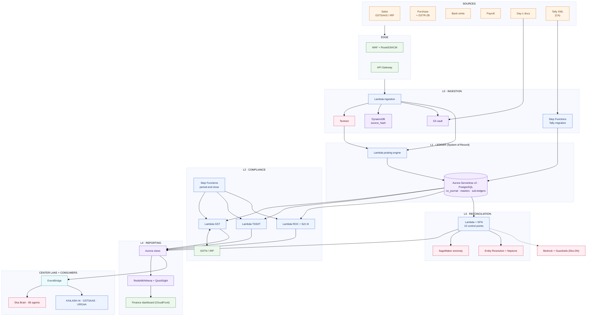
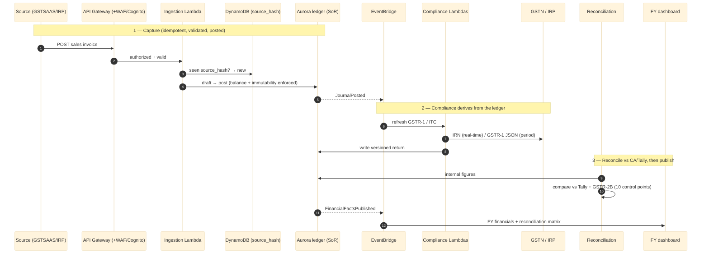

# Kailash — Technical Requirements Document (TRD)

> **Single source of truth.** This is the one and only TRD for the entire
> Kailash project (RULES.md Rule 3). It consolidates the former company-wide TRD,
> the per-platform (Android / iOS / Web) TRDs, and the Company-Segment technical
> and AWS-architecture specifications into one document, organised as sections.
> Do not create separate or duplicate TRD/spec files — edit this one.

---

## 0. Vision & Canonical Framing (Center Lake)

> The authoritative present-day frame; the grounded technical sections below are
> read through it. Product context: [`PRD.md`](./PRD.md); business: [`BRD.md`](./BRD.md).

**Center Lake.** Kailash is the central data lake + command center — the data
"heart"; **Eka Brain** is the AI "mind" orchestrating the agent matrix. All data
routes through Kailash first. Kailash is internal infrastructure, not a customer
product.

**Repository structure (RULES.md, enforced).** One master folder `Kailash/`;
**department → feature** (`frontend/`, `backend/`); one BRD/TRD/PRD; one agent
file; one gated pipeline. Frontend features live under `frontend/src/features/<feature>/`
(CRA requires `src/`; the `@` alias is used); backend mirrors the names under
`backend/features/<feature>/`, with shared code in a `platform/` layer per
department and the platform microservices under `backend/services/`.

**Data core — four segments**: Product · Sprint · Company · Goal.
**Command dashboard — three tiers**: Governance & Intelligence (Eka Brain, Shiv,
Parvati) → Analytics & Telemetry (FE→API→BE pulse) → the six products (Eka AI,
Website, Urja, EV Vidya, GST SaaS, Ignition).

**Telemetry.** Every service exposes `/health`, `/metrics`, and request-id'd JSON
logs; the dashboard renders these as a green/red pulse that isolates the failing
FE / API / BE layer per product.

**Naming map (adopted 2026-08).** Eka Brain ← GANESHA; GST SaaS ← GSTSAAS; Urja ←
URGAA; Company ← Go4Garage financials. Grounded sections below use the legacy
names.

**Resource prerequisites** for the full platform (Company/financials already runs
on Firebase + Supabase): an AI-provider key (`OPENROUTER_API_KEY`/`ANTHROPIC_API_KEY`),
a backend host (`BACKEND_SSH_*`), `MONGO_URL`, `REDIS_URL`,
`FIREBASE_SERVICE_ACCOUNT_JSON`, and valid AWS credentials (Route 53 DNS) —
currently absent/invalid in the environment.

---

## Section 1 — Company / Platform (Kailash)
## 1.1 Technical Requirements Document — Kailash-Ai

## 1. Document Control

| Field | Value |
|---|---|
| **Document title** | Technical Requirements Document — Kailash-Ai (Kailash AI Platform) |
| **Product** | Kailash — Go4Garage internal ML/AI platform |
| **Document type** | TRD (Product level) |
| **Version** | 1.0 |
| **Date** | 2026-07-31 |
| **Status** | Draft |
| **Owner** | TBD |
| **Author** | Go4Garage Documentation Workstream |
| **Reviewers** | TBD (Platform Engineering, Security, SRE) |
| **Approvers** | TBD |
| **Classification** | Internal — Proprietary (see `LICENSE`) |
| **Companion BRD** | `BRD_kailash_ai.md` |
| **Source of truth** | Local working copy at `C:\Go4Garage( Eka)\Kailash-Ai`, HEAD commit `40cca17` dated 2026-07-31 |

### 1.1 Revision History

| Version | Date | Author | Change |
|---|---|---|---|
| 1.0 | 2026-07-31 | Documentation Workstream | Initial draft, derived from on-disk source, configuration, Compose files and deploy scripts |

---

## 2. System / Architecture Overview

### 2.1 Shape of the system

Kailash is a **modular monolith with independently testable capability modules**. A single FastAPI application (`backend/main.py`) hosts the operational API, the department-agent layer and the guardian layer. Alongside it, nine "platform service" modules under `backend/services/` are each built from a shared `build_app()` factory in `backend/platform/app.py`, which means each can be run and tested as an isolated FastAPI app while still being deployable inside one process today. A React 19 single-page application in `frontend/` is the human surface. MongoDB is the primary datastore, with PostgreSQL and Redis in supporting roles.

Three architectural decisions define the platform:

1. **One shared library, one contract.** `backend/platform/` provides `build_app()`, `BaseServiceSettings`, `require_internal_token`, `ApiResponse`/`ErrorDetail`/`HealthResponse` envelopes, a `PlatformError` hierarchy, and structured JSON logging. Every module built through it automatically exposes `/health`, `/`, `/metrics` and `/docs`, and returns identical error shapes.
2. **Agents as first-class modules.** Domain behaviour is decomposed into 20 registered department classes and 3 guardian agents rather than into anonymous service functions, so capability, knowledge slice and ownership align.
3. **Provider abstraction at the edge.** All upstream model access flows through Kailash with a defined precedence chain, so no consumer product ever holds a model vendor credential.

### 2.2 Component diagram

```
                    ┌──────────────────────────────────────────────────────────┐
                    │            CONSUMER PRODUCTS (internal)                  │
                    │  URGAA · GSTSAAS · Ignition · ARJUN (ev-vidya-arjun)     │
                    │  each configured with KAILASH_AI_URL + X-Platform-Token  │
                    └───────────────────────────┬──────────────────────────────┘
                                                │ HTTPS (REST, ApiResponse envelope)
                                                │
  ┌──────────────────────────────┐              │
  │  KAILASH FRONTEND            │              │
  │  React 19 SPA (CRA + CRACO)  │  HTTPS       │
  │  Firebase Hosting            │──────────────┤
  │  project: kailash-38268      │  Bearer JWT  │
  └──────────────────────────────┘              │
                                                ▼
                    ┌──────────────────────────────────────────────────────────┐
                    │        NGINX REVERSE PROXY (api.kailash-ai.in)           │
                    │  TLS 1.2/1.3 (Let's Encrypt) · security headers          │
                    │  rate limit: api 30 r/s · auth 5 r/s · upstream keepalive │
                    └───────────────────────────┬──────────────────────────────┘
                                                │ proxy_pass → 127.0.0.1:8000
                                                ▼
  ┌───────────────────────────────────────────────────────────────────────────────────┐
  │                    KAILASH BACKEND — FastAPI (Python 3.11)                        │
  │  ┌─────────────────────────────────────────────────────────────────────────────┐  │
  │  │ MIDDLEWARE   security headers · error handler · CORS · request-id · metrics  │  │
  │  └─────────────────────────────────────────────────────────────────────────────┘  │
  │  ┌─────────────────────────────────────────────────────────────────────────────┐  │
  │  │ API LAYER  backend/features/*/api/  (~24 routers)                                  │  │
  │  │ auth · users · rbac · departments · department_intelligence · tasks ·       │  │
  │  │ gaps_tasks_crud · analytics · dashboard · conversations · knowledge ·       │  │
  │  │ knowledge_base · live_data · guardians · ganesha · ganesha_multimodel ·     │  │
  │  │ ganesha_orchestrator · ganesha_v2 · shiv_auto_rectify · scheduler_api ·     │  │
  │  │ system_health · simple_health · automobile                                  │  │
  │  └─────────────────────────────────────────────────────────────────────────────┘  │
  │  ┌──────────────────────┐  ┌──────────────────────┐  ┌────────────────────────┐  │
  │  │ GUARDIANS            │  │ DEPARTMENTS (20)     │  │ AUTOMOBILE MODULE      │  │
  │  │ GANESHA  orchestrate │──│ VISHWAKARMA LAKSHMI  │  │ pricing_engine         │  │
  │  │ SHIV     security    │  │ SURYA SARASWATI VAYU │  │ market_data            │  │
  │  │ PARVATI  workload    │  │ KUBERA INDRA YAMA    │  │ gst_integration        │  │
  │  └──────────────────────┘  │ VARUNA AGNI CHANDRA  │  │ router                 │  │
  │                            │ BRIHASPATI VISHNU    │  └────────────────────────┘  │
  │  ┌──────────────────────┐  │ BRAHMA KARTIKEYA     │  ┌────────────────────────┐  │
  │  │ APP SERVICES         │  │ DURGA HANUMAN NARADA │  │ AGENTS                 │  │
  │  │ ganesha_ai           │  │ ASHWINI DHARMA       │  │ c5_multimodel_strategy │  │
  │  │ orchestrator (v1/v2) │  │  (registry.py)       │  │ prompts/               │  │
  │  │ rag_service          │  └──────────────────────┘  └────────────────────────┘  │
  │  │ rag_knowledge_base   │                                                         │
  │  │ live_api_connector   │  ┌──────────────────────────────────────────────────┐  │
  │  │ email_service        │  │ PLATFORM SERVICES  backend/services/  (9)        │  │
  │  │ scheduler            │  │ document-ai · forecasting · anomaly · rag ·      │  │
  │  └──────────────────────┘  │ vision-gateway · speech · model-registry ·       │  │
  │                            │ knowledge-graph · automobile-llm                  │  │
  │  ┌──────────────────────┐  │ each: routes.py → service.py, own .env.example   │  │
  │  │ CORE                 │  └──────────────────────────────────────────────────┘  │
  │  │ config · mongodb     │                                                         │
  │  │ database · rbac      │  ┌──────────────────────────────────────────────────┐  │
  │  │ permissions          │  │ PLATFORM LIBRARY backend/platform/                  │  │
  │  │ security · firebase  │  │ build_app() · BaseServiceSettings · auth ·       │  │
  │  │ seeder · db_indexes  │  │ schemas · errors · logging                        │  │
  │  │ celery_app           │  └──────────────────────────────────────────────────┘  │
  │  │ performance          │                                                         │
  │  └──────────────────────┘  ┌──────────────────────────────────────────────────┐  │
  │                            │ KNOWLEDGE  backend/knowledge/                     │  │
  │  ┌──────────────────────┐  │ config/api_sources.json · pre-data/ ·            │  │
  │  │ TASKS                │  │ post-data/daily-digest/<date>/<dept>.json ·      │  │
  │  │ daily_learning       │  │ post-data/department-specific/                    │  │
  │  └──────────────────────┘  └──────────────────────────────────────────────────┘  │
  └───────────┬──────────────────────┬─────────────────────┬──────────────────────────┘
              │                      │                     │
              ▼                      ▼                     ▼
    ┌──────────────────┐   ┌──────────────────┐   ┌──────────────────────────────┐
    │ MongoDB 7        │   │ PostgreSQL 16    │   │ Redis 7                      │
    │ PRIMARY store    │   │ relational       │   │ cache · Celery broker        │
    │ db: "kailash"    │   │ postgres_models  │   │ maxmemory 256mb allkeys-lru  │
    └──────────────────┘   └──────────────────┘   └──────────────────────────────┘
              │
              ▼  UPSTREAM AI PROVIDERS (precedence order)
    ┌────────────────────────────────────────────────────────────────────────────┐
    │  1. OpenRouter (OPENROUTER_API_KEY)  →  2. Anthropic (ANTHROPIC_API_KEY)   │
    │  → 3. keyword / non-LLM fallback                                           │
    │  Also available: Google Gemini SDKs · AWS (boto3) · Pinecone (optional)    │
    └────────────────────────────────────────────────────────────────────────────┘
```

### 2.3 Request lifecycle

1. A caller (browser SPA or consumer product) sends an HTTPS request to `api.kailash-ai.in`.
2. Nginx terminates TLS, applies rate limits (`api_limit` 30 r/s, `auth_limit` 5 r/s per client IP), adds security headers, and proxies to `127.0.0.1:8000` over a keep-alive upstream.
3. FastAPI middleware attaches or generates a request ID, injects security headers, and installs the structured-logging context.
4. Authentication resolves: `Authorization: Bearer <JWT>` for human sessions, `X-Platform-Token` for internal service calls.
5. RBAC evaluates the caller's role against the named permission required by the route.
6. The router dispatches to a guardian, a department, a platform service, or the automobile module.
7. Where AI inference is needed, the provider chain is consulted in precedence order; retrieval context is fetched from the knowledge/RAG layer first where applicable.
8. State changes are persisted to MongoDB (and PostgreSQL where relational structure applies); activity records are written.
9. The response is wrapped in the `ApiResponse` envelope with the request ID echoed; metrics counters and histograms are updated.

---

## 3. Technology Stack

### 3.1 Backend

| Layer | Technology | Notes |
|---|---|---|
| Language / runtime | **Python 3.11** | Container base is `python:3.11-slim` |
| Web framework | **FastAPI 0.110.1** | ASGI; OpenAPI 3 auto-generated at `/docs` |
| ASGI server | **Uvicorn** | `uvicorn backend.main:app --host 0.0.0.0 --port 8000` |
| Settings | **pydantic-settings** | `backend/platform/core/config.py`, `BaseServiceSettings` in `backend/platform/config.py` |
| Validation | **Pydantic** | Models under `backend/features/*/models.py`, request/response schemas under `backend/features/*/schemas.py` |
| Mongo driver | **Motor / PyMongo (async)** | `backend/platform/core/mongodb.py`, `backend/platform/core/database.py` |
| Postgres driver | **asyncpg 0.31.0** | `backend/platform/models/postgres_models.py`, SQLAlchemy-style async URL |
| Task queue | **Celery 5.6.0** with **Redis** broker | `backend/platform/core/celery_app.py`; `amqp`/`billiard`/`kombu` present |
| Scheduling | **APScheduler 3.11.1** | `backend/platform/scheduling/scheduler.py`, `backend/platform/scheduling/scheduler_api.py`, `backend/features/eka_brain/jobs/daily_learning.py` |
| Password hashing | **bcrypt 4.1.3** | With `passlib`-style usage in `backend/platform/core/security.py` |
| Tokens | **python-jose / ecdsa**, HS256 JWT | 24-hour access token expiry (`ACCESS_TOKEN_EXPIRE_MINUTES = 60 * 24`) |
| Crypto | **cryptography 46.0.3** | TOTP secrets, backup codes, general primitives |
| ML / numeric | **NumPy**, **scikit-learn** (`IsolationForest`) | Forecasting (EMA + trend + seasonal) and anomaly detection |
| Document handling | **pypdf**, **CairoSVG / cairocffi** | `document-ai` service, rendering/export paths |
| AI SDKs | **anthropic 0.73.0**, **google-genai 1.50.1**, **google-generativeai 0.8.5**, OpenAI-compatible client against OpenRouter | Provider chain |
| Cloud SDK | **boto3 1.40.67** | AWS access where required |
| Identity (admin) | **Firebase Admin SDK** | `backend/platform/core/firebase.py`; can be disabled via `FIREBASE_DISABLED` |
| Email | Application email service | `backend/platform/email_service.py` |
| Lint / format | **ruff**, plus `black` and `flake8` in requirements | `ruff.toml`, `make lint`, `make fmt` |
| Test | **pytest** | `tests/platform`, `tests/backend`, `tests/integration`, per-service suites |

### 3.2 Frontend

| Layer | Technology | Version |
|---|---|---|
| Framework | **React** | 19.0.0 |
| Build tooling | **react-scripts (CRA) 5.0.1** wrapped by **CRACO 7.1.0** | `craco start` / `craco build` |
| Routing | **react-router-dom** | 7.5.1 |
| Server state | **@tanstack/react-query** | 4.42.0 |
| Client state | **zustand** | 5.0.8 |
| HTTP | **axios** | 1.8.4 |
| UI primitives | **Radix UI** (26 packages: dialog, dropdown-menu, select, tabs, toast, tooltip, popover, accordion, and others) | 1.x/2.x |
| Styling | **Tailwind CSS** 3.4.17, `tailwindcss-animate`, `tailwind-merge`, `class-variance-authority`, `clsx` | — |
| Icons | **lucide-react** | 0.507.0 |
| Motion | **framer-motion** | 12.23.24 |
| 3D | **three** 0.160.0, **@react-three/fiber** 8.15, **@react-three/drei** 9.100 | Dashboard visualisation |
| Forms | **react-hook-form** 7.56.2 with **zod** 3.24.4 via **@hookform/resolvers** 5.0.1 | — |
| Notifications | **sonner** 2.0.3 | — |
| Dates | **date-fns** 4.1.0, **react-day-picker** 8.10.1 | — |
| Client SDK | **firebase** 11.7.1 | Hosting-adjacent client features |
| Theming | **next-themes** 0.4.6 | Light/dark |
| Lint | **eslint 9.23.0** with react, import and jsx-a11y plugins | Accessibility linting present |
| Package manager | **yarn 1.22.22** (declared via `packageManager`) | — |
| Browser automation (dev) | **puppeteer** 24.33.1 | Dev dependency |

### 3.3 Data and infrastructure

| Layer | Technology |
|---|---|
| Primary datastore | **MongoDB 7** (`mongo:7`), database name `kailash` |
| Relational store | **PostgreSQL 16** (`postgres:16-alpine`) |
| Cache / broker | **Redis 7** (`redis:7-alpine`), `maxmemory 256mb`, `allkeys-lru` |
| Service-local store | **SQLite** — used by the `model-registry` platform service |
| Vector store (optional) | **Pinecone** — `PINECONE_API_KEY`, `PINECONE_INDEX=kailashai`, `PINECONE_HOST` (blank in the template) |
| Containers | **Docker**, **Docker Compose** |
| Reverse proxy | **Nginx** with **Let's Encrypt / certbot** |
| Compute | **managed host** |
| Static hosting | **Firebase Hosting**, project `kailash-38268` |
| CI/CD | **GitHub Actions** (`ci.yml`, `deploy-backend.yml`, `deploy-frontend.yml`) |
| Metrics | Prometheus text-format exposition at `/metrics` |
| Logging | Structured JSON logging with a `service` field injected via a `logging.Filter` |

---

## 4. Functional Requirements

| ID | Requirement | Acceptance criteria |
|---|---|---|
| **FR-1** | **Standard service contract.** Every module built via `build_app()` shall expose `GET /health` returning `{ service, version, uptime_s }`, `GET /` returning service metadata, `GET /metrics` in Prometheus text format, and `GET /docs` serving OpenAPI 3. | For each of the nine platform services and the main app, all four endpoints return 200 with the documented shape. |
| **FR-2** | **Uniform response envelope.** All domain routes shall return the `ApiResponse` envelope on success. Typed errors (`NotFoundError`, `ValidationError`, `UpstreamError`) shall map to `{ "ok": false, "error": { "code", "message", "hint" }, "request_id" }` with a stable `code` string. | Force one of each error type; assert the envelope shape, the correct `code`, and a non-null `request_id`. |
| **FR-3** | **Request correlation.** Middleware shall accept an inbound `x-request-id` header or generate a hex UUID, echo it on the response, and inject it into every log record produced during the request. | Send a request with a known `x-request-id`; find that exact value in the response header and in the corresponding JSON log lines. |
| **FR-4** | **Dual authentication.** Human callers authenticate with a JWT bearer token (HS256, 24-hour expiry) obtained from the auth router; internal service callers authenticate with `X-Platform-Token` validated by `require_internal_token` against `PLATFORM_INTERNAL_TOKEN`. Domain routes on platform services are guarded by the internal-token dependency. | Four cases tested: valid JWT accepted; expired/invalid JWT rejected with 401; valid platform token accepted on a guarded route; missing/incorrect platform token rejected. |
| **FR-5** | **Two-factor authentication.** The user record shall support `totp_secret`, `is_2fa_enabled` and a list of single-use `backup_codes`. When 2FA is enabled, a valid TOTP or an unused backup code shall be required to complete login, and a consumed backup code shall not be reusable. | Enable 2FA; login without a code fails; login with a valid TOTP succeeds; a backup code works once and fails on reuse. |
| **FR-6** | **RBAC enforcement.** Five roles (`super_admin`, `admin`, `manager`, `operator`, `viewer`) shall be evaluated against granular permissions across at least these families: departments (view/invoke/manage), guardians (view/manage/configure), users (view/create/update/delete), analytics (view/export/configure), pricing (view/manage), market data (view/manage), job cards (view/analyze), settings (view/update), tasks (view/create/assign/delete). | Role-by-permission matrix test; every denied combination returns an authorisation error with no data leakage in the body. |
| **FR-7** | **Department registry and invocation.** `initialize_departments()` shall instantiate every class in `DEPARTMENT_CLASSES` at startup; `get_department(name)` shall be case-insensitive; `list_departments()` shall return the full set. Each department shall be invocable through the departments API and viewable at `/department/:name` in the SPA. | Registry length equals `DEPARTMENT_CLASSES` length; lookup succeeds for lowercase and uppercase names; unknown names return a not-found error, not a crash. |
| **FR-8** | **Guardian orchestration.** GANESHA shall accept a natural-language request, select one or more departments, invoke them, and compose a response. A multimodel strategy (`agents/c5_multimodel_strategy.py`) shall select the model tier. SHIV shall apply security checks and auto-rectification. PARVATI shall track workload. The v2 GANESHA router shall be optional — if unavailable, the application shall log a warning and start with v2 endpoints disabled rather than failing. | Orchestrated request returns a composed answer naming the departments engaged; removing the v2 router module still allows startup with a logged warning. |
| **FR-9** | **Nine platform capabilities.** The platform shall provide: PDF text extraction with field validation (`document-ai`); demand/uptime/breakdown/energy forecasting via EMA plus trend plus seasonal baseline (`forecasting`); SLA/fraud/trust anomaly detection via `IsolationForest` (`anomaly`); embedding plus cosine retrieval with a SHA-256 hash fallback when no embedding provider is configured (`rag`); tier-based routing across vision models (`vision-gateway`); ASR and TTS with Indic locales (`speech`); an MLflow-shaped registry with evaluations backed by SQLite (`model-registry`); a typed graph over regulations, parts, HSN codes, workflows and certifications with BFS neighbour lookup (`knowledge-graph`); and domain-pinned automotive chat (`automobile-llm`). | Each service's test suite passes; each capability produces a correct result on a representative fixture. |
| **FR-10** | **Provider precedence and fallback.** AI calls shall attempt `OPENROUTER_API_KEY` first, then `ANTHROPIC_API_KEY`, then a non-LLM keyword fallback. Exhausting all options shall raise `UpstreamError`, never an unhandled exception. | Disable each tier in turn; observe the documented order in logs; final state returns the `upstream_error` envelope with a 5xx status, not a stack trace. |
| **FR-11** | **Retrieval-augmented answers.** The RAG layer shall index ingested documents and the dated per-department digests under `backend/knowledge/post-data/daily-digest/`, and shall return the top-k most similar chunks as context for department and guardian answers. Ingestion shall be possible via `database/rag_upload_script.py` without redeploying. | Ingest a document containing a unique token; query for it; the retrieved context contains the token and the answer reflects it. |
| **FR-12** | **Automobile domain computation.** The automobile module shall provide a pricing engine, market data lookup, and GST integration, exposed through its own router, returning a priced result with the applicable HSN/GST treatment for a given part or vehicle input. | Post a representative payload; response includes base price, applied market adjustment, HSN code and GST rate/amount. |
| **FR-13** | **Persistence and indexing.** On startup the application shall initialise the MongoDB connection, create required indexes (`backend/platform/core/db_indexes.py`), optionally seed reference data (`backend/platform/core/seeder.py`), and validate datastore permissions before accepting traffic, logging an explicit, actionable message if read or write permission on critical collections is missing. | Start against a permission-restricted user; the documented critical log block appears with the remediation steps; `SKIP_PERMISSION_CHECK=true` bypasses it in test environments only. |
| **FR-14** | **Scheduled and background work.** Celery (Redis broker) and APScheduler shall be wired, with at least a daily-learning task that refreshes department knowledge, and a scheduler API for inspection and control. | Trigger the daily-learning task; a new dated digest or knowledge update is produced and visible via the scheduler API. |
| **FR-15** | **Operations dashboard API.** The backend shall serve the SPA's needs across authentication, dashboard rollups, department detail and intelligence, tasks and GAPS CRUD, conversations, analytics, reports, users, RBAC administration, knowledge base, live data, guardians and system health. | Every authenticated SPA route loads with populated data against a seeded database; no route depends on an undocumented endpoint. |
| **FR-16** | **Health and metrics.** In addition to per-service `/health`, the main application shall expose a simple health endpoint at `/api/health` (used by the container healthcheck) and a richer system-health endpoint reporting datastore connectivity and dependency status. | `docker compose up` reaches a healthy container state; the system-health endpoint reports each dependency individually. |
| **FR-17** | **Configuration by environment only.** All environment-specific values — datastore URLs, secrets, provider keys, CORS origins, Firebase settings, domain URLs — shall come from environment variables with a checked-in `.env.example` template per module and no real value in version control. | Grep the repository for credential patterns; only placeholder values appear. Changing an environment variable changes behaviour without a code edit. |
| **FR-18** | **Graceful optional dependencies.** Firebase (`FIREBASE_DISABLED`), Pinecone (blank keys), and the v2 GANESHA router shall each be optional; absence shall degrade functionality with a logged warning rather than preventing startup. | Start with each optional dependency absent; the application reaches a healthy state with a warning per absent dependency. |
| **FR-19** | **Service scaffolding.** A new platform service shall be creatable from the existing pattern (`routes.py` → `service.py`, `.env.example`, tests) using the provided scaffolding script, and shall be picked up by the CI service matrix. | Scaffold a throwaway service; it exposes the four standard endpoints and its tests run in CI without pipeline edits beyond the matrix entry. |
| **FR-20** | **Data lifecycle tooling.** The platform shall provide MongoDB initialisation with collections and indexes, seed data for users, departments and activities, department data population, a RAG upload path, a health-check script and an automated backup routine. | Each script in `database/` runs to completion against a clean MongoDB instance and produces the documented artefacts. |

---

## 5. Non-Functional Requirements

### 5.1 Performance

| ID | Requirement | Measurement |
|---|---|---|
| NFR-P1 | Non-LLM API endpoints shall return within **500 ms at p95** under nominal load. | Server-side histogram from `/metrics`, excluding upstream-model routes. |
| NFR-P2 | LLM-backed department/guardian responses shall complete within **8 s at p95** and **20 s at p99**, or return a typed timeout error. | End-to-end timing per request ID. |
| NFR-P3 | Health endpoints shall respond within **200 ms** and shall not perform expensive dependency work on the simple health path. | Probe timing under the container healthcheck's 10 s timeout. |
| NFR-P4 | The frontend production bundle shall be served with immutable long-lived caching on hashed static assets (`Cache-Control: public, max-age=31536000, immutable`). | Inspect response headers from Firebase Hosting. |
| NFR-P5 | Retrieval over the RAG index shall add no more than **300 ms at p95** to a grounded answer at the current corpus size. | Instrument retrieval separately from generation. |
| NFR-P6 | Redis shall be bounded at 256 MB with `allkeys-lru` eviction so cache growth cannot exhaust host memory. | Confirmed in `docker-compose.yml` command line. |

### 5.2 Scalability

| ID | Requirement |
|---|---|
| NFR-S1 | The backend shall be **stateless per request** (session state in the JWT, data in MongoDB/Postgres/Redis) so that additional instances can be added behind a load balancer without sticky sessions. |
| NFR-S2 | The current single-container deployment shall support at least **50 concurrent authenticated users** and **4 consumer products** at portfolio traffic levels; capacity headroom shall be monitored via `/metrics`. |
| NFR-S3 | Long-running or bursty work shall be offloaded to Celery workers rather than executed inline in a request. |
| NFR-S4 | Each platform service shall remain independently extractable into its own container without code change, by virtue of the `build_app()` contract. |
| NFR-S5 | MongoDB indexes required by hot query paths shall be created at startup (`backend/platform/core/db_indexes.py`), not left to ad-hoc creation. |
| NFR-S6 | Scale-out shall be triggered before sustained CPU or memory utilisation exceeds **60%** on the VPS. |

### 5.3 Security

| ID | Requirement |
|---|---|
| NFR-Sec1 | All external traffic shall be TLS 1.2 or 1.3 only, with HTTP redirected to HTTPS at the proxy. |
| NFR-Sec2 | The application port shall bind to loopback (`127.0.0.1:8000`) and never be published directly to the public interface. |
| NFR-Sec3 | Passwords shall be stored only as bcrypt hashes; plaintext passwords shall never be logged. |
| NFR-Sec4 | `SECRET_KEY` shall be a long random value in every non-development environment; the default `dev-secret-key-change-in-production` shall be rejected at startup in production. |  <!-- secret-scan: allow documents the credential incident being remediated -->
| NFR-Sec5 | CORS shall be restricted to the explicit `ALLOWED_ORIGINS` list in production (`kailash-ai.in`, `www.kailash-ai.in`, and the Firebase hosting domains); the permissive development default shall not reach production. |
| NFR-Sec6 | Security headers shall be applied at both the proxy and the hosting layer: `X-Content-Type-Options: nosniff`, `X-Frame-Options: DENY`, `X-XSS-Protection`, `Referrer-Policy: strict-origin-when-cross-origin`, and a `Permissions-Policy` denying camera and geolocation while allowing microphone to self. |
| NFR-Sec7 | Rate limiting shall be enforced at the proxy: 30 requests/second for general API traffic and 5 requests/second for authentication endpoints, per client address. |
| NFR-Sec8 | The container shall run as a non-root user (`appuser`), as defined in the Dockerfile. |
| NFR-Sec9 | Internal service-to-service traffic shall require `X-Platform-Token`; this token shall be rotated on a defined schedule and on any suspected exposure. |
| NFR-Sec10 | No secret shall be committed. `.gitignore` shall exclude `.env`, `.venv/`, build artefacts and caches; pre-commit hooks and CI secret scanning shall enforce this. |
| NFR-Sec11 | Privileged accounts (`super_admin`, `admin`) shall have TOTP 2FA enabled. |
| NFR-Sec12 | Error responses shall not leak stack traces, internal paths, connection strings or upstream provider errors verbatim; the typed error envelope is the only external error surface. |

### 5.4 Availability and reliability

| ID | Requirement |
|---|---|
| NFR-A1 | Target availability of the backend API is **99.5% monthly**, measured by successful health probes. |
| NFR-A2 | Every container shall define a healthcheck and a `restart: unless-stopped` policy; the backend healthcheck shall use `/api/health` with a 40 s start period, 30 s interval, 10 s timeout and 3 retries. |
| NFR-A3 | The backend shall not start serving traffic until MongoDB, PostgreSQL and Redis report healthy (`depends_on: condition: service_healthy`). |
| NFR-A4 | MongoDB shall be backed up on a scheduled basis with a tested restore procedure; target **RPO 24 h**, **RTO 4 h**. |
| NFR-A5 | Container logs shall be rotated (`json-file` driver with size and file caps: 50 MB × 5 for the backend, smaller for datastores) so disk exhaustion cannot take down the host. |
| NFR-A6 | Failure of an optional dependency (Firebase, Pinecone, GANESHA v2) shall degrade rather than disable the platform. |
| NFR-A7 | Named data volumes shall be used for MongoDB, PostgreSQL and Redis so that container recreation does not destroy data. |

### 5.5 Compliance

| ID | Requirement |
|---|---|
| NFR-C1 | **GST / HSN.** Automobile pricing and GST integration shall apply the correct HSN classification and GST rate for automotive goods, with rates configurable rather than hard-coded, and each computed tax line traceable to the HSN code used. Rate changes shall be applicable without a code deployment. |
| NFR-C2 | **DISCOM / energy.** Where Kailash processes charger, energy or DISCOM-adjacent data on behalf of Ignition or URGAA, it shall retain the source and timestamp of every reading, shall not silently interpolate missing readings into billing-relevant outputs, and shall mark derived/forecast values distinctly from measured values. |
| NFR-C3 | **Data residency.** Personal and commercially sensitive Indian data shall be stored on Go4Garage-controlled infrastructure in India-appropriate regions. Any transfer to an offshore model provider shall be minimised, documented in the published sub-processor list, and subject to redaction of direct identifiers where the use case permits. |
| NFR-C4 | **Personal data handling.** Data subject rights (access, correction, erasure) shall be operationally supportable, backed by the published data-retention, data-transfer, data-breach and user-rights policies surfaced in the SPA. |
| NFR-C5 | **Auditability.** Privileged actions shall produce activity records with actor identity, role, timestamp and target, retained per the published retention policy. |
| NFR-C6 | **Licensing.** The codebase is proprietary; third-party dependency licences shall be reviewed before any external distribution of the Automobile-LLM or its artefacts. |
| NFR-C7 | **Accessibility.** The SPA shall target WCAG 2.1 AA; `eslint-plugin-jsx-a11y` is already in the toolchain and its findings shall be treated as build-blocking over time. |

### 5.6 Maintainability and observability

| ID | Requirement |
|---|---|
| NFR-M1 | `ruff check backend/` shall report zero violations; formatting shall be enforced by `ruff format` and pre-commit hooks. |
| NFR-M2 | Every module shall emit structured JSON logs including `service`, level, message and request ID. |
| NFR-M3 | `/metrics` shall expose Prometheus counters and histograms sufficient to compute request rate, error rate and latency distribution per route. |
| NFR-M4 | New capability shall follow the `routes.py` → `service.py` pattern; deviation requires an architecture decision record in `docs/architecture/`. |
| NFR-M5 | `README.md` and `ARCHITECTURE.md` shall remain accurate; a CI check shall assert that documented component counts match the code registry. |

---

## 6. Data Model / Storage

### 6.1 Storage allocation

| Store | Role | Rationale |
|---|---|---|
| **MongoDB 7** (database `kailash`) | Primary operational store: users, departments, tasks, activities, conversations, GANESHA records, system health, knowledge metadata | Document shape fits heterogeneous agent output and evolving schemas |
| **PostgreSQL 16** | Relational structures defined in `backend/platform/models/postgres_models.py` | Where referential integrity and relational querying matter |
| **Redis 7** | Cache and Celery broker/result backend | Bounded memory, LRU eviction |
| **SQLite** | `model-registry` service-local persistence | Simple, file-backed registry of model versions and evaluations |
| **Filesystem** | `backend/knowledge/` JSON corpus (config manifest, pre-data, dated daily digests, department-specific data) | Version-controllable, human-reviewable knowledge assets |
| **Pinecone** (optional, unconfigured) | External vector index, `PINECONE_INDEX=kailashai` | Reserved for durable vector retrieval at scale |
| **In-memory** | RAG cosine index; knowledge-graph adjacency structure | Current implementation; rebuilt on startup |

### 6.2 Core entities (MongoDB)

| Entity | Key fields | Notes |
|---|---|---|
| **User** (`backend/features/users/models.py`) | `id` (UUID string), `email`, `kailash_code`, `full_name`, `hashed_password`, `is_active`, `is_admin`, `role`, `totp_secret`, `is_2fa_enabled`, `backup_codes[]`, `created_at`, `updated_at` | `role` defaults to `viewer`; `kailash_code` is an internal staff identifier; 2FA fields are optional |
| **Department** (`backend/features/departments/models.py`) | Department identity, deity name, domain, status, capability metadata, knowledge linkage | Mirrors the code registry in `backend/features/departments/deities/registry.py` |
| **Task** (`backend/features/tasks/models.py`) | Task identity, title, description, assignee, department, status, priority, timestamps | Backs `/tasks` and the GAPS/task CRUD API |
| **Activity** (`backend/features/analytics/models.py`) | Actor, action, target, department, timestamp, metadata | The audit/activity trail |
| **GANESHA record** (`backend/features/eka_brain/models.py`) | Conversation/orchestration records: prompt, selected departments, model tier, response, timing | Backs conversations, GANESHA analytics and the multimodel strategy |

### 6.3 Knowledge layer layout

```
backend/knowledge/
├── config/
│   └── api_sources.json                 # manifest of external knowledge sources
├── pre-data/                            # curated source material prior to processing
└── post-data/
    ├── daily-digest/
    │   ├── 2025-12-15/  agni.json · ashwini.json · brahma.json · brihaspati.json ·
    │   │                chandra.json · indra.json · kartikeya.json · kubera.json ·
    │   │                lakshmi.json · marut.json · narada.json · pragya.json ·
    │   │                rudra.json · saraswati.json · surya.json · tvashta.json ·
    │   │                varuna.json · vayu.json · vishwakarma.json · yama.json ·
    │   │                summary.json
    │   └── 2025-12-18/  (same per-department shape)
    └── department-specific/             # longer-lived per-department knowledge
```

Note: the digest set includes deity names (`marut`, `pragya`, `rudra`, `tvashta`) that have **no corresponding department class** in `registry.py`. Either the digest producer or the registry is ahead of the other; this must be reconciled.

### 6.4 Indexing, seeding and backup

| Concern | Mechanism |
|---|---|
| Collection and index creation | `database/mongodb_init.js` (`createCollection`, `createIndex`) and `backend/platform/core/db_indexes.py` at startup |
| Reference data seeding | `database/seed_data.py` (users, departments, activities), `backend/platform/core/seeder.py` |
| Department content population | `database/populate_department_data.py` |
| RAG ingestion | `database/rag_upload_script.py` |
| Health verification | `database/mongodb_health_check.sh` |
| Backup | `database/backup_mongodb.py` (in-container daily automation) and `database/mongodb_backup.sh` |
| Startup permission validation | `validate_database_permissions()` in `backend/main.py`, checking read on `users` and write on `system_health`, bypassable with `SKIP_PERMISSION_CHECK=true` for testing only |

### 6.5 Data retention and classification

| Class | Examples | Handling |
|---|---|---|
| Credential | Password hashes, TOTP secrets, backup codes, API keys | Never logged; never returned by any API; secrets only via environment |
| Personal | Staff name, email, `kailash_code` | Access restricted by RBAC; retained per published retention policy |
| Operational | Tasks, activities, conversations, department outputs | Retained for audit and analytics; subject to the retention policy |
| Domain knowledge | Regulations, HSN mappings, certifications, digests | Versioned with effective dates; long retention by design |
| Derived | Forecasts, anomaly scores, model outputs | Marked as derived; not to be treated as measured fact (see NFR-C2) |

---

## 7. API & Integration Points

### 7.1 Internal API surface (main application)

| Router module | Responsibility |
|---|---|
| `auth.py` | Login, token issue, 2FA challenge |
| `users.py` | User CRUD and profile |
| `rbac.py` | Role and permission administration |
| `departments.py`, `department_intelligence.py` | Department listing, detail, invocation, intelligence rollups |
| `tasks.py`, `gaps_tasks_crud.py` | Task and GAPS lifecycle |
| `analytics.py`, `dashboard.py` | Analytics aggregates and dashboard rollups |
| `conversations.py` | Conversation history |
| `knowledge.py`, `knowledge_base.py` | Knowledge browsing and management |
| `live_data.py` | Live/external data surface (via `live_api_connector`) |
| `guardians.py` | Guardian status and control |
| `ganesha.py`, `ganesha_multimodel.py`, `ganesha_orchestrator.py`, `ganesha_v2.py` | Orchestration entry points across versions and strategies |
| `shiv_auto_rectify.py` | Security auto-rectification |
| `scheduler_api.py` | Scheduled job inspection and control |
| `system_health.py`, `simple_health.py` | Rich and lightweight health |
| `backend/features/automobile_pricing/api/automobile.py` plus `backend/features/automobile_pricing/engine/router.py` | Pricing, market data, GST integration |

### 7.2 Platform service endpoints

Each of the nine services under `backend/services/` exposes the standard contract (`/health`, `/`, `/metrics`, `/docs`) plus its domain routes, which are guarded by `require_internal_token`.

| Service | Representative domain capability |
|---|---|
| `document-ai` | Extract text and validate fields from PDFs against validation profiles |
| `forecasting` | Demand, uptime, breakdown and energy forecasts |
| `anomaly` | SLA, fraud and trust anomaly scoring |
| `rag` | Embed, index and retrieve document chunks |
| `vision-gateway` | Route vision requests to an appropriate model tier |
| `speech` | ASR and TTS with Indic locales |
| `model-registry` | Register model versions and record evaluations |
| `knowledge-graph` | Query regulations, parts, HSN, workflows and certifications; BFS neighbours |
| `automobile-llm` | Automotive-domain chat with a pinned system prompt |

### 7.3 Authentication headers

| Header | Used by | Validated by |
|---|---|---|
| `Authorization: Bearer <JWT>` | Human users via the SPA | Auth dependency in `backend/platform/deps.py` / `backend/platform/core/security.py` |
| `X-Platform-Token: <value>` | Internal service callers and consumer products | `backend.platform.auth.require_internal_token` against `PLATFORM_INTERNAL_TOKEN`; no-op in dev mode |
| `x-request-id` | Optional, any caller | Request-id middleware; echoed on the response |

### 7.4 Internal Go4Garage integrations

| Consumer | Integration pattern | Status in this workspace |
|---|---|---|
| **ARJUN / ev-vidya-arjun** | Configured with a `KAILASH_AI_URL` environment variable pointing at the Kailash backend base URL, plus the internal platform token; consumes ID-proofing and speech capability | Specified as the integration contract. The `ev-vidya-arjun` directory in this workspace currently contains only empty platform scaffolding folders, so **no integration code was found here to verify against**. |
| **URGAA** | Certification and SLA intelligence — document-ai, anomaly, forecasting | Not evidenced from this copy |
| **GSTSAAS** | Invoice, fraud and voice intelligence — document-ai, anomaly, speech, automobile-llm | Not evidenced from this copy |
| **Ignition** | Charger trust and RC verification — vision-gateway, knowledge-graph, anomaly | Not evidenced from this copy |
| **Kailash SPA** | Same REST API with JWT bearer auth | Present and built |

### 7.5 Third-party integrations

| Provider | Purpose | Configuration | Status |
|---|---|---|---|
| **OpenRouter** | Primary LLM gateway (OpenAI-compatible), multi-model access | `OPENROUTER_API_KEY`, `OPENROUTER_BASE_URL`, `OPENROUTER_MODEL`, `OPENROUTER_SITE_URL`, `OPENROUTER_APP_NAME` | Primary provider in the precedence chain |
| **Anthropic** | Direct model access | `ANTHROPIC_API_KEY` (SDK `anthropic 0.73.0`) | Second in the chain |
| **Google Gemini** | Additional model access | `google-genai`, `google-generativeai` SDKs present | Available via the vision/multimodel routing |
| **Firebase (Admin SDK)** | Backend identity/administrative integration | `FIREBASE_SERVICE_ACCOUNT_PATH` or `FIREBASE_SERVICE_ACCOUNT_JSON`, `FIREBASE_PROJECT_ID=kailash-38268`, `FIREBASE_STORAGE_BUCKET`, `FIREBASE_DISABLED` | Configured; optional via kill-switch |
| **Firebase Hosting** | Frontend static hosting and CDN | `frontend/firebase.json`, project `kailash-38268` | Configured; deploy scripts present |
| **Firebase (client SDK)** | Frontend client features | `firebase@11.7.1` in the SPA | Present |
| **Pinecone** | Optional durable vector index | `PINECONE_API_KEY`, `PINECONE_INDEX=kailashai`, `PINECONE_HOST` | Placeholders blank — **not active** |
| **AWS** | Cloud SDK access | `boto3` | Present as a dependency; specific usage not documented |
| **Let's Encrypt / certbot** | TLS certificate issuance and renewal | `deploy/host/nginx-api.conf`, `setup-vps.sh` | Configured for `api.kailash-ai.in` |
| **GitHub Actions** | CI and deployment automation | `.github/workflows/` | Configured |
| **Email provider** | Transactional email | `backend/platform/email_service.py` | Service module present; provider binding via environment |

### 7.6 Integrations explicitly NOT present

The following were **not found** in this codebase and must not be assumed: any **payment gateway** (Kailash carries no billing surface), any **Slack** integration, any **SMS or voice telephony provider** integration at the platform level (speech capability exists as provider-agnostic stubs, which is a different thing), and any **push notification** service (there is no mobile client to notify).

---

## 8. Infrastructure & Deployment

### 8.1 Container definition

The `Dockerfile` builds from `python:3.11-slim`, installs `gcc`, `libpq-dev` and `curl`, installs `backend/requirements.txt`, copies `backend/` and `database/`, creates a non-root `appuser`, exposes port 8000, and runs `uvicorn backend.main:app --host 0.0.0.0 --port 8000`.

### 8.2 Compose topology

`docker-compose.yml` defines four services on a bridge network `kailash-network`:

| Service | Image / build | Notes |
|---|---|---|
| `backend` | Built from the root `Dockerfile` | Published to `127.0.0.1:8000` only; `env_file: backend/.env`; healthcheck on `/api/health`; log rotation 50 MB × 5 |
| `mongo` | `mongo:7` | Volumes `mongo_data`, `mongo_config`; healthcheck via `mongosh ping` |
| `postgres` | `postgres:16-alpine` | Database/user `kailash`; password from `POSTGRES_PASSWORD`; healthcheck via `pg_isready` |
| `redis` | `redis:7-alpine` | `--maxmemory 256mb --maxmemory-policy allkeys-lru`; healthcheck via `redis-cli ping` |

All four use `restart: unless-stopped`. The backend declares `depends_on` with `condition: service_healthy` for all three datastores.

Additional Compose variants exist under `deploy/docker/`: `docker-compose.prod.yml` and `docker-compose.platform.yml`, plus an `nginx.conf`.

### 8.3 VPS deployment (managed host)

`deploy/host/setup-vps.sh` provisions the host; `deploy/host/deploy.sh` runs on the server, installing Docker, the Compose plugin, Nginx and certbot if absent, then syncing `/opt/kailash` from Git (`git fetch` plus `git reset --hard origin/<branch>` plus `git clean -fd`), verifying `backend/.env` exists (copying from `.env.example` with a loud warning if not), and bringing the stack up.

`deploy/host/nginx-api.conf` terminates TLS for `api.kailash-ai.in` with Let's Encrypt certificates, redirects HTTP to HTTPS, applies TLS 1.2/1.3 with `HIGH:!aNULL:!MD5` ciphers and session caching, sets security headers, defines two rate-limit zones (`api_limit` at 30 r/s, `auth_limit` at 5 r/s, each with a 10 MB state zone) and proxies to an upstream `kailash_backend` at `127.0.0.1:8000` with `keepalive 32`.

### 8.4 Frontend hosting

`frontend/firebase.json` publishes the `build` directory to Firebase Hosting with a catch-all SPA rewrite to `/index.html`, immutable one-year caching on `/static/**`, and security headers on all responses (`X-Content-Type-Options: nosniff`, `X-Frame-Options: DENY`, `X-XSS-Protection: 1; mode=block`, `Referrer-Policy: strict-origin-when-cross-origin`, `Permissions-Policy: camera=(), microphone=(self), geolocation=()`). Deploy scripts `yarn firebase:deploy` and `yarn firebase:preview` are defined in `package.json`.

### 8.5 CI/CD

`.github/workflows/ci.yml` defines six jobs — `lint` (ruff across `backend/`), `shared` (`tests/platform/`), `services` (a nine-way matrix, one job per platform service), `backend` (application smoke tests), `frontend` (`yarn install` plus `yarn build`), and `compose-build` (`docker compose build`). Separate workflows exist for `deploy-backend.yml` and `deploy-frontend.yml`.

### 8.6 Environments

| Environment | Definition | Status |
|---|---|---|
| **Local developer** | `docker compose up -d --build`, or `uvicorn` plus `yarn start` directly | **Confirmed working.** `backend/.venv/` is populated; `frontend/node_modules/` and `frontend/build/` exist. |
| **CI** | GitHub-hosted runners executing the six-job matrix | Configured in the repository |
| **Production backend** | Docker Compose on a managed host behind Nginx at `api.kailash-ai.in` | **Tooling present; live status not verified from this working copy.** |
| **Production frontend** | Firebase Hosting, project `kailash-38268`, domains `kailash-ai.in` / `www.kailash-ai.in` / `kailash-38268.web.app` | **Configuration present; live status not verified from this working copy.** |
| **Staging** | Not defined in this repository | Absent |

### 8.7 Source control reality

The local working copy is a Git repository on branch `main` with an `origin/main` tracking ref. `origin` is configured as `https://github.com/urgaa-eka/kailash.git`, and every in-repo reference (CI badges in `README.md`, `REPO_URL` in `deploy/host/deploy.sh`, `deploy/host/setup-vps.sh`, `docs/DEPLOYMENT.md`, `CHANGELOG.md` compare links) now points at that same remote. This was previously inconsistent and deploy-relevant, because `deploy.sh` clones and hard-resets from `REPO_URL`.

The most recent commit is `40cca17` — *"refactor: introduce top-level database/ folder, fix corrupted seed scripts"* — dated 2026-07-31 02:53 +0530, preceded by `92adca5` (frontend lockfile sync) and `07ea50f` (consolidation into a single backend and single frontend). Development is active as of today.

---

## 9. Security & Compliance Requirements

### 9.1 Identity and access

| ID | Requirement |
|---|---|
| SEC-1 | Human authentication: email plus bcrypt-verified password, issuing an HS256 JWT with a 24-hour lifetime. |
| SEC-2 | Optional TOTP 2FA per user with single-use backup codes; mandatory for `super_admin` and `admin`. |
| SEC-3 | Service authentication: `X-Platform-Token` shared secret, distinct per environment, rotated on schedule and on suspected exposure. |
| SEC-4 | Five-role RBAC with granular permission strings, enforced server-side on every protected route. Client-side hiding of UI is never the enforcement point. |
| SEC-5 | Least privilege on datastore credentials: the application user holds `readWrite` on the `kailash` database only, never cluster-admin rights. |

### 9.2 Transport and network

| ID | Requirement |
|---|---|
| SEC-6 | TLS 1.2/1.3 only, HTTP to HTTPS redirect, `HIGH:!aNULL:!MD5` cipher policy, server cipher preference on, session cache enabled. |
| SEC-7 | Application port bound to loopback; only Nginx faces the public network. |
| SEC-8 | Rate limiting at the proxy: 30 r/s general, 5 r/s on authentication paths. |
| SEC-9 | Datastore containers are reachable only on the internal Compose network and publish no host ports. |

### 9.3 Application security

| ID | Requirement |
|---|---|
| SEC-10 | Security headers applied by middleware and at the proxy and hosting layers (see NFR-Sec6). |
| SEC-11 | All input validated by Pydantic schemas; validation failures return `ValidationError` envelopes, not stack traces. |
| SEC-12 | Errors surfaced through the typed `PlatformError` hierarchy only; internal details are logged, never returned. |
| SEC-13 | SHIV auto-rectification shall record every automated security action as an activity record with actor `SHIV` and a rationale. |
| SEC-14 | Prompt-injection and data-exfiltration risk in RAG and agent flows shall be mitigated by constraining retrieved context to the authorised knowledge scope for the caller's role. |

### 9.4 Secrets management

| ID | Requirement |
|---|---|
| SEC-15 | Secrets exist only in environment variables or the secret store of the CI/CD provider; every module ships a `.env.example` with placeholders. |
| SEC-16 | `.gitignore` excludes `.env`, `.venv/`, build artefacts and caches; pre-commit hooks and CI secret scanning enforce this. |
| SEC-17 | Firebase service-account material shall be supplied by path or inline JSON at deploy time, never committed. |
| SEC-18 | Documented rotation procedure for `SECRET_KEY`, `PLATFORM_INTERNAL_TOKEN`, all model-provider keys, database credentials and Firebase service accounts. |

### 9.5 Compliance controls

| ID | Requirement |
|---|---|
| SEC-19 | **GST/HSN:** every tax computation traceable to an HSN code and a configurable rate; rate changes deployable as configuration. |
| SEC-20 | **DISCOM/energy:** measured versus derived values distinguished; source and timestamp retained for readings used in downstream decisions. |
| SEC-21 | **Data residency:** Indian personal and sensitive data stored on Go4Garage-controlled India-appropriate infrastructure; offshore model-provider transfers minimised, redacted where possible, and disclosed in the sub-processor list. |
| SEC-22 | **Retention and rights:** the published data-retention, data-transfer, data-breach and user-rights policies are operationally implemented, not merely displayed. |
| SEC-23 | **Audit:** activity records for all privileged actions with actor, role, timestamp and target. |
| SEC-24 | **Incident response:** the process in `SECURITY.md` and the in-product incident-response page shall be exercised at least annually. |
| SEC-25 | **Vulnerability management:** dependency scanning in CI; critical findings remediated within the `SECURITY.md` SLA. |

---

## 10. Testing Strategy

### 10.1 Test layers

| Layer | Location | Scope |
|---|---|---|
| Shared-library unit tests | `tests/platform/test_shared.py` | `build_app()` wiring, envelopes, typed errors, auth dependency, logging filter |
| Platform service tests | Per-service suites under `backend/services/<service>/` | Domain logic for each of the nine capability modules; run as a nine-way CI matrix |
| Backend integration tests | `tests/backend/{backend_test.py, comprehensive_backend_test.py, quick_ganesha_test.py}` | Router behaviour, auth flows, GANESHA paths against a running application |
| End-to-end / scenario | `tests/integration/investor_demo_test.py` | Full-journey demonstration scenarios |
| Exploratory / diagnostic scripts | `tests/scripts/` (`test_db_connection.py`, `debug_api_key.py`, `ganesha_orchestrator_test.py`, `kailash_comprehensive_test.py`, and others) | Developer diagnostics; not CI gates |
| Frontend build verification | CI `frontend` job | `yarn install` plus `yarn build` must succeed |
| Container verification | CI `compose-build` job | `docker compose build` must succeed |

### 10.2 Requirements

| ID | Requirement |
|---|---|
| TEST-1 | Every platform service shall have an independently runnable test suite that passes without network access to model providers (providers stubbed or the keyword fallback exercised). |
| TEST-2 | Contract tests shall assert the `ApiResponse` envelope and the `request_id` field on at least one success and one failure per router. |
| TEST-3 | An RBAC matrix test shall cover every role against every permission family, asserting both allow and deny outcomes. |
| TEST-4 | Authentication tests shall cover valid login, invalid password, expired token, 2FA-required, valid TOTP, backup-code single use, and platform-token accept/reject. |
| TEST-5 | Provider-fallback tests shall simulate failure at each tier and assert the documented precedence order and the terminal `UpstreamError`. |
| TEST-6 | Data-layer tests shall verify index creation, seed idempotency (re-running the seeder does not duplicate records) and the backup/restore round trip. |
| TEST-7 | Startup tests shall confirm graceful degradation when Firebase, Pinecone or the GANESHA v2 router is absent. |
| TEST-8 | The frontend shall have at least smoke coverage that the production bundle builds and the SPA mounts; accessibility linting (`jsx-a11y`) findings shall trend to zero. |
| TEST-9 | A CI check shall assert that documented component counts (departments, services) match the code registry, preventing the current 20-versus-24 style drift. |
| TEST-10 | Performance tests shall establish and track p95 latency baselines for both non-LLM and LLM-backed routes. |
| TEST-11 | Security tests shall include a secret scan across history, a check that the production configuration rejects the default `SECRET_KEY`, and a check that CORS is not wildcarded in production. |
| TEST-12 | Restore drills shall be performed quarterly and their RTO recorded. |

### 10.3 Gating

No change merges to `main` unless `lint`, `shared`, `services` (all nine), `backend`, `frontend` and `compose-build` are green. The pre-commit configuration in `.pre-commit-config.yaml` runs the same lint/format checks locally before commit.

---

## 11. Current Implementation Status

*Assessed 2026-07-31 against the working copy at `C:\Go4Garage( Eka)\Kailash-Ai`, HEAD `40cca17`.*

### 11.1 Verified present

| Component | Evidence |
|---|---|
| FastAPI application with lifespan startup, CORS, security and error middleware | `backend/main.py` |
| Roughly 24 API router modules | `backend/features/*/api/*.py` |
| 20 registered department classes | `backend/features/departments/deities/registry.py` (`DEPARTMENT_CLASSES`) |
| 3 guardian agents | `backend/features/guardians/{ganesha,shiv,parvati}.py` |
| Multi-model strategy and prompt library | `backend/features/eka_brain/agents/c5_multimodel_strategy.py`, `backend/features/eka_brain/agents/prompts/` |
| 9 platform services, each with `.env.example` | `backend/services/*/` |
| Automobile module (pricing, market data, GST, router) | `backend/features/automobile_pricing/engine/` |
| Core layer: config, mongodb, database, db_indexes, seeder, firebase, rbac, permissions, security, security_enhancements, performance, celery_app | `backend/platform/core/` |
| Application services: ganesha_ai, orchestrator v1/v2, rag_service, rag_knowledge_base, live_api_connector, email_service, scheduler | `backend/features/eka_brain/services/` |
| Models: user, department, task, activity, ganesha, postgres_models | `backend/features/*/models.py` |
| Schemas: auth, ganesha, task | `backend/features/*/schemas.py` |
| Background task: daily learning | `backend/features/eka_brain/jobs/daily_learning.py` |
| Knowledge corpus with dated digests | `backend/knowledge/` |
| React 19 SPA with roughly 70 page modules and roughly 21 authenticated routes | `frontend/src/features/`, `frontend/src/App.js` |
| Compiled frontend bundle | `frontend/build/` including `static/`, `index.html`, brand video and OG assets |
| Installed dependency trees | `backend/.venv/` (Lib, Scripts, pyvenv.cfg) and `frontend/node_modules/` (roughly 1,000 entries) |
| Database tooling | `database/` (init, seed, populate, RAG upload, health check, backup ×2) |
| Container and Compose definitions | `Dockerfile`, `docker-compose.yml`, `deploy/docker/` |
| VPS and proxy configuration | `deploy/host/{setup-vps.sh,deploy.sh,nginx-api.conf}` |
| Firebase Hosting configuration | `frontend/firebase.json` |
| CI/CD workflows | `.github/workflows/{ci.yml,deploy-backend.yml,deploy-frontend.yml}` |
| Test suites | `tests/{platform,backend,integration,scripts}/` |
| Developer tooling | `Makefile`, `ruff.toml`, `.pre-commit-config.yaml`, `.editorconfig`, `.devcontainer/`, `scripts/` |
| Documentation | `README.md`, `ARCHITECTURE.md`, `CHANGELOG.md`, `CONTRIBUTING.md`, `SECURITY.md`, `LICENSE`, `docs/` tree |

### 11.2 Present but shallow, stubbed, or unverified

| Item | Honest status |
|---|---|
| `automobile-llm` | An OpenRouter wrapper with a pinned domain system prompt, per the README. No owned fine-tuned model exists. |
| `speech` | Provider-agnostic stubs with Indic locale scaffolding; no production ASR/TTS provider is bound. |
| `rag` retrieval | In-memory cosine index with a SHA-256 hash embedding fallback when no embedding provider is configured. Not durable across restarts. |
| `knowledge-graph` | In-memory typed graph with BFS neighbour lookup. Not backed by a graph database. |
| Pinecone | Environment placeholders present and blank. **Not active.** |
| PostgreSQL | Container, driver and `postgres_models.py` present; the split of responsibility versus MongoDB is not documented. |
| Production environments | Deploy tooling and domain configuration exist; **no evidence in this copy that anything is currently live**. |
| Consumer-product integrations | The `KAILASH_AI_URL` contract is specified. `ev-vidya-arjun` in this workspace contains only empty scaffolding folders — the integration could not be verified here. URGAA, GSTSAAS and Ignition integrations were likewise not verifiable from this copy. |
| Department count | Code registers 20; `README.md` and `ARCHITECTURE.md` state 24; knowledge digests reference 4 additional deity names (`marut`, `pragya`, `rudra`, `tvashta`) with no matching classes. Unreconciled. |
| Test counts | README publishes 5 / 53 / 10+ / 3+; suites exist but were not re-executed for this assessment. |
| Git remote | Resolved — `urgaa-eka/kailash` is canonical (matches `origin`); README badges, `deploy/host/*.sh` and `docs/DEPLOYMENT.md` all updated. |
| `CORS_ORIGINS` default | `Settings.CORS_ORIGINS` defaults to `"*"` in `backend/platform/core/config.py`, with the restrictive list living in `.env.example`. The permissive default must not reach production. |
| `SECRET_KEY` default | Falls back to `dev-secret-key-change-in-production` if unset. Production startup must reject this. |  <!-- secret-scan: allow documents the credential incident being remediated -->
| Startup permission check | Currently logs a critical block and continues; the hard-fail line is commented out in `main.py`. |
| Mobile clients | **None.** `ios_app_kailash_ai/` and `android_app_kailash_ai/` contain only empty `deployed/` and `not_deployed/` directories. |

### 11.3 Summary

The technical foundation is real, coherent and unusually well-structured for an internal platform: a genuine shared library, a consistent service contract, a nine-way CI matrix, container and proxy hardening, and working local builds of both tiers. The credible gaps are (a) the difference between deployment tooling and a verified live deployment, (b) three configuration defaults that are safe for development and unsafe for production, (c) the remote-URL mismatch that makes the deploy script hazardous, and (d) the capability depth of `automobile-llm`, `speech` and durable retrieval.

---

## 12. Technical Risks & Dependencies

### 12.1 Technical risks

| ID | Risk | Likelihood | Impact | Mitigation |
|---|---|---|---|---|
| TR-1 | **Deploy script pulls from the wrong repository** because `REPO_URL` in `deploy/host/deploy.sh` does not match the configured `origin`. `deploy.sh` performs `git reset --hard` plus `git clean -fd`, so a wrong-source deploy is destructive. | Medium | High | Reconcile all three references to one canonical remote before the next deploy; parameterise `REPO_URL` from the environment; add a pre-deploy assertion that the resolved remote matches an allowlist. |
| TR-2 | **Permissive development defaults reach production** — `CORS_ORIGINS="*"`, `SECRET_KEY="dev-secret-key-change-in-production"`, `require_internal_token` being a no-op in dev mode. | Medium | High | Fail fast at startup when `ENV=production` and any of these hold an unsafe value; add a CI check on production configuration. |  <!-- secret-scan: allow documents the credential incident being remediated -->
| TR-3 | **Startup permission validation is advisory, not blocking** — the hard-fail is commented out, so the app can start into a state where authentication is guaranteed to fail. | Medium | High | Enable the hard-fail in production; add a synthetic login probe to monitoring so the failure is detected in seconds, not by users. |
| TR-4 | **In-memory RAG and knowledge graph lose state on restart** and cannot scale beyond a single process. | High | Medium | Move to a persistent vector store (the Pinecone configuration is already scaffolded) and a durable graph representation. |
| TR-5 | **Single-instance backend** — one container, one VPS, no redundancy. | Medium | High | Introduce a second instance behind a load balancer, or container orchestration; verify statelessness first (NFR-S1). |
| TR-6 | **Upstream model dependency** — rate limits, price changes, deprecations or outages at OpenRouter/Anthropic/Google. | High | High | Provider precedence chain with keyword fallback; model registry for auditable swaps; fine-tuning roadmap. |
| TR-7 | **Three datastores for one application** raises operational complexity and the chance of an unbacked-up store. | Medium | Medium | Document the responsibility split; extend backup coverage to PostgreSQL, not only MongoDB; verify restore for both. |
| TR-8 | **Dependency surface is very large** — the backend requirements span AI SDKs from three vendors, AWS, Celery, Postgres, Cairo/SVG rendering and more. | High | Medium | Dependency scanning in CI; periodic pruning of unused dependencies; pin and review upgrades. |
| TR-9 | **CRA is in maintenance mode** — `react-scripts 5.0.1` with CRACO is an ageing build path for a React 19 application. | Medium | Medium | Plan a migration to Vite or Next.js; treat build-tool risk as a scheduled item, not an emergency. |
| TR-10 | **Documentation/code drift** — the 20-versus-24 department discrepancy demonstrates the failure mode. | High | Low | CI assertion that documented counts match the registry (TEST-9). |
| TR-11 | **Prompt injection through RAG content** — ingested documents influencing agent behaviour. | Medium | High | Constrain retrieved context to the caller's authorised scope; separate instruction and data channels; red-team the ingestion path. |
| TR-12 | **Cost blowout** as four products drive traffic through paid model APIs. | Medium | Medium | Per-caller token accounting in metrics; tiered routing with cheap-model-first escalation; budget alerts. |
| TR-13 | **Secret exposure through logs** — request/response logging capturing tokens or personal data. | Medium | High | Redaction filters in the logging pipeline; assert in tests that known credential patterns never appear in log output. |
| TR-14 | **Optional-dependency drift** — code paths that are only exercised when Firebase or Pinecone are configured rot silently. | Medium | Low | Cover both configured and unconfigured states in CI. |

### 12.2 External dependencies

| Dependency | Type | Criticality | Failure impact |
|---|---|---|---|
| OpenRouter | Model gateway | Critical | Falls back to Anthropic, then keyword fallback; quality degrades |
| Anthropic | Model provider | High | Second-tier fallback lost |
| Google Gemini SDKs | Model provider | Medium | Vision/multimodel routing options reduced |
| MongoDB 7 | Datastore | Critical | Platform unavailable |
| PostgreSQL 16 | Datastore | Medium | Relational features unavailable |
| Redis 7 | Cache/broker | High | Background tasks stall; cache misses increase load |
| Firebase Hosting | Frontend CDN | High | Dashboard unreachable; backend API unaffected |
| Firebase Admin SDK | Backend identity | Medium | Disable via `FIREBASE_DISABLED`; related features degrade |
| managed host | Compute host | Critical | Backend unavailable |
| Let's Encrypt | TLS certificates | High | Certificate expiry breaks HTTPS; automate renewal monitoring |
| GitHub Actions | CI/CD | High | Manual deploy required |
| Pinecone | Vector index | Low today | Not active; would become High after TR-4 remediation |
| PyPI / npm registries | Build-time | High | Build reproducibility; mitigate with lockfiles and pinned versions |

### 12.3 Internal dependencies

| Dependency | Note |
|---|---|
| `backend/platform/` | Every module depends on it; a breaking change there breaks everything. Treat as a versioned internal API. |
| `backend/features/departments/deities/registry.py` | Single point of truth for department availability; keep documentation generated from it. |
| `backend/platform/core/config.py` | Single point of truth for settings; environment-variable naming changes are breaking. |
| Knowledge corpus | Answer quality depends on SME curation cadence, not on code. |
| Consumer products | Kailash's API contract is load-bearing for four products; contract changes require coordinated releases. |

---

## 13. Appendix

### 13.1 Sibling documents

This product-level TRD accompanies **`BRD_kailash_ai.md`** (product level, same directory). The application-level documents are:

| Document | Location |
|---|---|
| `BRD_web_app_kailash_ai.md` | `web_app_kailash_ai/` |
| `TRD_web_app_kailash_ai.md` | `web_app_kailash_ai/` |
| `BRD_ios_app_kailash_ai.md` | `ios_app_kailash_ai/` |
| `TRD_ios_app_kailash_ai.md` | `ios_app_kailash_ai/` |
| `BRD_android_app_kailash_ai.md` | `android_app_kailash_ai/` |
| `TRD_android_app_kailash_ai.md` | `android_app_kailash_ai/` |

### 13.2 Repository layout reference

```
Kailash-Ai/
├── backend/
│   ├── app/          agents · api · automobile · core · departments · guardians ·
│   │                 middleware · models · schemas · services · tasks · main.py
│   ├── services/     document-ai · forecasting · anomaly · rag · vision-gateway ·
│   │                 speech · model-registry · knowledge-graph · automobile-llm
│   ├── shared/       app.py · auth.py · schemas.py · errors.py · config.py · logging.py
│   ├── knowledge/    config/ · pre-data/ · post-data/
│   ├── routers/      v2 GANESHA router
│   ├── tests/        backend tests
│   ├── requirements.txt · server.py · .env.example · .venv/
├── frontend/         src/ (components, pages, services, stores, hooks, context, data,
│                     lib, styles) · build/ · node_modules/ · package.json · firebase.json
├── database/         mongodb_init.js · seed_data.py · populate_department_data.py ·
│                     rag_upload_script.py · backup_mongodb.py · mongodb_backup.sh ·
│                     mongodb_health_check.sh
├── deploy/           docker/ (compose.prod, compose.platform, nginx.conf)
│                     host/  (setup-vps.sh, deploy.sh, nginx-api.conf)
├── docs/             architecture/ · api/ · guides/ · business/ · archived/
├── tests/            platform/ · backend/ · integration/ · scripts/
├── scripts/          generate_services.ps1 · health_check.sh
├── .github/workflows/ ci.yml · deploy-backend.yml · deploy-frontend.yml
├── Dockerfile · docker-compose.yml · Makefile · ruff.toml
├── README.md · ARCHITECTURE.md · CHANGELOG.md · CONTRIBUTING.md · SECURITY.md · LICENSE
├── BRD_kailash_ai.md · TRD_kailash_ai.md
├── web_app_kailash_ai/ · ios_app_kailash_ai/ · android_app_kailash_ai/
```

### 13.3 Environment variable reference (from `backend/.env.example`)

| Variable | Purpose |
|---|---|
| `MONGO_URL`, `DATABASE_NAME` | MongoDB connection and database (`kailash`) |
| `SECRET_KEY` | JWT signing key |
| `OPENROUTER_API_KEY`, `OPENROUTER_BASE_URL`, `OPENROUTER_MODEL`, `OPENROUTER_SITE_URL`, `OPENROUTER_APP_NAME` | Primary model provider |
| `ANTHROPIC_API_KEY` | Secondary model provider |
| `PINECONE_API_KEY`, `PINECONE_INDEX`, `PINECONE_HOST` | Optional vector store |
| `BACKEND_URL`, `FRONTEND_URL`, `ALLOWED_ORIGINS` | Domain and CORS configuration |
| `FIREBASE_SERVICE_ACCOUNT_PATH` / `FIREBASE_SERVICE_ACCOUNT_JSON`, `FIREBASE_PROJECT_ID`, `FIREBASE_STORAGE_BUCKET`, `FIREBASE_DISABLED` | Firebase Admin SDK |
| `POSTGRES_URL`, `POSTGRES_PASSWORD` | PostgreSQL (set in Compose) |
| `REDIS_URL` | Redis (set in Compose) |
| `PLATFORM_INTERNAL_TOKEN` | Internal service authentication (shared library) |
| `SKIP_PERMISSION_CHECK` | Testing-only bypass of startup datastore permission validation |

### 13.4 Standard error codes

| Exception | `error.code` | Typical HTTP status |
|---|---|---|
| `NotFoundError` | `not_found` | 404 |
| `ValidationError` | `validation_error` | 422 |
| `UpstreamError` | `upstream_error` | 502 / 503 |

### 13.5 Make targets

| Target | Action |
|---|---|
| `make install` | Install backend requirements |
| `make lint` | `ruff check backend/` |
| `make fmt` | `ruff format backend/` |
| `make test` | `pytest tests/` |
| `make test-platform` | Run each platform service's suite |
| `make up` / `make down` | `docker compose up -d --build` / `docker compose down` |

### 13.6 Open technical questions

1. What is the intended responsibility split between MongoDB and PostgreSQL?
2. Which Git remote is canonical, and who owns updating `deploy/host/deploy.sh`?
3. Is a persistent vector store approved (Pinecone versus a self-hosted alternative), given the data-residency position in NFR-C3?
4. Should the startup permission hard-fail be enabled now, and behind which environment flag?
5. Which ASR/TTS provider will replace the speech stubs, and does it satisfy Indic language coverage and residency requirements?
6. What is the migration plan and timeline off CRA/CRACO for the frontend build?
7. Are 20 departments correct, or are 4 more to be implemented to match the documented 24?

---

## Section 2 — Android App
### 2.1 Technical Requirements Document — Kailash-Ai Android Application

## 1. Document Control

| Field | Value |
|---|---|
| **Document title** | Technical Requirements Document — Kailash-Ai Android Application |
| **Product** | Kailash — Go4Garage internal ML/AI platform |
| **Surface** | Android (phone / tablet native client) |
| **Document type** | TRD (Application level) |
| **Version** | 1.0 |
| **Date** | 2026-07-31 |
| **Status** | Draft — **conditional design for a client that does not exist** |
| **Owner** | TBD |
| **Author** | Go4Garage Documentation Workstream |
| **Reviewers** | TBD (Platform Lead, Security, Mobile Lead if appointed) |
| **Approvers** | TBD |
| **Classification** | Internal — Proprietary |
| **Companion BRD** | `BRD_android_app_kailash_ai.md` (same directory) |
| **Parent product BRD** | `../BRD_kailash_ai.md` |
| **Parent product TRD** | `../TRD_kailash_ai.md` |
| **Source of truth** | `C:\Go4Garage( Eka)\Kailash-Ai\android_app_kailash_ai`, product HEAD commit `40cca17` dated 2026-07-31 |

### 1.1 Status notice

**No Android application exists.** See §11 for the formal existence statement. Sections 2 through 10 are a **conditional technical specification**: they describe what would be built, and to what standard, *if* a decision to build were approved against the criteria in the companion BRD §11.1. Nothing here describes shipped or in-progress work.

### 1.2 Revision History

| Version | Date | Author | Change |
|---|---|---|---|
| 1.0 | 2026-07-31 | Documentation Workstream | Initial draft. Records the no-client position and specifies the conditional technical design, including Android-specific delivery-reliability requirements. |

---

## 2. System / Architecture Overview

### 2.1 Current architecture — where Android sits

Kailash today has exactly two runtime tiers: a FastAPI backend and a React 19 web client. There is no third tier. An Android device reaches Kailash by loading the web application in Chrome for Android.

```
  CURRENT STATE (2026-07-31)
  ══════════════════════════

  ┌────────────────────┐  ┌──────────────────┐  ┌────────────────────────────────┐
  │ Android phone/tab  │  │ Desktop browser  │  │ Consumer products              │
  │  ┌──────────────┐  │  │                  │  │ URGAA · GSTSAAS · Ignition ·   │
  │  │ Chrome for   │  │  │ Chrome/Edge/     │  │ ARJUN (KAILASH_AI_URL)         │
  │  │ Android      │  │  │ Firefox/Safari   │  │                                │
  │  │ (mobile web) │  │  │                  │  │                                │
  │  └──────┬───────┘  │  └────────┬─────────┘  └───────────────┬────────────────┘
  │         │          │           │                            │
  │  ┌ ─ ─ ─┴ ─ ─ ─ ┐  │           │                            │
  │  │ NATIVE       │  │           │                            │
  │  │ ANDROID APP  │  │           │                            │
  │  │ ✗ DOES NOT   │  │           │                            │
  │  │   EXIST      │  │           │                            │
  │  └ ─ ─ ─ ─ ─ ─ ─┘  │           │                            │
  └─────────┬──────────┘           │                            │
            │                      │                            │
            └──────────┬───────────┴────────────────────────────┘
                       │  HTTPS
                       ▼
       ┌──────────────────────────────┐       ┌─────────────────────────────┐
       │ Firebase Hosting             │       │ Nginx → FastAPI backend     │
       │ React 19 SPA (build/)        │──────▶│ api.kailash-ai.in           │
       │ project kailash-38268        │       │ 20 departments · 3 guardians│
       └──────────────────────────────┘       │ · 9 platform services       │
                                              └──────────────┬──────────────┘
                                                             ▼
                                          MongoDB 7 · PostgreSQL 16 · Redis 7

       ✗ NO FCM messaging configuration exists (Firebase used for hosting only)
       ✗ NO device-token model exists
       ✗ NO notification dispatch service exists
       ✗ NO Android job exists in .github/workflows/ci.yml
       ✗ NO service worker / web push on the web app either
```

### 2.2 Conditional target architecture

Were an Android client approved, it would slot in as a **third client of the same backend**, adding one new backend capability (push dispatch) plus one Android-specific concern that has no iOS equivalent: **delivery-reliability mitigation against OEM battery management**.

```
  CONDITIONAL TARGET STATE (only if approved)
  ═══════════════════════════════════════════

  ┌────────────────────────────────────────────────────────────────────────────┐
  │                     ANDROID APP (phone / tablet)                           │
  │                                                                            │
  │  ┌──────────────────────────────────────────────────────────────────────┐  │
  │  │  PRESENTATION     Jetpack Compose (or RN/Flutter equivalent)         │  │
  │  │  ── Executive read · Alert feed · Departments · Tasks ──             │  │
  │  │  ── GANESHA chat · Settings (read-only) ──                          │  │
  │  │  Material 3 · dynamic colour · edge-to-edge · predictive back        │  │
  │  │  TalkBack · font scaling · 48dp targets · dark theme                 │  │
  │  └────────────────────────────────┬─────────────────────────────────────┘  │
  │  ┌────────────────────────────────▼─────────────────────────────────────┐  │
  │  │  STATE      ViewModels · StateFlow · navigation graph                 │  │
  │  └────────────────────────────────┬─────────────────────────────────────┘  │
  │  ┌────────────────────────────────▼─────────────────────────────────────┐  │
  │  │  API CLIENT   typed models mirroring ApiResponse envelope             │  │
  │  │  ── auth interceptor (Bearer JWT) · x-request-id · retry/backoff ──   │  │
  │  │  ── typed error mapping: not_found / validation_error / upstream ──   │  │
  │  └───────┬─────────────────┬──────────────────┬────────────────────────┘  │
  │  ┌───────▼──────┐ ┌────────▼─────────┐ ┌──────▼──────────────────────────┐ │
  │  │ ENCRYPTED    │ │ LOCAL CACHE      │ │ FCM SERVICE                     │ │
  │  │ STORAGE      │ │ (read-only)      │ │ token registration · high-      │ │
  │  │ Keystore-    │ │ Room, encrypted, │ │ priority message handling ·     │ │
  │  │ backed       │ │ stale-labelled,  │ │ deep-link routing · channel     │ │
  │  │ JWT · 2FA    │ │ purged on logout │ │ per notification category       │ │
  │  │ backup       │ └──────────────────┘ └──────┬──────────────────────────┘ │
  │  │ excluded     │ ┌──────────────────┐        │                            │
  │  └──────────────┘ │ BIOMETRIC GATE   │ ┌──────▼──────────────────────────┐ │
  │                   │ BiometricPrompt  │ │ ★ OEM BATTERY MITIGATION ★      │ │
  │                   │ device-credential│ │ restriction detection ·         │ │
  │                   │ fallback         │ │ OEM-specific exemption guidance │ │
  │                   └──────────────────┘ │ (Xiaomi/Oppo/Vivo/Realme/       │ │
  │                                        │  Samsung) · fallback signalling │ │
  │                                        └──────┬──────────────────────────┘ │
  └───────────────────────────┬───────────────────┼────────────────────────────┘
                              │ HTTPS · Bearer JWT│ FCM
                              ▼                   ▲
  ┌───────────────────────────────────────────────┼────────────────────────────┐
  │  NGINX (api.kailash-ai.in) → FastAPI BACKEND  │                            │
  │  existing routers: auth · departments · tasks · analytics · dashboard ·    │
  │  conversations · ganesha* · guardians · system_health · automobile         │
  │                                                                            │
  │  ┌──────────────────────────────────────────────────────────────────────┐ │
  │  │  NEW: device registration + channel-agnostic notification dispatch    │─┘
  │  │  device_tokens · notification_preferences · dispatch audit            │
  │  │  channels: email · SMS · web push · FCM                               │
  │  │  ★ per-device delivery tracking + automatic fallback on non-delivery ★│
  │  └──────────────────────────────────────────────────────────────────────┘
  └────────────────────────────────────────────────────────────────────────────┘
```

### 2.3 Architectural principles

| # | Principle |
|---|---|
| **AP-1** | **Thin client, thick backend.** No domain logic — no pricing, no GST computation, no orchestration, no model selection — on the device. |
| **AP-2** | **One contract, three clients.** Identical `ApiResponse`-enveloped REST API, identical JWT auth, identical five-role RBAC. No mobile-only business endpoints except device registration. |
| **AP-3** | **Read-cached, never write-cached.** Cached data is display-only, always labelled with retrieval time, never the basis for a write. No offline mutation queue. |
| **AP-4** | **Narrow by design.** Alerting and triage, not parity. |
| **AP-5** | **Assume delivery is unreliable.** Unlike iOS, Android push delivery cannot be assumed. Every alert path must have a defined non-push fallback, and delivery must be measured per OEM. |
| **AP-6** | **Design for the mid-range device.** Performance budgets are set against a 4 GB mid-tier device, not a flagship. |

---

## 3. Technology Stack

### 3.1 Current stack

**None.** No Android technology stack exists because no Android project exists. No language, framework, build system, dependency configuration or signing setup has been chosen.

### 3.2 Conditional framework decision

The choice would be recorded as an Architecture Decision Record before any code is written.

| Option | Fit for Kailash | Assessment |
|---|---|---|
| **Kotlin + Jetpack Compose** | Best native integration (FCM, BiometricPrompt, WorkManager, Material 3 dynamic colour); best performance on budget hardware; no cross-platform reuse; requires Kotlin skills the team does not evidently have | **Preferred if Android-only with a high quality bar and budget-device performance is critical** |
| **React Native (or Expo)** | Reuses the team's existing React 19 and JavaScript expertise (the web app is React); allows **literally shared Zod schemas and TypeScript API models with the web client**; Expo simplifies FCM and build tooling; some friction on deep native work such as OEM battery-exemption intents; heavier runtime on budget devices | **Preferred if both Android and iOS are wanted** — highest reuse of existing skills |
| **Flutter** | Single codebase for both platforms, strong rendering performance; introduces Dart, with no presence in the Go4Garage stack | **Not recommended** — no existing Dart competency to leverage |

**Recommendation, conditional:** given the parent BRD's position that Android would lead any mobile programme and that iOS would likely follow, **React Native with Expo** maximises reuse of the existing React competency and enables shared API schemas across all three clients — directly mitigating the contract-drift risk. If budget-device performance proves the binding constraint, **Kotlin + Compose** is the fallback.

### 3.3 Conditional stack detail — Kotlin / Compose variant

| Layer | Technology |
|---|---|
| Language | Kotlin (current stable) |
| UI | Jetpack Compose with Material 3 |
| Minimum SDK | API 26 (Android 8.0) — reviewed annually |
| Target SDK | Current Google Play policy requirement |
| Architecture | MVVM with ViewModel, StateFlow, Navigation Compose |
| Concurrency | Kotlin Coroutines and Flow |
| Networking | Retrofit with OkHttp; Kotlinx Serialization or Moshi for `ApiResponse` models |
| Dependency injection | Hilt |
| Local storage | Room with SQLCipher (encrypted); DataStore for non-sensitive preferences |
| Credential storage | EncryptedSharedPreferences backed by Android Keystore |
| Biometrics | `androidx.biometric` BiometricPrompt |
| Push | Firebase Cloud Messaging (`firebase-messaging`) |
| Background work | WorkManager (used sparingly — see §5.1 on battery) |
| Build | Gradle with Kotlin DSL; App Bundle (AAB) output |
| Test | JUnit, MockK, Turbine (Flow), Compose UI Test, Espresso |
| Distribution | Managed Google Play (private app) |

### 3.4 Conditional stack detail — React Native / Expo variant

| Layer | Technology |
|---|---|
| Language | TypeScript |
| Framework | React Native with Expo |
| Navigation | React Navigation |
| Server state | TanStack Query — **same library as the web app** |
| Client state | Zustand — **same library as the web app** |
| HTTP | Axios or `fetch` with a shared typed client |
| Schema validation | Zod — **same library as the web app**, enabling shared API schemas |
| Credential storage | `expo-secure-store` (Keystore-backed) |
| Biometrics | `expo-local-authentication` |
| Push | `expo-notifications` over FCM |
| Local storage | `expo-sqlite` with encryption, or WatermelonDB |
| Build | EAS Build; App Bundle output |
| Test | Jest, React Native Testing Library; Maestro or Detox for E2E |
| Distribution | Managed Google Play |

### 3.5 Firebase position

Go4Garage **already uses Firebase**: project `kailash-38268` hosts the web frontend, and the backend carries Firebase Admin SDK configuration (`FIREBASE_PROJECT_ID`, `FIREBASE_STORAGE_BUCKET`, service-account credentials, and a `FIREBASE_DISABLED` kill switch). FCM would therefore be an incremental configuration on an existing project rather than a new vendor relationship — a genuine cost advantage for Android over the iOS APNs path. FCM can also relay to APNs, so a single dispatch implementation could serve both platforms if iOS ever follows.

---

## 4. Functional Requirements

> All requirements in this section are **conditional** — they apply only upon an approved decision to build.

| ID | Requirement | Acceptance criteria |
|---|---|---|
| **FR-AND-1** | **Backend contract reuse.** The app shall consume the existing Kailash REST API with no mobile-specific business endpoints, decoding the `ApiResponse` success envelope and the `{ ok: false, error: { code, message, hint }, request_id }` error envelope into typed models, branching on `error.code` and never on `message` text. | Decode fixtures for each documented error code into distinct typed cases; a wording change in `message` causes no behavioural change. |
| **FR-AND-2** | **Authentication.** The app shall obtain a JWT via the existing auth endpoint, attach it as `Authorization: Bearer <token>` on every authenticated request, refresh or re-authenticate before the 24-hour expiry, and on any 401 shall clear the session and return to sign-in without a retry loop. | Force an expired token; the app returns cleanly to sign-in; network inspection shows no retry storm. |
| **FR-AND-3** | **Two-factor challenge.** Where 2FA is enabled, the app shall present an OTP entry supporting TOTP codes and single-use backup codes, with the correct keyboard type, SMS autofill where applicable, and inline error handling that preserves entry state. | 2FA account cannot sign in without a code; invalid code shows an inline error; a consumed backup code is rejected. |
| **FR-AND-4** | **Biometric session gate.** After initial sign-in, the app shall gate resumption behind BiometricPrompt (fingerprint, face or device credential), and shall auto-lock after a configurable background interval (default 5 minutes). Biometric failure or cancellation shall never grant access. | Background past the interval; resumption requires biometric or device credential; cancelling returns to a locked state. |
| **FR-AND-5** | **Credential storage.** The JWT and any 2FA state shall be stored exclusively in Keystore-backed encrypted storage, never in plain `SharedPreferences`, never in plaintext files, never in logcat, and **shall be excluded from Android Auto Backup and Google cloud backup**. | Filesystem, logcat and `bmgr`-triggered backup inspection finds no token in the clear; `android:allowBackup` behaviour verified via backup rules. |
| **FR-AND-6** | **FCM registration.** On notification permission grant, the app shall obtain the FCM registration token and upload it to the backend device-registration endpoint with user identity, device model, OEM, OS version and app version. It shall handle token rotation, and deregister on sign-out. | Register on device A; a server-side dispatch reaches device A. Rotate the token; dispatch still reaches the device. Sign out; dispatch no longer reaches it. |
| **FR-AND-7** | **Notification channels.** The app shall create a distinct Android notification channel per category (anomaly, sla_breach, guardian_escalation, task_assigned, system_incident), each with an appropriate importance level, so users can tune categories individually via system settings. | Inspect system notification settings; five channels present with correct names and importance. |
| **FR-AND-8** | **Notification payloads and deep links.** Push payloads shall carry a typed `category` and target identifier. Tapping shall route directly to the corresponding screen with the correct record loaded, from cold start, from background and from foreground. | Test all three app states for each of the five categories — fifteen cases — all landing correctly. |
| **FR-AND-9** | **★ OEM battery-restriction detection and mitigation.** The app shall detect when it is subject to battery optimisation or OEM background restriction, shall present OEM-aware guidance directing the user to the correct settings screen (Xiaomi/MIUI Autostart, Oppo/ColorOS and Realme background management, Vivo/FuntouchOS high background power consumption, Samsung "Never sleeping apps", plus the generic `REQUEST_IGNORE_BATTERY_OPTIMIZATIONS` flow), and shall report its restriction state to the backend so the dispatcher can select a fallback channel. | On a Xiaomi and an Oppo device with default settings: restriction is detected, guidance appears, the correct settings screen opens, and the backend records the restriction state. |
| **FR-AND-10** | **★ Delivery-assurance fallback.** Where the backend does not receive a delivery acknowledgement within a defined window, or where a device is known to be restricted, it **shall automatically dispatch the same alert via a secondary channel (email or SMS)**. Alerts shall never depend solely on push. | Suppress push on a test device; the alert arrives by the fallback channel within the defined window; the dispatch audit records both attempts. |
| **FR-AND-11** | **In-context permission requests.** `POST_NOTIFICATIONS` (Android 13+) shall be requested only after the user has been shown its purpose, never at first launch, with a rationale UI before the system dialog, and the app shall remain fully usable if denied. | Fresh install requests no permission until the user reaches the alerts feature; declining leaves all non-alert functionality intact. |
| **FR-AND-12** | **Minimal permissions.** The manifest shall declare only permissions actually used. At MVP scope: `INTERNET`, `ACCESS_NETWORK_STATE`, `POST_NOTIFICATIONS`, `USE_BIOMETRIC`, and optionally `RECEIVE_BOOT_COMPLETED` for FCM token restoration. **No camera, microphone, location, storage, contacts or SMS-read permission** unless a corresponding feature ships. | Manifest audit — every declared permission maps to a shipped feature; Play Console permissions declaration is consistent. |
| **FR-AND-13** | **Executive read view.** The app shall present a phone-first summary of platform health — overall status, department status counts, open alerts by severity, task load — legible at a glance without scrolling on a standard phone. | An executive extracts current platform status within 5 seconds on a mid-range device. |
| **FR-AND-14** | **Alert feed and triage.** The app shall list alerts sorted by severity and recency, filterable by severity and department, supporting acknowledge, assign, reassign, status change and comment — each reachable in three taps or fewer from a notification tap. | Tap-count measurement for each action from a cold notification. |
| **FR-AND-15** | **Department views.** The app shall list all departments from the backend registry with status and provide a detail view per department, resolving names case-insensitively and showing a native not-found state for unknown names. | List count matches the backend registry; each detail loads; an invented name shows the not-found state without a crash. |
| **FR-AND-16** | **Task views.** The app shall list tasks assigned to or relevant to the signed-in user with detail, status change and comment, reflecting changes to the backend immediately and reconciling optimistic updates against the server response. | Change a status on device; the web client reflects it on refresh; a rejected change reverts the optimistic update with a clear message. |
| **FR-AND-17** | **GANESHA conversational access.** The app shall submit a prompt to the orchestration endpoint, display the composed response with department attribution, handle long-running responses with a progress state and timeout, and list prior conversations. | The same prompt returns equivalent content on Android and web; a slow response shows progress and does not appear frozen (no ANR). |
| **FR-AND-18** | **Role-aware presentation.** The app shall render controls conditionally on the signed-in user's role and permissions, matching the backend's five-role model, presenting no control whose backend call would be rejected. | For each role, enumerate visible controls and exercise each; zero authorisation errors. |
| **FR-AND-19** | **Excluded administrative surfaces.** The app shall provide no user administration, no RBAC modification and no platform settings modification, for any role. | Code and UI audit confirms absence for all roles. |
| **FR-AND-20** | **Offline and degraded behaviour.** With no connectivity, the app shall display last-known cached content clearly labelled with its retrieval time, refuse write actions with an explicit message rather than queuing them, and never present a blank screen or an indefinite spinner. Given intermittent Indian coverage, transient loss shall be handled without losing screen state. | Airplane Mode mid-session: cached views show staleness labels; a write attempt is refused clearly; toggling connectivity does not reset navigation state. |
| **FR-AND-21** | **Material Design 3 conformance.** The app shall use Material 3 components, support dynamic colour on Android 12+, render edge-to-edge with correct window insets, support the predictive back gesture, follow system light/dark theme, and use standard navigation patterns. | Material Design review checklist completed; the app looks and behaves native on a Pixel and on a heavily-skinned OEM device. |
| **FR-AND-22** | **Font scaling and accessibility.** All text shall respect system font scaling to the largest setting without truncation, clipping or overlap; all touch targets shall be at least 48 dp; all interactive elements shall have TalkBack content descriptions; and reduced-motion settings shall be respected. | Screenshot matrix at default and maximum font scale; TalkBack traversal completes all core journeys. |
| **FR-AND-23** | **Device and OS coverage.** The app shall support the minimum SDK through the current target SDK, on phones (5.5-inch through 6.8-inch) and tablets, across at least the top five OEM skins in the user base. | Functional pass on minimum SDK, target SDK, one budget device, one mid-range device, one flagship, one tablet, and five OEM skins. |
| **FR-AND-24** | **Version compatibility guard.** The app shall send its version to the backend and shall present a blocking upgrade prompt when the backend reports the client version as unsupported. | Configure the backend to reject the installed version; the app shows the upgrade prompt and blocks further use. |
| **FR-AND-25** | **No forked logic.** All pricing, GST/HSN treatment, orchestration, model routing and anomaly scoring shall come from the backend; the app shall not compute or hard-code any of it. | Code review; changing a backend rule changes app behaviour with no app release. |
| **FR-AND-26** | **Remote sign-out.** A server-side session revocation shall sign the device out on next request, and the app shall clear encrypted storage and cached data on sign-out. | Revoke server-side; the next request returns to sign-in; storage inspection shows no residual token or cached platform data. |

---

## 5. Non-Functional Requirements

> Conditional — applicable only to a built client.

### 5.1 Performance

| ID | Requirement |
|---|---|
| NFR-AND-P1 | Cold launch to first interactive content under **3 s on a mid-range 4 GB device** (and under 2 s on a flagship). Budgets are set against mid-range hardware, not flagships. |
| NFR-AND-P2 | Warm launch (biometric unlock to content) under **1.5 s** on mid-range hardware. |
| NFR-AND-P3 | Scrolling in all list views sustains **60 fps** on mid-range hardware (higher on high-refresh displays) with no jank on a 200-item list. |
| NFR-AND-P4 | **ANR rate under 0.47%** and **crash rate under 1.09%** — the Google Play Console bad-behaviour thresholds. No blocking work on the main thread. |
| NFR-AND-P5 | Notification delivery to visible notification within **60 s** of server-side trigger on an unrestricted device. |
| NFR-AND-P6 | Download size under **30 MB** and installed size under **80 MB** at MVP scope; App Bundle splits used to minimise per-device download. |
| NFR-AND-P7 | Memory footprint under **200 MB** on a 4 GB device; no memory leaks across navigation cycles. |
| NFR-AND-P8 | **No background polling.** Push only, with WorkManager used sparingly and never for periodic network work — polling is both battery-hostile and actively suppressed by OEM skins. |
| NFR-AND-P9 | Cellular data use minimised: request only visible data, paginate every list, never prefetch large payloads on a metered connection, and respect the Data Saver setting. |

### 5.2 Scalability and device coverage

| ID | Requirement |
|---|---|
| NFR-AND-S1 | The device-token store shall support one user across multiple devices and one device across sequential users, without cross-delivery. |
| NFR-AND-S2 | Notification dispatch shall be batched and rate-limited server-side so a mass alert event does not overwhelm FCM or the backend. |
| NFR-AND-S3 | List views shall paginate; no screen shall load an unbounded collection. |
| NFR-AND-S4 | The app shall function correctly as the department registry grows beyond its current 20 entries, with no hard-coded department list. |
| NFR-AND-S5 | The app shall function on screen sizes from small phone through 10-inch tablet, and shall not break on foldables (correct configuration-change handling, no state loss on fold/unfold). |

### 5.3 Security

| ID | Requirement |
|---|---|
| NFR-AND-Sec1 | TLS 1.2/1.3 for all traffic; cleartext traffic disabled via a network security configuration (`cleartextTrafficPermitted="false"`). |
| NFR-AND-Sec2 | Certificate pinning against the Kailash API certificate via the network security configuration, with a documented rotation procedure so pinning does not become an outage source. |
| NFR-AND-Sec3 | Credentials exclusively in Keystore-backed encrypted storage; nothing sensitive in plain `SharedPreferences`, files or logs. |
| NFR-AND-Sec4 | **Backup exclusion** — `android:allowBackup` configured with explicit backup rules excluding all credential and cached platform data, so tokens never leave the device via Google backup. |
| NFR-AND-Sec5 | Biometric gate on resume plus auto-lock on background (FR-AND-4). |
| NFR-AND-Sec6 | `FLAG_SECURE` set on screens displaying sensitive platform data, preventing screenshots and obscuring the recents-screen thumbnail. |
| NFR-AND-Sec7 | Root detection with a documented policy response (warn, restrict privileged actions, or block) for a client with privileged platform access. |
| NFR-AND-Sec8 | Code shrinking and obfuscation via R8/ProGuard on release builds, with mapping files retained for crash symbolication. |
| NFR-AND-Sec9 | No third-party analytics, advertising, attribution or session-replay SDK. Crash reporting, if adopted, must not transmit personal or platform data. |
| NFR-AND-Sec10 | Nothing sensitive written to logcat in release builds; logging stripped or gated by build type. |
| NFR-AND-Sec11 | Local cache encrypted at rest (SQLCipher or equivalent) and purged completely on sign-out and remote revocation. |
| NFR-AND-Sec12 | Model-generated content rendered as text; no WebView rendering of untrusted HTML; if a WebView is used at all, JavaScript disabled unless specifically justified. |
| NFR-AND-Sec13 | Deep links and App Links validated and authenticated before acting; a link shall never bypass the biometric gate or the auth check. Exported components minimised and protected. |
| NFR-AND-Sec14 | Signing key stored in a secure key management system (Play App Signing plus a protected upload key); never committed. |
| NFR-AND-Sec15 | For privileged roles, device enrolment in Go4Garage MDM shall be a distribution precondition. |

### 5.4 Availability

| ID | Requirement |
|---|---|
| NFR-AND-A1 | The app shall launch and present a usable shell even when the backend is unreachable, showing an explicit backend-unavailable state. |
| NFR-AND-A2 | Failed requests shall retry with bounded exponential backoff, then surface an error state with manual retry — never an infinite spinner and never an ANR. |
| NFR-AND-A3 | Crash-free session rate **99.5% or better**; ANR-free session rate within Play thresholds. |
| NFR-AND-A4 | A broken release shall be haltable mid-rollout and a prior version re-promotable within **4 hours**; staged rollout is mandatory. |
| NFR-AND-A5 | The app shall tolerate additive backend changes (new fields) without crashing; unknown fields are ignored, not fatal. |
| NFR-AND-A6 | **Notification delivery shall not be a single point of failure** — the fallback channel requirement (FR-AND-10) is an availability requirement, not merely a feature. |

### 5.5 Compliance

| ID | Requirement |
|---|---|
| NFR-AND-C1 | **Google Play policy** conformance for the chosen track: target API level requirement, Data Safety declaration, permissions declarations, and any provisions applying to private/enterprise apps. |
| NFR-AND-C2 | **Data Safety declaration** accurately reflecting all data collected — at MVP scope limited to account identity and diagnostic data, with **no data sharing and no tracking**. |
| NFR-AND-C3 | **Data residency:** the app shall persist no personal or platform data beyond the encrypted read cache and Keystore credentials, and shall transmit only to Go4Garage-controlled endpoints. **FCM relay metadata (a necessary Google dependency) shall be disclosed in the published sub-processor list**, alongside Firebase Hosting which is already a sub-processor. |
| NFR-AND-C4 | **Accessibility:** TalkBack support, font scaling to the largest setting, sufficient contrast, 48 dp minimum touch targets, and respect for reduced-motion — meeting Android accessibility expectations and, by extension, the WCAG 2.1 AA spirit applied to the web surface. |
| NFR-AND-C5 | **GST/HSN:** where the app displays priced automotive values, it shall display the HSN code and GST rate supplied by the backend and shall never compute or infer tax locally. |
| NFR-AND-C6 | **DISCOM/energy:** where charger or energy values are displayed, forecast values shall be visually distinguished from measured values, matching the parent product requirement. |
| NFR-AND-C7 | **Retention:** cached platform data on device shall be covered by the published data-retention policy, and the policy shall be updated to describe mobile caching if an app ships. |
| NFR-AND-C8 | **Export compliance and encryption declarations** completed accurately in the Play Console. |

### 5.6 Maintainability

| ID | Requirement |
|---|---|
| NFR-AND-M1 | API models shall be generated from, or validated against, the backend OpenAPI schema — not hand-maintained in parallel. |
| NFR-AND-M2 | If React Native is chosen, Zod schemas and TypeScript API types shall be **physically shared** with the web client, not duplicated. |
| NFR-AND-M3 | The app shall be buildable and testable in CI without a developer's local machine. |
| NFR-AND-M4 | Annual target-API-level compliance work shall be an explicitly budgeted maintenance item. |
| NFR-AND-M5 | The minimum SDK shall be reviewed annually against actual user-base distribution. |
| NFR-AND-M6 | Per-OEM notification delivery rates shall be monitored continuously, not measured once at launch. |

---

## 6. Data Model / Storage

### 6.1 Current state

**No data model exists**, because no application exists. No Room schema, no `SharedPreferences` keys, no DataStore definitions, no Keystore aliases are defined anywhere for Kailash on Android.

### 6.2 Conditional on-device storage inventory

| Store | Contents | Protection | Lifetime |
|---|---|---|---|
| **Keystore-backed encrypted storage** (EncryptedSharedPreferences / expo-secure-store) | JWT session token; refresh state; device identifier | Hardware-backed Keystore where available; **excluded from backup** | Until sign-out, expiry or remote revocation |
| **Encrypted Room database** (SQLCipher) | Last-known departments, alerts, tasks, executive summary — **read-only, never authoritative** | Encrypted at rest; excluded from backup | Purged on sign-out; entries expire per TTL |
| **DataStore / SharedPreferences** | Non-sensitive preferences: theme, notification category preferences, last-selected filters, auto-lock interval, OEM-guidance-shown flag | None required | Persistent |
| **In-memory** | ViewModel state, in-flight requests, decoded responses | — | Process lifetime |
| **Not stored anywhere** | Passwords, TOTP secrets, backup codes, AI provider keys, the internal platform token, any database credential | — | — |

### 6.3 Backup exclusion

Android's Auto Backup is enabled by default and will silently upload app data to the user's Google Drive unless configured otherwise. Requirement: explicit backup rules shall **exclude** the encrypted credential store and the cache database. This is an Android-specific hazard with no iOS equivalent and must be verified by test, not assumed.

### 6.4 Backend additions required

An Android client would require **one new backend capability** — device registration and notification dispatch — with Android-specific fields for delivery reliability.

| Entity | Fields | Store |
|---|---|---|
| **DeviceToken** | `id`, `user_id`, `platform` (`android`/`ios`/`web`), `token`, `app_version`, `os_version`, `device_model`, **`oem`**, **`battery_restricted`**, `created_at`, `last_seen_at`, `revoked_at` | MongoDB (new collection, indexed on `user_id` and `token`) |
| **NotificationPreference** | `user_id`, `category`, `enabled`, `min_severity`, `quiet_hours`, `fallback_channel` | MongoDB |
| **NotificationDispatch** | `id`, `user_id`, `device_token_id`, `category`, `target_id`, `payload`, `channel`, `status`, `sent_at`, **`acknowledged_at`**, **`fallback_dispatched`**, `error` | MongoDB (audit, delivery tracking and per-OEM analytics) |

The bolded fields exist specifically to support the Android delivery-reliability requirements (FR-AND-9, FR-AND-10) and the per-OEM delivery KPI. They have no iOS counterpart.

**Design requirement:** the dispatcher shall be **channel-agnostic** — a single dispatch record can target email, SMS, web push or FCM, with automatic fallback on non-acknowledgement. This is deliberate: the notification infrastructure delivers value immediately (via email and SMS) without any app, and an app becomes an additional channel rather than a prerequisite.

### 6.5 Caching rules

| Rule | Statement |
|---|---|
| CR-1 | Cached data is display-only. No write may be derived from, or validated against, a cached value. |
| CR-2 | Every cached view displays its retrieval timestamp when older than a defined freshness threshold. |
| CR-3 | Cache entries expire per category TTL (alerts: 5 minutes; departments: 1 hour; executive summary: 15 minutes). |
| CR-4 | The entire cache is purged on sign-out, on remote revocation, and on a detected role change. |
| CR-5 | No offline write queue exists. Writes without connectivity are refused with a clear message. |
| CR-6 | The cache is excluded from Android backup. |

---

## 7. API & Integration Points

### 7.1 Primary integration — the Kailash backend

An Android client would consume the **identical API** described in `../TRD_kailash_ai.md` §7, with no mobile-specific business endpoints.

| Aspect | Detail |
|---|---|
| Base URL | `https://api.kailash-ai.in` (production); configurable per build variant |
| Transport | HTTPS, JSON, TLS 1.2/1.3, certificate-pinned via network security config |
| Auth | `Authorization: Bearer <JWT>` — same HS256 token, same 24-hour lifetime, same five-role RBAC |
| Correlation | `x-request-id` sent per request; surfaced in error displays for support correlation |
| Envelope | `ApiResponse` on success; `{ ok, error: { code, message, hint }, request_id }` on failure |
| Rate limiting | The proxy enforces 30 r/s general and 5 r/s on auth paths; the client must respect these and back off |

**Consumed routers:** auth, departments, department_intelligence, tasks, gaps_tasks_crud, dashboard, analytics (summary only), conversations, ganesha (v2 preferred), guardians, system_health, automobile (read only).

**Not consumed:** users, rbac, settings, knowledge_base management, scheduler_api — excluded by FR-AND-19.

### 7.2 New backend integration required

| Endpoint | Purpose |
|---|---|
| `POST /api/devices/register` | Register an FCM token with OEM and restriction state |
| `PATCH /api/devices/{id}/restriction` | Report a change in battery-restriction state |
| `DELETE /api/devices/{id}` | Deregister on sign-out |
| `GET/PUT /api/notifications/preferences` | Per-user, per-category preferences including fallback channel |
| `POST /api/notifications/{id}/ack` | Client acknowledgement of delivery, enabling fallback logic |
| Internal dispatch service | Channel-agnostic fan-out with acknowledgement tracking and automatic fallback |

**None of this exists today.** The backend has no push infrastructure of any kind.

### 7.3 Third-party integrations

| Integration | Status / requirement |
|---|---|
| **Firebase Cloud Messaging (FCM)** | **Would be required.** Not currently configured. **Advantage: Firebase project `kailash-38268` already exists** for hosting and the backend already carries Firebase Admin SDK configuration — FCM would be an incremental configuration, not a new vendor relationship. FCM can also relay to APNs, serving a future iOS client from one dispatch implementation. |
| **Google Play Console / managed Google Play** | Required for private distribution. |
| **Play App Signing** | Required; upload key held in the CI secret store. |
| **Cloud device farm** (Firebase Test Lab, or equivalent) | Strongly recommended for the fragmentation test matrix. Firebase Test Lab is again incremental on the existing Firebase relationship. |
| **Crash reporting** | Optional. If adopted, must not transmit personal or platform data (NFR-AND-Sec9). Firebase Crashlytics would be the path of least resistance but requires a data-flow assessment against NFR-AND-C3. |
| **SMS provider** | **Backend-side only**, as a notification fallback channel. Not an app integration — the app never calls a telephony provider directly. |
| **Payment gateway / Google Play Billing** | **Not applicable.** Kailash has no billing surface; no in-app purchase or subscription would exist. |
| **Slack** | **Not present** anywhere in Kailash; not proposed. |
| **`KAILASH_AI_URL`-style internal integration** | **Not applicable.** That environment-variable convention is how other Go4Garage *products* (notably ARJUN / `ev-vidya-arjun`) locate the Kailash backend. A first-party Android client would use its own build-variant base-URL configuration against the same host. |
| **Third-party analytics / advertising** | **Prohibited** by NFR-AND-Sec9. |

---

## 8. Infrastructure & Deployment

### 8.1 Current reality

**Nothing is deployed, because nothing is built.**

| Item | Status |
|---|---|
| Gradle project (`build.gradle`, `settings.gradle`, `gradlew`) | **Does not exist** |
| Kotlin or Java source | **Does not exist** |
| `AndroidManifest.xml` | **Does not exist** |
| Application ID | **Not registered** |
| `res/` resources, icons, themes | **Do not exist** |
| React Native / Expo / Flutter project | **Does not exist** |
| `google-services.json` | **Does not exist** |
| Signing keystore | **Does not exist** |
| Google Play Console record | **Does not exist** |
| App Bundle (AAB) | **Does not exist** |
| Release track (internal / closed / production) | **Does not exist** |
| FCM configuration | **Not configured** (Firebase project exists for hosting only) |
| Android CI job | **Does not exist** — `.github/workflows/ci.yml` defines only `lint`, `shared`, `services`, `backend`, `frontend`, `compose-build` |
| `android_app_kailash_ai/deployed/` | **Empty** |
| `android_app_kailash_ai/not_deployed/` | **Empty** |

### 8.2 What is deployed for Kailash

For completeness, and to make the contrast explicit:

| Component | Deployment status |
|---|---|
| Backend | Docker/Compose and managed host tooling present; **live status not verified** from this working copy |
| Frontend | Firebase Hosting configuration present (project `kailash-38268`), built bundle present; **live status not verified** |
| Android app | **Does not exist** — nothing to deploy |
| iOS app | **Does not exist** — nothing to deploy |

### 8.3 Conditional deployment pipeline

| Stage | Mechanism |
|---|---|
| Prerequisites | Play Console developer account; managed Google Play channel; application ID registered; FCM configured on project `kailash-38268`; signing keystore created and secured; Play App Signing enrolled |
| Build capacity | Standard Linux CI runners (no macOS requirement — a genuine advantage over iOS); Gradle build producing a signed App Bundle, or EAS Build if React Native |
| CI | New workflow running lint (ktlint/detekt or ESLint), unit tests, instrumentation tests and a signed AAB build on every pull request |
| Versioning | Semantic `versionName` plus monotonic `versionCode`, injected from CI |
| Internal testing | Play Console internal testing track — fastest turnaround, defined tester group |
| Closed testing | Closed track across at least five OEM skins before production |
| Production | Managed Google Play private app with **staged rollout** (5% → 20% → 50% → 100%) and defined halt criteria on crash/ANR rate |
| Rollback | Halt rollout and re-promote the prior release; target under 4 hours |
| Secret handling | Keystore, upload key and `google-services.json` in the CI secret store; never committed |
| Monitoring | Crash-free rate, ANR rate, **per-OEM notification delivery rate**, version-adoption distribution, Android vitals |

### 8.4 Environment configuration

| Build variant | Backend base URL | Distribution |
|---|---|---|
| `debug` | `http://localhost:8000` or a developer's Compose backend (requires a cleartext exception limited to debug) | Emulator / local device |
| `staging` | Staging backend (**does not exist today** — no staging environment is defined for Kailash) | Internal testing track |
| `release` | `https://api.kailash-ai.in` | Managed Google Play |

Note: the parent TRD records that **no staging environment exists** for Kailash. A mobile client would create pressure to build one, since testing pre-release mobile builds against production is poor practice. That cost belongs in any business case.

### 8.5 Device test matrix (conditional)

Unlike iOS, Android requires an explicit device matrix. Minimum viable coverage:

| Class | Examples | Purpose |
|---|---|---|
| Budget | 4 GB RAM, entry SoC, Android 8–11 | Performance floor validation |
| Mid-range | 6 GB RAM, mid SoC, Android 12–13 | The realistic primary target |
| Flagship | 8 GB+, current Android | Upper bound and new-API behaviour |
| **Xiaomi / Redmi (MIUI/HyperOS)** | Any | **Battery-restriction testing** |
| **Oppo / Realme (ColorOS)** | Any | **Battery-restriction testing** |
| **Vivo (FuntouchOS)** | Any | **Battery-restriction testing** |
| **Samsung (One UI)** | Any | **Battery-restriction testing** plus largest install base |
| Pixel (stock) | Any | Reference behaviour |
| Tablet | 10-inch | Layout adaptation |
| Foldable | Any | Configuration-change handling |

The four bolded OEM rows exist solely because of the notification-suppression problem and represent recurring test cost with no iOS equivalent.

---

## 9. Security & Compliance Requirements

> Conditional — applicable only to a built client. Consolidated here for a security reviewer.

### 9.1 Device and data security

| ID | Control |
|---|---|
| SEC-AND-1 | Keystore-backed encrypted credential storage; nothing sensitive in plain `SharedPreferences` or files. |
| SEC-AND-2 | **Backup exclusion** for all credential and cached platform data — verified by test, not assumed. |
| SEC-AND-3 | Biometric gate on resume via BiometricPrompt with device-credential fallback; auto-lock on background. |
| SEC-AND-4 | `FLAG_SECURE` on sensitive screens, preventing screenshots and obscuring recents thumbnails. |
| SEC-AND-5 | Root detection with a documented policy response. |
| SEC-AND-6 | Encrypted local cache; full purge on sign-out and remote revocation. |
| SEC-AND-7 | R8/ProGuard shrinking and obfuscation on release builds; mapping files retained securely for symbolication. |
| SEC-AND-8 | No sensitive value in logcat in release builds. |

### 9.2 Network security

| ID | Control |
|---|---|
| SEC-AND-9 | Network security configuration with `cleartextTrafficPermitted="false"` for release builds. |
| SEC-AND-10 | Certificate pinning via network security config, pinned to the intermediate CA (not the leaf) with a documented rotation runbook. |
| SEC-AND-11 | The client never holds an AI provider key, a Firebase Admin credential or the internal platform token. |
| SEC-AND-12 | Deep links and App Links validated and authenticated; exported components minimised and permission-protected; a link never bypasses the auth or biometric gate. |
| SEC-AND-13 | Respect the backend's proxy rate limits (30 r/s general, 5 r/s auth); implement client-side backoff. |

### 9.3 Application security

| ID | Control |
|---|---|
| SEC-AND-14 | Model-generated content rendered as text; no WebView rendering of untrusted HTML; JavaScript disabled in any WebView unless justified. |
| SEC-AND-15 | Server-side RBAC is the authorisation boundary; client gating is presentation only. |
| SEC-AND-16 | No user administration, RBAC change or settings change available in the app for any role. |
| SEC-AND-17 | Remote sign-out invalidates the device session on next request. |
| SEC-AND-18 | Minimum-supported-version enforcement prevents an outdated client operating against an incompatible contract. |
| SEC-AND-19 | Dependency vulnerability scanning in the mobile CI pipeline. |

### 9.4 Distribution and compliance

| ID | Control |
|---|---|
| SEC-AND-20 | Private distribution via managed Google Play; **not** a public Play Store listing. |
| SEC-AND-21 | Play App Signing enrolled; upload key in secure CI storage; keystore never committed. |
| SEC-AND-22 | Accurate Data Safety declaration; no data sharing, no tracking; minimal data categories. |
| SEC-AND-23 | MDM enrolment required for devices used by privileged roles. |
| SEC-AND-24 | Data-residency position documented, including **FCM as a Google-operated relay** in the published sub-processor list. |
| SEC-AND-25 | Target-API-level compliance maintained per Google Play policy. |
| SEC-AND-26 | Annual mobile security review, including a penetration test of the client and its API usage, with attention to Android-specific attack surface (exported components, deep links, backup, root). |

---

## 10. Testing Strategy

> Conditional — applicable only to a built client.

### 10.1 Current state

**No Android tests exist**, because no Android code exists. The Kailash CI pipeline contains no mobile job of any kind.

### 10.2 Conditional test layers

| Layer | Tooling | Scope |
|---|---|---|
| Unit | JUnit + MockK + Turbine (Kotlin), or Jest (React Native) | ViewModels, API decoding, error mapping, cache TTL logic, auth state machine |
| Contract | Fixture-driven decoding tests generated from the backend OpenAPI schema | Every endpoint's success and error envelope decodes to the correct typed model |
| UI / instrumentation | Compose UI Test / Espresso, or Maestro/Detox | Sign-in with and without 2FA, biometric gate, alert triage, task status change, department detail, GANESHA prompt |
| **Notification delivery** | Real-device testing per OEM with simulated FCM payloads | All five categories deep-link correctly across cold/background/foreground; **delivery verified on each major OEM skin with default battery settings** |
| **OEM battery restriction** | Manual and scripted testing on Xiaomi, Oppo, Vivo, Realme, Samsung | Restriction detected; correct settings screen opens; backend records state; fallback fires |
| Accessibility | Accessibility Scanner, Espresso accessibility checks, manual TalkBack | All core journeys TalkBack-completable; maximum font scale renders correctly |
| Screenshot | Paparazzi or equivalent | Layout integrity across device sizes, themes and font scales |
| Security | Static analysis, filesystem and logcat inspection, backup-content inspection, rooted-device testing, pinning verification | No credential leakage; backup exclusion effective |
| Performance | Android Studio Profiler, Macrobenchmark, Android vitals | Cold launch, scroll jank, memory, ANR — **measured on a mid-range device** |
| Compatibility | Cloud device farm across the §8.5 matrix | Minimum SDK through target SDK; five OEM skins; tablet; foldable |
| Regression | Full suite in CI on every pull request | No merge on red |

### 10.3 Conditional test requirements

| ID | Requirement |
|---|---|
| TEST-AND-1 | Contract tests shall decode a fixture for every consumed endpoint, including every documented error code; a backend schema change that breaks decoding shall fail CI. |
| TEST-AND-2 | Auth tests shall cover valid sign-in, invalid password, 2FA challenge, valid TOTP, backup-code single use, token expiry, 401 handling, biometric success, biometric cancel, biometric unavailable, and remote revocation. |
| TEST-AND-3 | Notification tests shall verify all five categories across cold start, background and foreground — fifteen cases — each landing on the correct screen with the correct record. |
| TEST-AND-4 | **★ OEM delivery tests shall verify notification arrival on at least Xiaomi, Oppo, Vivo, Realme and Samsung devices with default (unmodified) battery settings**, and shall record the per-OEM delivery rate. |
| TEST-AND-5 | **★ Fallback tests shall verify that a suppressed or unacknowledged push results in a secondary-channel dispatch within the defined window.** |
| TEST-AND-6 | Role tests shall verify, for each of the five roles, that the visible control set matches the permitted permission set and that no visible control produces an authorisation error. |
| TEST-AND-7 | Offline tests shall verify staleness labelling, write refusal, absence of any silent queue, and no state loss on transient connectivity change. |
| TEST-AND-8 | Accessibility tests shall verify TalkBack completion of all core journeys, maximum font-scale layout integrity, and 48 dp minimum touch targets. |
| TEST-AND-9 | Security tests shall verify Keystore-only credential storage, no tokens in logcat or the filesystem, **backup exclusion**, effective certificate pinning, `FLAG_SECURE` behaviour, and complete purge on sign-out. |
| TEST-AND-10 | Performance tests shall assert cold launch under 3 s, 60 fps scrolling and memory under 200 MB **on a mid-range 4 GB device**, and shall assert ANR and crash rates within Play thresholds. |
| TEST-AND-11 | Compatibility tests shall pass across the §8.5 device matrix, including tablet and foldable configuration changes. |
| TEST-AND-12 | A pre-submission checklist shall verify Play policy conformance, Data Safety declaration accuracy, permissions declarations, target API level, and export-compliance declaration. |
| TEST-AND-13 | Version-guard tests shall verify that an unsupported client version is blocked with an upgrade prompt. |
| TEST-AND-14 | Internal and closed testing tracks shall run for a defined minimum period across at least five OEM skins before any production promotion, with staged-rollout halt criteria defined in advance. |

---

## 11. Current Implementation Status

### 11.1 Platform existence statement — Android

> **No Kailash Android application exists in code.**
>
> Verified 2026-07-31 at product HEAD commit `40cca17`. The directory `C:\Go4Garage( Eka)\Kailash-Ai\android_app_kailash_ai\` contains **only two empty subdirectories** — `deployed/` and `not_deployed/` — plus the two documentation files this workstream is producing. There is no application source of any kind.
>
> **Kailash is presently a backend and web-only internal service.** It is Go4Garage's internal ML/AI platform, consumed by other Go4Garage products over HTTP (notably via the `KAILASH_AI_URL` environment-variable convention) and operated by staff through a single React 19 web dashboard. **No dedicated mobile client is planned**, unless the reader decides otherwise on the basis of the decision criteria in the companion BRD §11.1.

### 11.2 Detailed absence audit

| Artefact | Present? |
|---|---|
| `build.gradle` / `build.gradle.kts` / `settings.gradle` / `gradle.properties` / `gradlew` | **No** |
| Kotlin or Java source files | **No** |
| `AndroidManifest.xml` | **No** |
| Application ID | **No** |
| `res/` directory, icons, themes, strings | **No** |
| React Native project (`package.json` with `react-native`, `metro.config.js`, `android/` folder) | **No** |
| Expo project (`app.json`, `eas.json`) | **No** |
| Flutter project (`pubspec.yaml`, `lib/`, `android/` folder) | **No** |
| `google-services.json` | **No** |
| ProGuard / R8 rules | **No** |
| Signing keystore | **No** |
| Google Play Console record | **No** |
| App Bundle (AAB) or APK | **No** |
| Release track (internal / closed / production) | **No** |
| FCM messaging configuration | **No** — Firebase project `kailash-38268` exists for hosting only |
| Backend device-token model | **No** |
| Backend notification dispatch service | **No** |
| Backend `/api/devices/*` endpoints | **No** |
| Android job in `.github/workflows/ci.yml` | **No** — the six jobs are `lint`, `shared`, `services`, `backend`, `frontend`, `compose-build` |
| Any mobile-related dependency in `backend/requirements.txt` | **No** |
| Service worker or web push on the web app (the cheaper alternative) | **No** — also absent |

### 11.3 What exists in the product for contrast

| Component | Status |
|---|---|
| **FastAPI backend** | **Built, dependencies installed, run locally.** Roughly 24 API routers, 20 registered department agents, 3 guardian agents, 9 platform services, populated `backend/.venv/`. |
| **React 19 web app** | **Built and compiled.** Roughly 70 page modules, roughly 1,000 installed packages, compiled `frontend/build/` output, Firebase Hosting configuration with SPA rewrites and five security headers. |
| **Firebase relationship** | **Exists** — project `kailash-38268` for hosting, Firebase Admin SDK configuration in the backend. **This lowers the barrier to FCM specifically.** |
| **Docker / Compose / managed host / Nginx tooling** | **Present.** Live deployment status unverified from this copy. |
| **CI pipeline** | **Present** — six jobs, none mobile. |
| **Android client** | **Absent.** |

### 11.4 Technical prerequisites before any Android work could begin

| # | Prerequisite | Current state | Effort class |
|---|---|---|---|
| 1 | Approved business case (BR-AND-24) | Not started | Governance |
| 2 | **PWA alternative evaluated and rejected** — Chrome for Android supports installability and web push | Not evaluated | Days — **and should be done first** |
| 3 | Framework ADR (Kotlin/Compose vs React Native vs Flutter) | Not made | Days |
| 4 | Google Play Console developer account | Not held (unverified) | Days |
| 5 | Managed Google Play private distribution channel | Not established | Days |
| 6 | FCM configuration on project `kailash-38268` | Not configured | Hours — **low barrier, project exists** |
| 7 | Backend device-token model and registration endpoints | **Does not exist** | Weeks |
| 8 | Backend channel-agnostic notification dispatcher with acknowledgement and fallback | **Does not exist** | Weeks — *and independently valuable without an app* |
| 9 | Staging environment for pre-release testing | **Does not exist** for Kailash | Weeks |
| 10 | Client-side schema validation shared with the web client | Not implemented on either client | Weeks — *and independently valuable* |
| 11 | Signing keystore and secure key management | Not created | Days |
| 12 | Device test matrix / cloud device farm access | Not established | Days, plus recurring cost |
| 13 | Mobile engineering capacity | Not allocated | Ongoing |
| 14 | MDM baseline for privileged roles | Not defined | Weeks |

Items 8 and 10 deserve emphasis: both are **prerequisites for a mobile client that deliver value even if no mobile client is ever built**. A channel-agnostic dispatcher with fallback improves alerting today via email and SMS; shared schema validation hardens the web client against contract drift today. Both should be built regardless of the mobile decision.

Item 2 deserves equal emphasis and is Android-specific: **Chrome for Android supports both PWA installability and web push**. Adding a service worker and manifest to the existing React app would deliver the two genuine native benefits — an app icon and push notifications — at a fraction of the cost of a native client, from a codebase the team already maintains. This should be exhausted before a native build is contemplated.

---

## 12. Technical Risks & Dependencies

### 12.1 Risks of the current position

| ID | Risk | Likelihood | Impact | Mitigation |
|---|---|---|---|---|
| TR-AND-1 | The empty directory is misread as abandoned work. | High | Low | This document plus a README in the directory. |
| TR-AND-2 | No push infrastructure exists at all, so time-critical alerts depend entirely on whatever email or chat path is in use. | Medium | High | Build the channel-agnostic dispatcher (prerequisite 8) independently of any mobile decision. |
| TR-AND-3 | Mobile web on Chrome for Android degrades untested, creating pressure for a native app that better web testing would have avoided. | Medium | Medium | Keep Chrome for Android in the web app's tested matrix; test at 414 px and 360 px on a mid-range device each release. |
| TR-AND-4 | The cheaper PWA path is never evaluated, and a native build is commissioned that a service worker would have obviated. | Medium | Medium | Make PWA evaluation a mandatory gate in the business case (prerequisite 2). |
| TR-AND-5 | A reactive mobile build is commissioned without prerequisites 7, 8, 9 and 10, producing a fragile client. | Low | High | Enforce the prerequisite list as a gate. |

### 12.2 Risks that would attach to building

| ID | Risk | Likelihood | Impact | Mitigation |
|---|---|---|---|---|
| TR-AND-6 | **★ OEM battery optimisation silently suppresses notifications**, defeating the app's primary justification on precisely the devices most common in India. | **High** | **High** | High-priority FCM messages; restriction detection and OEM-specific exemption guidance (FR-AND-9); **mandatory secondary-channel fallback (FR-AND-10)**; per-OEM delivery-rate monitoring as a permanent KPI. |
| TR-AND-7 | **Device fragmentation** produces defects visible only on specific OEM skins or Android versions. | **High** | Medium | Cloud device-farm testing across the §8.5 matrix; per-model crash and ANR monitoring; staged rollout with halt criteria. |
| TR-AND-8 | **Performance floor on budget devices** — an app tuned on a flagship is unusable on a 4 GB mid-range phone. | High | Medium | Set all budgets against a mid-range reference device (NFR-AND-P1); profile on that device. |
| TR-AND-9 | **ANR and crash rates breach Play Console bad-behaviour thresholds**, harming distribution even on a private track. | Medium | Medium | Main-thread discipline; monitor against the 0.47% ANR threshold; profile on budget hardware. |
| TR-AND-10 | **Android Auto Backup silently exfiltrates credentials** to Google Drive if backup rules are not configured. | Medium | **High** | Explicit backup exclusion (SEC-AND-2), verified by test (TEST-AND-9), not assumed. |
| TR-AND-11 | **Contract drift between three clients** — a backend change breaks Android silently. | High | High | Generate API models from the OpenAPI schema; contract tests in CI; version guard (FR-AND-24); share Zod schemas if React Native is chosen. |
| TR-AND-12 | **No staging environment** forces pre-release mobile testing against production. | High | High | Build a staging environment as a prerequisite. |
| TR-AND-13 | **Annual target-API-level policy** forces recurring compatibility work with no feature value. | High | Medium | Budget maintenance explicitly; reassess the app annually against usage KPIs. |
| TR-AND-14 | **Certificate pinning becomes an outage source** on certificate rotation. | Medium | High | Pin the intermediate CA, or pin multiple certificates; document and rehearse rotation. |
| TR-AND-15 | **Platform credentials on personal devices**, with Android's more open filesystem and sideloading culture widening exposure. | Medium | High | Keystore-backed storage, backup exclusion, biometric gate, auto-lock, remote revocation, root detection, MDM for privileged roles. |
| TR-AND-16 | **Notification fatigue** trains users to dismiss pushes. | High | Medium | Per-category channels (FR-AND-7), severity thresholds, quiet hours, digest batching. |
| TR-AND-17 | **Scope creep toward web parity** turns a narrow triage client into a second full product. | High | High | Hard scope boundary (FR-AND-19, BRD §5.3); written justification for every addition. |
| TR-AND-18 | **Cached stale data misleads a decision** — an operator acts on an out-of-date anomaly list. | Medium | High | Mandatory staleness labelling (CR-2), short TTLs (CR-3), refusal of writes derived from cache (CR-1). |
| TR-AND-19 | **Intermittent Indian network coverage** produces a poor experience without careful offline and retry design. | High | Medium | Explicit offline states (FR-AND-20), bounded retry with backoff, small payloads, pagination, no state loss on connectivity change. |
| TR-AND-20 | **Framework lock-in** — the wrong choice among Kotlin/Compose, React Native and Flutter. | Medium | Medium | Decide by ADR against explicit criteria; weight existing React competency and iOS intent heavily. |

### 12.3 Dependencies

| Dependency | Type | Criticality | Note |
|---|---|---|---|
| Kailash backend API | Internal | **Critical** | The app is useless without it |
| Backend push infrastructure with fallback | Internal | **Critical** | **Does not exist**; must be built first |
| Staging environment | Internal | High | **Does not exist**; needed for safe pre-release testing |
| Firebase Cloud Messaging | External | **Critical** for the core value proposition | Not configured — **but the Firebase project already exists**, lowering the barrier |
| Google Play Console | External | **Critical** | Not held |
| Managed Google Play | External | **Critical** for private distribution | Not established |
| Cloud device farm | External | High | Needed for the fragmentation matrix |
| **OEM battery-management behaviour** | External | **Critical and uncontrollable** | The single largest technical risk; changes without notice per OEM per OS version |
| Android SDK / Gradle toolchain | External | **Critical** | Annual churn |
| Chosen framework ecosystem | External | High | Kotlin/Compose, React Native or Flutter — each with its own cadence |
| Mobile engineering capacity | Internal | **Critical** | Not allocated |

---

## 13. Appendix

### 13.1 Parent and sibling documents

| Document | Location | Relationship |
|---|---|---|
| **`BRD_kailash_ai.md`** | `../BRD_kailash_ai.md` | Parent product BRD — platform-wide business requirements |
| **`TRD_kailash_ai.md`** | `../TRD_kailash_ai.md` | Parent product TRD — the backend architecture, data model and API any client consumes |
| `BRD_android_app_kailash_ai.md` | Same directory | Companion business requirements, including the decision criteria for building |
| `BRD_web_app_kailash_ai.md` / `TRD_web_app_kailash_ai.md` | `../web_app_kailash_ai/` | The one Kailash client that exists |
| `BRD_ios_app_kailash_ai.md` / `TRD_ios_app_kailash_ai.md` | `../ios_app_kailash_ai/` | Sibling surface — records the equivalent no-app position for iOS |

### 13.2 Directory contents, verbatim

```
android_app_kailash_ai/
├── deployed/                        (empty — no build has ever been deployed)
├── not_deployed/                    (empty — no build exists to be pending)
├── BRD_android_app_kailash_ai.md
└── TRD_android_app_kailash_ai.md    ← this document
```

### 13.3 Conditional manifest permissions at MVP scope

| Permission | Required? | Justification |
|---|---|---|
| `INTERNET` | **Yes** | All functionality is backend-served |
| `ACCESS_NETWORK_STATE` | **Yes** | Offline-state detection (FR-AND-20) |
| `POST_NOTIFICATIONS` (API 33+) | **Yes** | Alert delivery — the app's primary justification |
| `USE_BIOMETRIC` | **Yes** | Session unlock (FR-AND-4) |
| `RECEIVE_BOOT_COMPLETED` | Optional | FCM token restoration after reboot |
| `REQUEST_IGNORE_BATTERY_OPTIMIZATIONS` | Conditional | Only if the generic exemption flow is used; **note this permission attracts Play policy scrutiny and must be justified** |
| `CAMERA` | **No** | Only if platform-level document capture is added |
| `RECORD_AUDIO` | **No** | Only if voice input to GANESHA is added |
| `READ_EXTERNAL_STORAGE` / `READ_MEDIA_*` | **No** | Not needed at MVP scope |
| `ACCESS_FINE_LOCATION` / `ACCESS_COARSE_LOCATION` | **No** | Kailash has no location-dependent feature |
| `READ_CONTACTS` / `READ_SMS` | **No** | Never required |

Declaring an unused permission is a Play policy risk and a privacy-posture failure.

### 13.4 Notification category and channel specification (conditional)

| Category | Channel importance | Trigger | Deep link target |
|---|---|---|---|
| `anomaly` | High | Anomaly service score above threshold | Alert detail |
| `sla_breach` | High | SLA breach detected | Alert detail |
| `guardian_escalation` | High | SHIV or GANESHA escalates | Guardian detail |
| `task_assigned` | Default | Task assigned to the signed-in user | Task detail |
| `system_incident` | High | System-health incident | System health |

All high-importance categories require the FR-AND-10 fallback path.

### 13.5 OEM battery-restriction reference (conditional)

| OEM / Skin | Mechanism | User action required |
|---|---|---|
| Xiaomi / Redmi / Poco (MIUI, HyperOS) | Autostart and battery saver restrictions | Enable Autostart; set battery saver to "No restrictions" |
| Oppo / Realme (ColorOS) | Background power management, startup manager | Allow background running; allow auto-launch |
| Vivo / iQOO (FuntouchOS, OriginOS) | High background power consumption whitelist | Allow high background power; allow auto-start |
| Samsung (One UI) | "Sleeping apps" / "Deep sleeping apps" | Add to "Never sleeping apps" |
| Huawei (EMUI) | Protected apps / launch management | Manage manually; enable auto-launch |
| Generic Android | Doze and App Standby buckets | `REQUEST_IGNORE_BATTERY_OPTIMIZATIONS` prompt |

The app must detect its restriction state and route users to the correct screen per OEM — a maintenance burden that grows with each new OEM and OS release.

### 13.6 Glossary

| Term | Meaning |
|---|---|
| **FCM** | Firebase Cloud Messaging — Google's push notification service |
| **AAB** | Android App Bundle — Play's required publishing format |
| **ANR** | Application Not Responding — a Play Console bad-behaviour metric |
| **API level** | Android SDK version identifier (API 26 = Android 8.0) |
| **BiometricPrompt** | Android's unified biometric authentication API |
| **Material 3 / Material You** | Google's current design system, including dynamic colour |
| **Managed Google Play** | Google's private organisational app distribution channel |
| **Doze / App Standby** | Android's built-in background restriction mechanisms |
| **OEM battery management** | Vendor-specific background restrictions beyond stock Android |
| **R8 / ProGuard** | Android code shrinking and obfuscation |
| **Play App Signing** | Google-managed app signing key custody |
| **MDM** | Mobile Device Management |
| **ADR** | Architecture Decision Record |
| **`ApiResponse`** | The Kailash standard response envelope |

### 13.7 Open technical questions

1. Does Go4Garage hold a Google Play Console developer account, and is managed Google Play available?
2. **Should the PWA route be evaluated and costed first?** Chrome for Android supports installability and web push; a service worker on the existing React app would deliver both native benefits at a fraction of the cost. (Strongly recommended.)
3. Should the channel-agnostic notification dispatcher with acknowledgement and fallback be built now, independent of any mobile decision? (Recommended: yes.)
4. Should client-side schema validation be added to the web client now, so a future second client inherits it? (Recommended: yes.)
5. Should a staging environment be created for Kailash regardless of the mobile question?
6. Given FCM can relay to APNs, should a single dispatch implementation be designed to serve both platforms from the outset?
7. Which framework — and given the parent BRD's position that Android would lead any mobile programme with iOS following, does that favour React Native for cross-platform reuse?
8. What is the realistic OEM distribution across Go4Garage staff devices, and what would per-OEM notification testing cost annually?
9. What is the MDM baseline for devices holding a privileged Kailash session?

---

## Section 3 — iOS App
### 3.1 Technical Requirements Document — Kailash-Ai iOS Application

## 1. Document Control

| Field | Value |
|---|---|
| **Document title** | Technical Requirements Document — Kailash-Ai iOS Application |
| **Product** | Kailash — Go4Garage internal ML/AI platform |
| **Surface** | iOS (iPhone / iPad native client) |
| **Document type** | TRD (Application level) |
| **Version** | 1.0 |
| **Date** | 2026-07-31 |
| **Status** | Draft — **conditional design for a client that does not exist** |
| **Owner** | TBD |
| **Author** | Go4Garage Documentation Workstream |
| **Reviewers** | TBD (Platform Lead, Security, Mobile Lead if appointed) |
| **Approvers** | TBD |
| **Classification** | Internal — Proprietary |
| **Companion BRD** | `BRD_ios_app_kailash_ai.md` (same directory) |
| **Parent product BRD** | `../BRD_kailash_ai.md` |
| **Parent product TRD** | `../TRD_kailash_ai.md` |
| **Source of truth** | `C:\Go4Garage( Eka)\Kailash-Ai\ios_app_kailash_ai`, product HEAD commit `40cca17` dated 2026-07-31 |

### 1.1 Status notice

**No iOS application exists.** See §11 for the formal existence statement. Sections 2 through 10 of this document are a **conditional technical specification**: they describe what would be built, and to what standard, *if* a decision to build were approved against the criteria in the companion BRD §11.1. Nothing in this document should be read as describing shipped or in-progress work.

### 1.2 Revision History

| Version | Date | Author | Change |
|---|---|---|---|
| 1.0 | 2026-07-31 | Documentation Workstream | Initial draft. Records the no-client position and specifies the conditional technical design. |

---

## 2. System / Architecture Overview

### 2.1 Current architecture — where iOS sits

Kailash today has exactly two runtime tiers: a FastAPI backend and a React 19 web client. There is no third tier. An iOS device reaches Kailash by loading the web application in mobile Safari.

```
  CURRENT STATE (2026-07-31)
  ══════════════════════════

  ┌──────────────────┐   ┌──────────────────┐   ┌───────────────────────────────┐
  │  iPhone / iPad   │   │  Desktop browser │   │  Consumer products             │
  │  ┌────────────┐  │   │                  │   │  URGAA · GSTSAAS · Ignition ·  │
  │  │  Safari    │  │   │  Chrome/Edge/    │   │  ARJUN (KAILASH_AI_URL)        │
  │  │  (mobile   │  │   │  Firefox/Safari  │   │                                │
  │  │   web)     │  │   │                  │   │                                │
  │  └─────┬──────┘  │   └────────┬─────────┘   └───────────────┬───────────────┘
  │        │         │            │                             │
  │  ┌ ─ ─ ┴ ─ ─ ─┐  │            │                             │
  │  │ NATIVE iOS │  │            │                             │
  │  │ APP        │  │            │                             │
  │  │ ✗ DOES NOT │  │            │                             │
  │  │   EXIST    │  │            │                             │
  │  └ ─ ─ ─ ─ ─ ─┘  │            │                             │
  └────────┬─────────┘            │                             │
           │                      │                             │
           └──────────┬───────────┴─────────────────────────────┘
                      │  HTTPS
                      ▼
        ┌──────────────────────────────┐        ┌────────────────────────────┐
        │  Firebase Hosting            │        │  Nginx → FastAPI backend   │
        │  React 19 SPA (build/)       │───────▶│  api.kailash-ai.in         │
        │  project kailash-38268       │        │  20 departments · 3        │
        └──────────────────────────────┘        │  guardians · 9 services    │
                                                └─────────────┬──────────────┘
                                                              ▼
                                            MongoDB 7 · PostgreSQL 16 · Redis 7

        ✗ NO APNs configuration exists in the backend
        ✗ NO device-token model exists
        ✗ NO notification dispatch service exists
        ✗ NO iOS job exists in .github/workflows/ci.yml
```

### 2.2 Conditional target architecture

Were an iOS client approved, it would slot in as a **third client of the same backend**, adding one new backend capability (push dispatch) and nothing else.

```
  CONDITIONAL TARGET STATE (only if approved)
  ═══════════════════════════════════════════

  ┌────────────────────────────────────────────────────────────────────────────┐
  │                          iOS APP (iPhone / iPad)                           │
  │                                                                            │
  │  ┌──────────────────────────────────────────────────────────────────────┐  │
  │  │  PRESENTATION       SwiftUI views (or RN/Flutter equivalent)         │  │
  │  │  ── Executive read view · Alert feed · Department list/detail ──     │  │
  │  │  ── Task list/detail · GANESHA chat · Settings (read-only) ──        │  │
  │  │  Dynamic Type · Dark Mode · VoiceOver · Reduce Motion                │  │
  │  └────────────────────────────────┬─────────────────────────────────────┘  │
  │  ┌────────────────────────────────▼─────────────────────────────────────┐  │
  │  │  STATE / VIEW MODELS      observable state · navigation coordinator   │  │
  │  └────────────────────────────────┬─────────────────────────────────────┘  │
  │  ┌────────────────────────────────▼─────────────────────────────────────┐  │
  │  │  API CLIENT       typed models mirroring ApiResponse envelope         │  │
  │  │  ── auth interceptor (Bearer JWT) · x-request-id · retry/backoff ──   │  │
  │  │  ── typed error mapping: not_found / validation_error / upstream ──   │  │
  │  └────────────────────────────────┬─────────────────────────────────────┘  │
  │  ┌──────────────┐ ┌───────────────▼──────────┐ ┌─────────────────────────┐ │
  │  │ KEYCHAIN     │ │ LOCAL CACHE (read-only)  │ │ NOTIFICATION HANDLER    │ │
  │  │ JWT · 2FA    │ │ last-known state, stale- │ │ APNs registration ·     │ │
  │  │ state        │ │ labelled, never authori- │ │ token upload · deep-    │ │
  │  │ kSecAttr     │ │ tative, purged on logout │ │ link routing            │ │
  │  │ AfterFirst   │ └──────────────────────────┘ └──────────┬──────────────┘ │
  │  │ UnlockThis   │ ┌──────────────────────────┐            │                │
  │  │ DeviceOnly   │ │ BIOMETRIC GATE           │            │                │
  │  └──────────────┘ │ LocalAuthentication      │            │                │
  │                   │ Face ID / Touch ID       │            │                │
  │                   │ passcode fallback        │            │                │
  │                   └──────────────────────────┘            │                │
  └────────────────────────────┬──────────────────────────────┼────────────────┘
                               │ HTTPS · Bearer JWT           │ APNs
                               ▼                              ▲
  ┌───────────────────────────────────────────────────────────┼────────────────┐
  │  NGINX (api.kailash-ai.in) → FastAPI BACKEND              │                │
  │  existing routers: auth · departments · tasks · analytics │                │
  │  · dashboard · conversations · ganesha* · guardians ·     │                │
  │  system_health · automobile                               │                │
  │                                                            │                │
  │  ┌──────────────────────────────────────────────────────┐ │                │
  │  │  NEW: device registration + notification dispatch     │─┘                │
  │  │  device_tokens collection · APNs credentials ·        │                  │
  │  │  channel-agnostic dispatcher (email/SMS/web-push/APNs)│                  │
  │  └──────────────────────────────────────────────────────┘                  │
  └────────────────────────────────────────────────────────────────────────────┘
```

### 2.3 Architectural principles for any iOS client

| # | Principle |
|---|---|
| **AP-1** | **Thin client, thick backend.** No domain logic — no pricing, no GST computation, no orchestration, no model selection — is reimplemented on the device. The app renders and interacts; the backend decides. |
| **AP-2** | **One contract, three clients.** The app consumes the identical `ApiResponse`-enveloped REST API the web client uses, with the same JWT auth and the same five-role RBAC. No mobile-only endpoints except device registration. |
| **AP-3** | **Read-cached, never write-cached.** Cached data is for display continuity only, always labelled with its retrieval time, and never the basis for a write. No offline mutation queue. |
| **AP-4** | **Narrow by design.** Alerting and triage, not parity. Every feature beyond that scope requires written justification. |
| **AP-5** | **Secure by default.** Keychain-only credentials, biometric gate, auto-lock on background, certificate pinning, no plaintext persistence, no third-party SDK with data access. |

---

## 3. Technology Stack

### 3.1 Current stack

**None.** There is no iOS technology stack because there is no iOS project. No language, framework, dependency manager, build system or signing configuration has been chosen or configured.

### 3.2 Conditional stack decision

The framework choice would be recorded as an Architecture Decision Record before any code is written. The three candidates, assessed against Go4Garage's actual position:

| Option | Fit for Kailash | Assessment |
|---|---|---|
| **Native Swift / SwiftUI** | Best native integration (APNs, Face ID, widgets, Dynamic Type, VoiceOver); no cross-platform reuse; requires Swift skills the team does not evidently have; requires macOS for all development | **Preferred if iOS-only and quality bar is high** |
| **React Native (or Expo)** | Reuses the team's existing React 19 and JavaScript expertise (the web app is React); shares TypeScript models with the web client; Expo simplifies APNs and build tooling; some native-capability friction | **Preferred if both iOS and Android are wanted** — highest reuse of existing skills |
| **Flutter** | Single codebase for both platforms, strong performance; introduces Dart, a language with no presence in the Go4Garage stack | **Not recommended** — no existing Dart competency to leverage |

**Recommendation, conditional:** if a mobile client is ever built and Android is also wanted (likely, given the Indian device market), **React Native with Expo** maximises reuse of the existing React competency and allows shared TypeScript API models with the web client. If iOS-only with a premium quality bar, **SwiftUI**.

### 3.3 Conditional stack detail — SwiftUI variant

| Layer | Technology |
|---|---|
| Language | Swift 5.9 or later |
| UI | SwiftUI, with UIKit interop only where necessary |
| Minimum deployment target | Current iOS major minus 2 |
| Concurrency | Swift Concurrency (`async`/`await`, structured tasks) |
| Networking | `URLSession` with a typed client layer; `Codable` models mirroring the `ApiResponse` envelope |
| Credential storage | Keychain Services, protection class `kSecAttrAccessibleAfterFirstUnlockThisDeviceOnly` |
| Biometrics | `LocalAuthentication` (`LAContext`), device-passcode fallback |
| Push | `UserNotifications` plus APNs; token registered with the backend |
| Local cache | Core Data or SQLite via GRDB, encrypted, read-only semantics |
| Dependency management | Swift Package Manager |
| Build | Xcode, `xcodebuild` on macOS CI |
| Test | XCTest (unit), XCUITest (UI), plus snapshot testing |
| Distribution | TestFlight (beta), Apple Business Manager custom app (production) |

### 3.4 Conditional stack detail — React Native / Expo variant

| Layer | Technology |
|---|---|
| Language | TypeScript |
| Framework | React Native with Expo (managed or bare, per capability needs) |
| Navigation | React Navigation |
| Server state | TanStack Query — **same library as the web app**, enabling shared query patterns |
| Client state | Zustand — **same library as the web app** |
| HTTP | Axios or `fetch` with a shared typed client |
| Schema validation | Zod — **same library as the web app**, enabling literally shared API schemas |
| Credential storage | `expo-secure-store` (Keychain-backed) |
| Biometrics | `expo-local-authentication` |
| Push | `expo-notifications` over APNs |
| Build | EAS Build (hosted macOS), removing the local-Mac prerequisite |
| Test | Jest plus React Native Testing Library; Detox or Maestro for E2E |
| Distribution | TestFlight, then Apple Business Manager |

The React Native path's decisive advantage is that **Zod schemas, TypeScript API models and TanStack Query keys can be shared with the existing web client**, directly mitigating the contract-drift risk (WTR-1 in the web TRD, IR-8 in the iOS BRD).

---

## 4. Functional Requirements

> All requirements in this section are **conditional** — they apply only upon an approved decision to build.

| ID | Requirement | Acceptance criteria |
|---|---|---|
| **FR-iOS-1** | **Backend contract reuse.** The app shall consume the existing Kailash REST API with no mobile-specific business endpoints, decoding the `ApiResponse` success envelope and the `{ ok: false, error: { code, message, hint }, request_id }` error envelope into typed models, branching on `error.code` and never on `message` text. | Decode fixtures for each documented error code into distinct typed cases; a wording change in `message` causes no behavioural change. |
| **FR-iOS-2** | **Authentication.** The app shall obtain a JWT via the existing auth endpoint, attach it as `Authorization: Bearer <token>` on every authenticated request, refresh or re-authenticate before the 24-hour expiry, and on any 401 shall clear the session and return to the sign-in screen without a retry loop. | Force an expired token; the app returns cleanly to sign-in with a user-visible message; network inspection shows no retry storm. |
| **FR-iOS-3** | **Two-factor challenge.** Where the account has 2FA enabled, the app shall present a native OTP entry supporting TOTP codes and single-use backup codes, with correct keyboard type, autofill from the system where available, and inline error handling that preserves entry state. | 2FA account cannot sign in without a code; an invalid code shows an inline error; a consumed backup code is rejected. |
| **FR-iOS-4** | **Biometric session gate.** After initial sign-in, the app shall gate resumption behind Face ID or Touch ID via `LocalAuthentication`, falling back to the device passcode, and shall auto-lock after a configurable background interval (default 5 minutes). Biometric failure shall never grant access. | Background past the interval; resumption requires biometric or passcode; cancelling the prompt returns to a locked state, not to content. |
| **FR-iOS-5** | **Credential storage.** The JWT and any 2FA state shall be stored exclusively in the iOS Keychain with `kSecAttrAccessibleAfterFirstUnlockThisDeviceOnly` (or stricter), never in `UserDefaults`, never in plaintext files, and never emitted to logs or crash reports. | Filesystem and log inspection on a jailbroken or simulator device finds no token outside the Keychain. |
| **FR-iOS-6** | **APNs registration.** On notification permission grant, the app shall register for remote notifications, obtain the APNs device token, and upload it to the backend device-registration endpoint with the user identity, device identifier and app version. On sign-out it shall deregister the token. | Register on device A; a server-side dispatch reaches device A. Sign out; the same dispatch no longer reaches device A. |
| **FR-iOS-7** | **Notification payloads and deep links.** Push payloads shall carry a typed `category` (anomaly, sla_breach, guardian_escalation, task_assigned, system_incident) and a target identifier. Tapping a notification shall route directly to the corresponding screen with the correct record loaded, from cold start, from background and from foreground. | Test all three app states for each of the five categories; the correct screen loads with the correct record in all fifteen cases. |
| **FR-iOS-8** | **In-context permission requests.** Notification permission shall be requested only after the user has been shown its purpose, never at first launch, and the app shall remain fully functional if denied, offering a route to Settings for later enablement. | Fresh install requests no permission until the user reaches the alerts feature; declining leaves all non-alert functionality intact. |
| **FR-iOS-9** | **Minimal device permissions.** The app shall declare in `Info.plist` only the permissions it actually uses, each with a specific purpose string naming the concrete benefit. At MVP scope, only `NSFaceIDUsageDescription` is required. Camera, microphone, photo library, location, contacts and calendar shall **not** be requested unless a corresponding feature exists. | `Info.plist` audit — every declared usage key maps to a shipped feature. |
| **FR-iOS-10** | **Executive read view.** The app shall present a phone-first summary of platform health — overall status, department status counts, open alerts by severity, and task load — legible at a glance without scrolling on a standard iPhone. | An executive extracts current platform status within 5 seconds on a 6.1-inch device without scrolling. |
| **FR-iOS-11** | **Alert feed and triage.** The app shall list current alerts sorted by severity and recency, allow filtering by severity and department, and support acknowledge, assign, reassign, status change and comment — each reachable in three taps or fewer from a notification tap. | Tap-count measurement for each action from a cold notification; all within budget. |
| **FR-iOS-12** | **Department views.** The app shall list all departments from the backend registry with status, and provide a detail view per department, resolving names case-insensitively and showing a native not-found state for unknown names. | List count matches the backend registry; each detail loads; an invented name shows the not-found state without a crash. |
| **FR-iOS-13** | **Task views.** The app shall list tasks assigned to or relevant to the signed-in user, with detail, status change and comment, reflecting changes to the backend immediately and reconciling optimistic updates against the server response. | Change a status on device; the web client reflects it on refresh; a rejected change reverts the optimistic update with a clear message. |
| **FR-iOS-14** | **GANESHA conversational access.** The app shall submit a prompt to the orchestration endpoint, display the composed response with department attribution, handle long-running responses with a progress state and a timeout, and list prior conversations. | The same prompt returns equivalent content on iOS and web; a slow response shows progress and does not appear frozen; conversations persist across sessions. |
| **FR-iOS-15** | **Role-aware presentation.** The app shall render controls conditionally on the signed-in user's role and permissions, matching the backend's five-role model, and shall present no control whose backend call would be rejected. | For each role, enumerate visible controls and exercise each; zero authorisation errors. |
| **FR-iOS-16** | **Excluded administrative surfaces.** The app shall provide no user administration, no RBAC modification and no platform settings modification, for any role. | Code and UI audit confirms absence for all roles. |
| **FR-iOS-17** | **Offline and degraded behaviour.** With no connectivity, the app shall display last-known cached content clearly labelled with its retrieval time, shall refuse write actions with an explicit message rather than queuing them, and shall never present a blank screen or an indefinite spinner. | Airplane Mode mid-session: cached views show staleness labels; a write attempt is refused clearly; every screen has a defined offline state. |
| **FR-iOS-18** | **Human Interface Guidelines conformance.** The app shall use native navigation patterns, standard system controls, correct safe-area handling (including the Dynamic Island where present), native pull-to-refresh, standard share and back gestures, and shall not imitate another platform's idioms. | HIG review checklist completed and signed off. |
| **FR-iOS-19** | **Dynamic Type and Dark Mode.** All text shall scale with Dynamic Type up to the largest accessibility sizes without truncation, clipping or overlap, and every screen shall render correctly in both light and dark appearance. | Screenshot matrix: every screen at default and largest accessibility text size, in both appearances. |
| **FR-iOS-20** | **VoiceOver support.** Every interactive element shall have an accessible label, value and trait; navigation order shall be logical; and all core journeys shall be completable using VoiceOver alone. | VoiceOver-only traversal completes sign-in, alert triage, department detail and task status change. |
| **FR-iOS-21** | **Device and OS coverage.** The app shall support the current iOS major version and the two preceding majors, on iPhone (small through large) and iPad (at minimum a correct scaled experience, ideally adaptive layout). | Functional pass on the oldest supported OS, the newest OS, one small iPhone, one large iPhone and one iPad. |
| **FR-iOS-22** | **Version compatibility guard.** The app shall send its version to the backend and shall present a blocking upgrade prompt when the backend reports the client version as unsupported, rather than failing in undefined ways against an incompatible contract. | Configure the backend to reject the installed version; the app shows the upgrade prompt and blocks further use. |
| **FR-iOS-23** | **No forked logic.** All pricing, GST/HSN treatment, orchestration, model routing and anomaly scoring shall come from the backend; the app shall not compute or hard-code any of it. | Code review; changing a backend rule changes app behaviour with no app release. |
| **FR-iOS-24** | **Remote sign-out.** A server-side session revocation shall sign the device out on its next request, and the app shall clear Keychain material and cached data on sign-out. | Revoke server-side; the next app request returns to sign-in; filesystem inspection shows no residual token or cached platform data. |

---

## 5. Non-Functional Requirements

> Conditional — applicable only to a built client.

### 5.1 Performance

| ID | Requirement |
|---|---|
| NFR-iOS-P1 | Cold launch to first interactive content under **2 s** on the oldest supported device. |
| NFR-iOS-P2 | Warm launch (biometric unlock to content) under **1 s**. |
| NFR-iOS-P3 | Scrolling in all list views sustains **60 fps** (120 fps on ProMotion displays) with no dropped-frame hitches on a 200-item list. |
| NFR-iOS-P4 | Notification delivery to visible banner within **60 s** of the server-side trigger under normal network conditions. |
| NFR-iOS-P5 | Installed app size under **50 MB** at MVP scope. |
| NFR-iOS-P6 | No measurable battery impact beyond normal foreground use; no background polling — push only. |
| NFR-iOS-P7 | Cellular data use minimised: request only visible data, paginate lists, and never prefetch large payloads on a metered connection. |

### 5.2 Scalability

| ID | Requirement |
|---|---|
| NFR-iOS-S1 | The device-token store shall support one user across multiple devices and one device across sequential users, without cross-delivery of notifications. |
| NFR-iOS-S2 | Notification dispatch shall be batched and rate-limited server-side so that a mass alert event does not overwhelm APNs or the backend. |
| NFR-iOS-S3 | List views shall paginate; no screen shall load an unbounded collection. |
| NFR-iOS-S4 | The app shall function correctly as the department registry grows beyond its current 20 entries, with no hard-coded department list. |

### 5.3 Security

| ID | Requirement |
|---|---|
| NFR-iOS-Sec1 | TLS 1.2 or 1.3 for all network traffic, with App Transport Security enforced and no exceptions in `Info.plist`. |
| NFR-iOS-Sec2 | Certificate pinning against the Kailash API certificate, with a documented rotation procedure so pinning does not become an outage source. |
| NFR-iOS-Sec3 | Credentials exclusively in the Keychain with a device-only, after-first-unlock protection class; nothing sensitive in `UserDefaults`, plists or plaintext files. |
| NFR-iOS-Sec4 | Biometric gate on resume plus auto-lock on background (FR-iOS-4). |
| NFR-iOS-Sec5 | Sensitive screens obscured in the app switcher snapshot. |
| NFR-iOS-Sec6 | Jailbreak detection with a documented policy response (warn, restrict privileged actions, or block) for a client with privileged platform access. |
| NFR-iOS-Sec7 | No third-party analytics, advertising, attribution or session-replay SDK. Crash reporting, if adopted, must not transmit personal or platform data. |
| NFR-iOS-Sec8 | No sensitive value written to `NSLog`, `os_log` at a public level, or crash-report metadata. |
| NFR-iOS-Sec9 | Cached platform data stored encrypted at rest and purged completely on sign-out and on remote revocation. |
| NFR-iOS-Sec10 | Model-generated content rendered as text; no web view rendering of untrusted HTML; any web view used shall disable JavaScript unless a specific need is justified. |
| NFR-iOS-Sec11 | Deep links and universal links validated and authenticated before acting; a link shall never bypass the biometric gate or the auth check. |
| NFR-iOS-Sec12 | For privileged roles, device enrolment in Go4Garage MDM shall be a distribution precondition. |

### 5.4 Availability

| ID | Requirement |
|---|---|
| NFR-iOS-A1 | The app shall launch and present a usable shell even when the backend is unreachable, showing an explicit backend-unavailable state. |
| NFR-iOS-A2 | Failed requests shall retry with bounded exponential backoff, then surface an error state with manual retry — never an infinite spinner. |
| NFR-iOS-A3 | Crash-free session rate **99.5% or better**. |
| NFR-iOS-A4 | A broken release shall be withdrawable and a prior build re-promotable through App Store Connect / Apple Business Manager within **4 hours**. |
| NFR-iOS-A5 | The app shall tolerate additive backend changes (new fields) without crashing; unknown fields are ignored, not fatal. |

### 5.5 Compliance

| ID | Requirement |
|---|---|
| NFR-iOS-C1 | **App Store Review Guidelines** conformance for the chosen distribution channel, including guideline 2.1 (completeness), 4.2 (minimum functionality), 5.1 (privacy), and the business-app provisions if distributed via Apple Business Manager. |
| NFR-iOS-C2 | **App Privacy disclosure** (privacy nutrition label) accurately reflecting all data collected — which at MVP scope should be limited to account identity and diagnostic data, with no tracking. |
| NFR-iOS-C3 | **Data residency:** the app shall persist no personal or platform data beyond the encrypted read cache and Keychain credentials, and shall transmit only to Go4Garage-controlled endpoints. APNs relay metadata (a necessary Apple dependency) shall be disclosed in the sub-processor list. |
| NFR-iOS-C4 | **Accessibility:** VoiceOver, Dynamic Type, sufficient contrast, and Reduce Motion respect — meeting Apple's accessibility expectations and, by extension, the WCAG 2.1 AA spirit applied to the web surface. |
| NFR-iOS-C5 | **GST/HSN:** where the app displays priced automotive values, it shall display the HSN code and GST rate supplied by the backend and shall never compute or infer tax locally. |
| NFR-iOS-C6 | **DISCOM/energy:** where charger or energy values are displayed, forecast values shall be visually distinguished from measured values, matching the parent product requirement. |
| NFR-iOS-C7 | **Export compliance:** the standard encryption exemption declaration shall be completed accurately for App Store Connect. |
| NFR-iOS-C8 | **Retention:** cached platform data on device shall be covered by the published data-retention policy, and the policy shall be updated to describe mobile caching if an app ships. |

### 5.6 Maintainability

| ID | Requirement |
|---|---|
| NFR-iOS-M1 | API models shall be generated from, or validated against, the backend OpenAPI schema — not hand-maintained in parallel. |
| NFR-iOS-M2 | If React Native is chosen, Zod schemas and TypeScript API types shall be **physically shared** with the web client, not duplicated. |
| NFR-iOS-M3 | The app shall be buildable and testable in CI without a developer's local machine (hosted macOS runner or EAS Build). |
| NFR-iOS-M4 | Annual iOS major-version compatibility work shall be an explicitly budgeted maintenance item. |
| NFR-iOS-M5 | The minimum supported iOS version shall be reviewed annually and raised in step with the current-minus-two policy. |

---

## 6. Data Model / Storage

### 6.1 Current state

**No data model exists**, because no application exists. No Core Data model, no SQLite schema, no `UserDefaults` keys, no Keychain items are defined anywhere for Kailash on iOS.

### 6.2 Conditional on-device storage inventory

| Store | Contents | Protection | Lifetime |
|---|---|---|---|
| **Keychain** | JWT session token; refresh state; device identifier | `kSecAttrAccessibleAfterFirstUnlockThisDeviceOnly`; device-only, non-syncing | Until sign-out, expiry or remote revocation |
| **Encrypted local cache** (Core Data / GRDB / SQLite) | Last-known departments, alerts, tasks, executive summary — **read-only, never authoritative** | File protection `NSFileProtectionComplete` | Purged on sign-out; entries expire after a defined TTL |
| **`UserDefaults`** | Non-sensitive preferences only: theme, notification category preferences, last-selected filters, auto-lock interval | None required | Persistent |
| **In-memory** | View-model state, in-flight requests, decoded responses | — | App lifetime |
| **Not stored anywhere** | Passwords, TOTP secrets, backup codes, AI provider keys, the internal platform token, any database credential | — | — |

### 6.3 Backend additions required

An iOS client would require **one new backend capability** — device registration and notification dispatch. Nothing else in the data model changes.

| Entity | Fields | Store |
|---|---|---|
| **DeviceToken** | `id`, `user_id`, `platform` (`ios`/`android`/`web`), `token`, `app_version`, `os_version`, `device_model`, `created_at`, `last_seen_at`, `revoked_at` | MongoDB (new collection, indexed on `user_id` and `token`) |
| **NotificationPreference** | `user_id`, `category`, `enabled`, `min_severity`, `quiet_hours` | MongoDB |
| **NotificationDispatch** | `id`, `user_id`, `device_token_id`, `category`, `target_id`, `payload`, `channel`, `status`, `sent_at`, `error` | MongoDB (audit and delivery tracking) |

**Design requirement:** the dispatcher shall be **channel-agnostic** — a single dispatch record can target email, SMS, web push or APNs. This is deliberate: it means the notification infrastructure delivers value immediately (via email/SMS) without an app, and an app becomes an additional channel rather than a prerequisite. This directly supports milestone IM-3 in the companion BRD.

### 6.4 Caching rules

| Rule | Statement |
|---|---|
| CR-1 | Cached data is display-only. No write action may be derived from, or validated against, a cached value. |
| CR-2 | Every cached view displays its retrieval timestamp when the data is older than a defined freshness threshold. |
| CR-3 | Cache entries expire after a category-specific TTL (alerts: 5 minutes; departments: 1 hour; executive summary: 15 minutes). |
| CR-4 | The entire cache is purged on sign-out, on remote revocation, and on a detected role change. |
| CR-5 | No offline write queue exists. Attempted writes without connectivity are refused with a clear message. |

---

## 7. API & Integration Points

### 7.1 Primary integration — the Kailash backend

An iOS client would consume the **identical API** described in `../TRD_kailash_ai.md` §7, with no mobile-specific business endpoints.

| Aspect | Detail |
|---|---|
| Base URL | `https://api.kailash-ai.in` (production); configurable per build variant |
| Transport | HTTPS, JSON, TLS 1.2/1.3, certificate-pinned |
| Auth | `Authorization: Bearer <JWT>` — same HS256 token, same 24-hour lifetime, same five-role RBAC |
| Correlation | `x-request-id` sent per request; surfaced in error displays for support correlation |
| Envelope | `ApiResponse` on success; `{ ok, error: { code, message, hint }, request_id }` on failure |
| Rate limiting | The proxy enforces 30 r/s general and 5 r/s on auth paths; the client must respect these and back off |

**Consumed routers:** auth, departments, department_intelligence, tasks, gaps_tasks_crud, dashboard, analytics (summary only), conversations, ganesha (v2 preferred), guardians, system_health, automobile (read only).

**Not consumed:** users, rbac, settings, knowledge_base management, scheduler_api — excluded by FR-iOS-16.

### 7.2 New backend integration required

| Endpoint | Purpose |
|---|---|
| `POST /api/devices/register` | Register an APNs token against the signed-in user |
| `DELETE /api/devices/{id}` | Deregister on sign-out |
| `GET/PUT /api/notifications/preferences` | Per-user, per-category notification preferences |
| Internal dispatch service | Channel-agnostic notification fan-out (email, SMS, web push, APNs) |

**None of this exists today.** The backend has no push infrastructure of any kind.

### 7.3 Third-party integrations

| Integration | Status / requirement |
|---|---|
| **APNs (Apple Push Notification service)** | **Would be required.** Not currently configured anywhere. Requires an APNs authentication key or certificate held in the backend's secret store. |
| **Firebase Cloud Messaging** | Optional alternative to direct APNs (FCM can relay to APNs). Go4Garage already uses Firebase (project `kailash-38268`), so FCM would allow one dispatch path serving both iOS and Android. **Recommended if both platforms are ever built.** |
| **Firebase (other services)** | The backend holds Firebase Admin SDK configuration; the iOS client would need `GoogleService-Info.plist` only if FCM or another Firebase client service is adopted. |
| **TestFlight** | Required for beta distribution. |
| **Apple Business Manager** | Required for private production distribution. |
| **Crash reporting** | Optional. If adopted, it must not transmit personal or platform data (NFR-iOS-Sec7). |
| **Payment gateway** | **Not applicable.** Kailash has no billing surface; no in-app purchase or subscription would exist. |
| **SMS / voice provider** | **Not applicable to the client.** Alerting via SMS is a backend dispatch channel, not an app integration. |
| **Slack** | **Not present** anywhere in Kailash; not proposed. |
| **`KAILASH_AI_URL`-style internal integration** | **Not applicable.** That environment-variable convention is how other Go4Garage *products* (notably ARJUN / `ev-vidya-arjun`) locate the Kailash backend. A first-party iOS client would use its own build-time base-URL configuration against the same host. |
| **Third-party analytics / advertising** | **Prohibited** by NFR-iOS-Sec7. |

---

## 8. Infrastructure & Deployment

### 8.1 Current reality

**Nothing is deployed, because nothing is built.**

| Item | Status |
|---|---|
| Xcode project / workspace | **Does not exist** |
| Source code (any language) | **Does not exist** |
| Bundle identifier | **Not registered** |
| Apple Developer Program membership | **Not held** (unverified — no evidence in this workspace) |
| Apple Business Manager enrolment | **Not held** (unverified) |
| App Store Connect record | **Does not exist** |
| TestFlight build | **Does not exist** |
| Signing certificate / provisioning profile | **Does not exist** |
| APNs authentication key | **Does not exist** |
| iOS CI job | **Does not exist** — `.github/workflows/ci.yml` defines only `lint`, `shared`, `services`, `backend`, `frontend`, `compose-build` |
| macOS build capacity | **Not available** — the observed development environment is Windows 11 |
| `ios_app_kailash_ai/deployed/` | **Empty** |
| `ios_app_kailash_ai/not_deployed/` | **Empty** |

### 8.2 What is deployed for Kailash

For completeness, and to make the contrast explicit:

| Component | Deployment status |
|---|---|
| Backend | Docker/Compose and managed host tooling present; **live status not verified** from this working copy |
| Frontend | Firebase Hosting configuration present (project `kailash-38268`), built bundle present; **live status not verified** |
| iOS app | **Does not exist** — nothing to deploy |
| Android app | **Does not exist** — nothing to deploy |

### 8.3 Conditional deployment pipeline

| Stage | Mechanism |
|---|---|
| Prerequisites | Apple Developer Program membership; Apple Business Manager enrolment; bundle identifier registered; APNs key generated; signing certificates and provisioning profiles created |
| Build capacity | Hosted macOS CI runner (GitHub Actions `macos-latest`) or EAS Build if React Native/Expo — avoids a local-Mac dependency |
| CI | New workflow running lint, unit tests, UI tests and a signed archive build on every pull request |
| Versioning | Semantic version plus monotonic build number, injected from CI |
| Beta | TestFlight with a defined internal tester group; release notes mandatory per build |
| Production | Apple Business Manager custom app distribution — **not** the public App Store |
| Rollback | Withdraw the release and re-promote the prior build; target under 4 hours (NFR-iOS-A4) |
| Secret handling | Signing certificates, provisioning profiles and the APNs key stored in the CI secret store; never committed |
| Monitoring | Crash-free session rate, notification delivery rate, version-adoption distribution |

### 8.4 Environment configuration

| Variant | Backend base URL | Distribution |
|---|---|---|
| Debug | `http://localhost:8000` or a developer's Compose backend | Simulator / local device |
| Staging | Staging backend (**does not exist today** — no staging environment is defined for Kailash) | TestFlight internal group |
| Production | `https://api.kailash-ai.in` | Apple Business Manager |

Note: the parent TRD records that **no staging environment exists** for Kailash. A mobile client would create pressure to build one, since testing pre-release mobile builds against production is poor practice. That cost belongs in any business case.

---

## 9. Security & Compliance Requirements

> Conditional — applicable only to a built client. Consolidated here for a security reviewer.

### 9.1 Device and data security

| ID | Control |
|---|---|
| SEC-iOS-1 | Keychain-only credential storage, device-only non-syncing protection class. |
| SEC-iOS-2 | Biometric gate on resume with passcode fallback; auto-lock on background after a configurable interval. |
| SEC-iOS-3 | Encrypted local cache with `NSFileProtectionComplete`; full purge on sign-out and on remote revocation. |
| SEC-iOS-4 | App-switcher snapshot obscured on sensitive screens. |
| SEC-iOS-5 | Jailbreak detection with a documented policy response. |
| SEC-iOS-6 | No sensitive value in logs, crash metadata or analytics payloads. |
| SEC-iOS-7 | Copy/paste of sensitive fields restricted where appropriate. |

### 9.2 Network security

| ID | Control |
|---|---|
| SEC-iOS-8 | TLS 1.2/1.3 only; App Transport Security enforced with no `Info.plist` exceptions. |
| SEC-iOS-9 | Certificate pinning with a documented rotation runbook. |
| SEC-iOS-10 | The client never holds an AI provider key, a Firebase Admin credential or the internal platform token. |
| SEC-iOS-11 | Deep links and universal links authenticated and validated before acting; never a bypass of the auth or biometric gate. |
| SEC-iOS-12 | Respect the backend's proxy rate limits (30 r/s general, 5 r/s auth); implement client-side backoff. |

### 9.3 Application security

| ID | Control |
|---|---|
| SEC-iOS-13 | Model-generated content rendered as text; no untrusted HTML in a web view; JavaScript disabled in any web view unless justified. |
| SEC-iOS-14 | Server-side RBAC is the authorisation boundary; client gating is presentation only. |
| SEC-iOS-15 | No user administration, RBAC change or settings change available in the app for any role. |
| SEC-iOS-16 | Remote sign-out invalidates the device session on next request. |
| SEC-iOS-17 | Minimum-supported-version enforcement prevents an outdated client operating against an incompatible contract. |
| SEC-iOS-18 | Dependency vulnerability scanning in the mobile CI pipeline. |

### 9.4 Distribution and compliance

| ID | Control |
|---|---|
| SEC-iOS-19 | Private distribution via Apple Business Manager; not published to the public App Store. |
| SEC-iOS-20 | Accurate App Privacy disclosure; no tracking; minimal data categories. |
| SEC-iOS-21 | MDM enrolment required for devices used by privileged roles. |
| SEC-iOS-22 | Data-residency position documented, including APNs as an Apple-operated relay in the sub-processor list. |
| SEC-iOS-23 | Export-compliance declaration completed accurately. |
| SEC-iOS-24 | Annual mobile security review, including a penetration test of the client and its API usage. |

---

## 10. Testing Strategy

> Conditional — applicable only to a built client.

### 10.1 Current state

**No iOS tests exist**, because no iOS code exists. The Kailash CI pipeline contains no mobile job of any kind.

### 10.2 Conditional test layers

| Layer | Tooling | Scope |
|---|---|---|
| Unit | XCTest (SwiftUI) or Jest (React Native) | View models, API decoding, error mapping, cache TTL logic, auth state machine |
| Contract | Fixture-driven decoding tests generated from the backend OpenAPI schema | Every endpoint's success and error envelope decodes to the correct typed model |
| UI / integration | XCUITest or Detox/Maestro | Sign-in with and without 2FA, biometric gate, alert triage, task status change, department detail, GANESHA prompt |
| Notification | Simulated APNs payloads across cold, background and foreground states | All five categories deep-link correctly in all three app states |
| Accessibility | XCUITest accessibility audit plus manual VoiceOver traversal | All core journeys VoiceOver-completable; Dynamic Type at maximum size |
| Snapshot | Snapshot testing across device sizes, appearances and text sizes | Layout integrity matrix |
| Security | Static analysis, filesystem and log inspection, jailbroken-device testing, pinning verification | No credential leakage; pinning effective |
| Performance | Instruments (Time Profiler, Allocations, Energy) | Launch time, scroll performance, memory, battery |
| Compatibility | Device farm or physical matrix | Oldest and newest supported iOS; small iPhone, large iPhone, iPad |
| Regression | Full suite in CI on every pull request | No merge on red |

### 10.3 Conditional test requirements

| ID | Requirement |
|---|---|
| TEST-iOS-1 | Contract tests shall decode a fixture for every consumed endpoint, including every documented error code; a backend schema change that breaks decoding shall fail CI. |
| TEST-iOS-2 | Auth tests shall cover valid sign-in, invalid password, 2FA challenge, valid TOTP, backup-code single use, token expiry, 401 handling, biometric success, biometric cancel, biometric unavailable, and remote revocation. |
| TEST-iOS-3 | Notification tests shall verify all five categories across cold start, background and foreground — fifteen cases — each landing on the correct screen with the correct record. |
| TEST-iOS-4 | Role tests shall verify, for each of the five roles, that the visible control set matches the permitted permission set and that no visible control produces an authorisation error. |
| TEST-iOS-5 | Offline tests shall verify staleness labelling, write refusal, and the absence of any silent queue. |
| TEST-iOS-6 | Accessibility tests shall verify VoiceOver completion of all core journeys and layout integrity at the largest Dynamic Type size. |
| TEST-iOS-7 | Security tests shall verify Keychain-only storage, no tokens in logs or the filesystem, effective certificate pinning, app-switcher obscuring, and complete purge on sign-out. |
| TEST-iOS-8 | Performance tests shall assert cold launch under 2 s, warm launch under 1 s, and 60 fps scrolling on the oldest supported device. |
| TEST-iOS-9 | Compatibility tests shall pass on the oldest and newest supported iOS versions across at least three device classes. |
| TEST-iOS-10 | A pre-submission checklist shall verify App Store Review Guideline conformance, App Privacy disclosure accuracy, `Info.plist` purpose-string correctness, and export-compliance declaration. |
| TEST-iOS-11 | Version-guard tests shall verify that an unsupported client version is blocked with an upgrade prompt. |
| TEST-iOS-12 | TestFlight beta shall run for a minimum defined period with a defined tester group before any production promotion. |

---

## 11. Current Implementation Status

### 11.1 Platform existence statement — iOS

> **No Kailash iOS application exists in code.**
>
> Verified 2026-07-31 at product HEAD commit `40cca17`. The directory `C:\Go4Garage( Eka)\Kailash-Ai\ios_app_kailash_ai\` contains **only two empty subdirectories** — `deployed/` and `not_deployed/` — plus the two documentation files this workstream is producing. There is no application source of any kind.
>
> **Kailash is presently a backend and web-only internal service.** It is Go4Garage's internal ML/AI platform, consumed by other Go4Garage products over HTTP (notably via the `KAILASH_AI_URL` environment-variable convention) and operated by staff through a single React 19 web dashboard. **No dedicated mobile client is planned**, unless the reader decides otherwise on the basis of the decision criteria in the companion BRD §11.1.

### 11.2 Detailed absence audit

| Artefact | Present? |
|---|---|
| `.xcodeproj` / `.xcworkspace` | **No** |
| Swift or Objective-C source files | **No** |
| React Native project (`package.json` with `react-native`, `metro.config.js`, `ios/` folder) | **No** |
| Expo project (`app.json`, `eas.json`) | **No** |
| Flutter project (`pubspec.yaml`, `lib/`, `ios/` folder) | **No** |
| `Info.plist` | **No** |
| Bundle identifier | **No** |
| Entitlements file | **No** |
| `Podfile` / Swift Package manifest | **No** |
| `GoogleService-Info.plist` | **No** |
| Asset catalogue / app icons / launch screen | **No** |
| Localisation files | **No** |
| App Store Connect record | **No** |
| TestFlight build | **No** |
| Provisioning profile / signing certificate | **No** |
| APNs authentication key | **No** |
| Backend device-token model | **No** |
| Backend notification dispatch service | **No** |
| Backend `/api/devices/*` endpoints | **No** |
| iOS job in `.github/workflows/ci.yml` | **No** — the six jobs are `lint`, `shared`, `services`, `backend`, `frontend`, `compose-build` |
| Any mobile-related dependency in `backend/requirements.txt` | **No** |
| macOS build capacity in the development environment | **No** — Windows 11 |

### 11.3 What exists in the product for contrast

| Component | Status |
|---|---|
| **FastAPI backend** | **Built, dependencies installed, run locally.** Roughly 24 API routers, 20 registered department agents, 3 guardian agents, 9 platform services, populated `backend/.venv/`. |
| **React 19 web app** | **Built and compiled.** Roughly 70 page modules, roughly 1,000 installed packages, compiled `frontend/build/` output, Firebase Hosting configuration with SPA rewrites and five security headers. |
| **Docker / Compose / managed host / Nginx tooling** | **Present.** Live deployment status unverified from this copy. |
| **CI pipeline** | **Present** — six jobs, none mobile. |
| **iOS client** | **Absent.** |

### 11.4 Technical prerequisites before any iOS work could begin

| # | Prerequisite | Current state | Effort class |
|---|---|---|---|
| 1 | Approved business case (BR-iOS-22) | Not started | Governance |
| 2 | Framework ADR (SwiftUI vs React Native vs Flutter) | Not made | Days |
| 3 | Apple Developer Program membership | Not held | Days, plus annual fee |
| 4 | Apple Business Manager enrolment | Not held | Days |
| 5 | macOS build capacity (hosted runner or EAS Build) | Not available | Days, plus recurring cost |
| 6 | Backend device-token model and registration endpoints | **Does not exist** | Weeks |
| 7 | Backend channel-agnostic notification dispatcher | **Does not exist** | Weeks — *and independently valuable without an app* |
| 8 | APNs (or FCM) credentials and configuration | Not configured | Days |
| 9 | Staging environment for pre-release testing | **Does not exist** for Kailash | Weeks |
| 10 | Client-side schema validation shared with the web client | Not implemented on either client | Weeks — *and independently valuable* |
| 11 | Mobile engineering capacity | Not allocated | Ongoing |
| 12 | MDM baseline for privileged roles | Not defined | Weeks |

Items 7 and 10 are worth noting: both are **prerequisites for a mobile client that deliver value even if no mobile client is ever built**. A channel-agnostic notification dispatcher improves alerting today via email and SMS; shared schema validation hardens the web client against contract drift today. These should be built regardless of the mobile decision.

---

## 12. Technical Risks & Dependencies

### 12.1 Risks of the current position

| ID | Risk | Likelihood | Impact | Mitigation |
|---|---|---|---|---|
| TR-iOS-1 | The empty directory is misread as abandoned work. | High | Low | This document plus a README in the directory. |
| TR-iOS-2 | No push infrastructure exists at all, so time-critical alerts depend entirely on whatever email or chat path is in use. | Medium | High | Build the channel-agnostic dispatcher (prerequisite 7) independently of any mobile decision. |
| TR-iOS-3 | Mobile web on iOS Safari degrades untested, creating pressure for a native app that better web testing would have avoided. | Medium | Medium | Keep iOS Safari in the web app's tested matrix; test at 414 px and 360 px each release. |
| TR-iOS-4 | A reactive mobile build is commissioned without prerequisites 6, 7, 9 and 10, producing a fragile client. | Low | High | Enforce the prerequisite list as a gate in the business case. |

### 12.2 Risks that would attach to building

| ID | Risk | Likelihood | Impact | Mitigation |
|---|---|---|---|---|
| TR-iOS-5 | **Contract drift between three clients.** A backend change breaks iOS silently. | High | High | Generate API models from the OpenAPI schema; contract tests in CI; version guard (FR-iOS-22); share Zod schemas if React Native is chosen. |
| TR-iOS-6 | **No macOS build capacity** in a Windows development environment. | High | High | Hosted macOS CI runner or EAS Build; budget it explicitly. |
| TR-iOS-7 | **No staging environment** forces pre-release mobile testing against production. | High | High | Build a staging environment as a prerequisite; do not test mobile builds against production data. |
| TR-iOS-8 | **Apple review or policy change** blocks or delays release. | Medium | Medium | Private distribution via Apple Business Manager; pre-submission guideline checklist. |
| TR-iOS-9 | **Annual iOS major-version churn** imposes recurring cost with no feature value. | High | Medium | Budget maintenance explicitly; hold to the current-minus-two support policy; reassess the app annually against usage KPIs. |
| TR-iOS-10 | **Certificate pinning becomes an outage source** when the API certificate rotates. | Medium | High | Pin to the intermediate CA rather than the leaf, or pin multiple certificates; document and rehearse rotation. |
| TR-iOS-11 | **Platform credentials on personal devices** widen the breach surface. | Medium | High | Keychain-only, biometric gate, auto-lock, remote revocation, MDM for privileged roles, jailbreak policy. |
| TR-iOS-12 | **Notification fatigue** degrades alert response. | High | Medium | Severity thresholds, per-category preferences, quiet hours, digest batching. |
| TR-iOS-13 | **Framework lock-in** — the wrong choice among SwiftUI, React Native and Flutter. | Medium | Medium | Decide by ADR against explicit criteria; weight Android intent and existing React competency heavily. |
| TR-iOS-14 | **Scope creep toward web parity** turns a narrow triage client into a second full product. | High | High | Hard scope boundary (FR-iOS-16, §5.3 of the BRD); written justification for every addition. |
| TR-iOS-15 | **Cached stale data misleads a decision** — an operator acts on an out-of-date anomaly list. | Medium | High | Mandatory staleness labelling (CR-2), short TTLs (CR-3), refusal of writes derived from cache (CR-1). |
| TR-iOS-16 | **Two release cadences diverge**, with the app lagging backend capability. | Medium | Medium | Minimum-supported-version enforcement; additive-change tolerance (NFR-iOS-A5); coordinated release planning. |

### 12.3 Dependencies

| Dependency | Type | Criticality | Note |
|---|---|---|---|
| Kailash backend API | Internal | **Critical** | The app is useless without it |
| Backend push infrastructure | Internal | **Critical** | **Does not exist**; must be built first |
| Staging environment | Internal | High | **Does not exist**; needed for safe pre-release testing |
| Apple Developer Program | External | **Critical** | Not held |
| Apple Business Manager | External | **Critical** for private distribution | Not held |
| APNs | External | **Critical** for the core value proposition | Not configured |
| macOS build capacity | External | **Critical** | Not available |
| Firebase / FCM | External | Optional | Already in use for hosting; could serve as a unified push path for iOS and Android |
| Xcode and the Apple toolchain | External | **Critical** | Annual major-version churn |
| Chosen framework ecosystem | External | High | SwiftUI, React Native or Flutter — each with its own upgrade cadence |
| Mobile engineering capacity | Internal | **Critical** | Not allocated |

---

## 13. Appendix

### 13.1 Parent and sibling documents

| Document | Location | Relationship |
|---|---|---|
| **`BRD_kailash_ai.md`** | `../BRD_kailash_ai.md` | Parent product BRD — platform-wide business requirements |
| **`TRD_kailash_ai.md`** | `../TRD_kailash_ai.md` | Parent product TRD — the backend architecture, data model and API any client consumes |
| `BRD_ios_app_kailash_ai.md` | Same directory | Companion business requirements, including the decision criteria for building |
| `BRD_web_app_kailash_ai.md` / `TRD_web_app_kailash_ai.md` | `../web_app_kailash_ai/` | The one Kailash client that exists |
| `BRD_android_app_kailash_ai.md` / `TRD_android_app_kailash_ai.md` | `../android_app_kailash_ai/` | Sibling surface — records the equivalent no-app position for Android |

### 13.2 Directory contents, verbatim

```
ios_app_kailash_ai/
├── deployed/                    (empty — no build has ever been deployed)
├── not_deployed/                (empty — no build exists to be pending)
├── BRD_ios_app_kailash_ai.md
└── TRD_ios_app_kailash_ai.md    ← this document
```

### 13.3 Recommended `Info.plist` usage keys at MVP scope

| Key | Required? | Purpose string guidance |
|---|---|---|
| `NSFaceIDUsageDescription` | **Yes** | "Kailash uses Face ID to unlock your session without re-entering your password." |
| `NSCameraUsageDescription` | No | Only if a platform-level document-capture feature is added |
| `NSMicrophoneUsageDescription` | No | Only if voice input to GANESHA is added |
| `NSPhotoLibraryUsageDescription` | No | Not needed at MVP scope |
| `NSLocationWhenInUseUsageDescription` | No | Kailash has no location-dependent feature |
| `NSContactsUsageDescription` | No | Never required |
| `NSCalendarsUsageDescription` | No | Never required |

Requesting any permission without a shipped feature that uses it is an App Review rejection risk and a privacy-posture failure.

### 13.4 Notification category specification (conditional)

| Category | Trigger | Severity gate | Deep link target |
|---|---|---|---|
| `anomaly` | Anomaly service score above threshold | Configurable per user | Alert detail |
| `sla_breach` | SLA breach detected | Always | Alert detail |
| `guardian_escalation` | SHIV or GANESHA escalates | Always | Guardian detail |
| `task_assigned` | Task assigned to the signed-in user | Always | Task detail |
| `system_incident` | System-health incident | Always | System health |

### 13.5 Glossary

| Term | Meaning |
|---|---|
| **APNs** | Apple Push Notification service |
| **ATS** | App Transport Security — iOS enforcement of secure connections |
| **Keychain** | iOS secure credential storage |
| **Dynamic Type** | User-controlled system text sizing that apps must respect |
| **HIG** | Apple Human Interface Guidelines |
| **TestFlight** | Apple's beta distribution service |
| **Apple Business Manager** | Apple's private organisational app distribution channel |
| **MDM** | Mobile Device Management |
| **EAS Build** | Expo Application Services hosted build service |
| **ADR** | Architecture Decision Record |
| **`ApiResponse`** | The Kailash standard response envelope |

### 13.6 Open technical questions

1. Does Go4Garage hold an Apple Developer Program membership and Apple Business Manager enrolment?
2. Should the channel-agnostic notification dispatcher be built now, independent of any mobile decision? (Recommended: yes.)
3. Should client-side schema validation be added to the web client now, so that a future second client inherits it? (Recommended: yes.)
4. Should a staging environment be created for Kailash regardless of the mobile question?
5. If a mobile client is ever built, is FCM preferable to direct APNs given Firebase is already in the stack and Android would likely follow?
6. Which framework, and does Android intent change the answer?
7. What is the MDM baseline for devices holding a privileged Kailash session?
8. Given no macOS capacity exists, is EAS Build (implying React Native/Expo) effectively the deciding constraint?

---

## Section 4 — Web App
### 4.1 Technical Requirements Document — Kailash-Ai Web Application

## 1. Document Control

| Field | Value |
|---|---|
| **Document title** | Technical Requirements Document — Kailash-Ai Web Application |
| **Product** | Kailash — Go4Garage internal ML/AI platform |
| **Surface** | Web application (browser client) — `frontend/` in the Kailash repository |
| **Document type** | TRD (Application level) |
| **Version** | 1.0 |
| **Date** | 2026-07-31 |
| **Status** | Draft |
| **Owner** | TBD |
| **Author** | Go4Garage Documentation Workstream |
| **Reviewers** | TBD (Frontend Lead, Security, SRE) |
| **Approvers** | TBD |
| **Classification** | Internal — Proprietary |
| **Companion BRD** | `BRD_web_app_kailash_ai.md` (same directory) |
| **Parent product BRD** | `../BRD_kailash_ai.md` |
| **Parent product TRD** | `../TRD_kailash_ai.md` |
| **Source of truth** | `C:\Go4Garage( Eka)\Kailash-Ai\frontend`, HEAD commit `40cca17` dated 2026-07-31 |

### 1.1 Revision History

| Version | Date | Author | Change |
|---|---|---|---|
| 1.0 | 2026-07-31 | Documentation Workstream | Initial draft, derived from `package.json`, `App.js`, `firebase.json` and the on-disk build output |

---

## 2. System / Architecture Overview

### 2.1 Shape

The Kailash web application is a **client-rendered React 19 single-page application** compiled to static assets and served from a CDN. It holds no server-side runtime of its own: every dynamic behaviour is an HTTPS call to the Kailash FastAPI backend. Authentication state is a JWT bearer token; authorisation is enforced server-side and mirrored client-side purely for ergonomics.

Three architectural properties define it:

1. **Static-first delivery.** The production output is a hashed asset bundle plus an `index.html` shell, published to Firebase Hosting with a catch-all rewrite so any deep link resolves to the shell and is routed client-side by React Router.
2. **Server state versus client state separation.** TanStack Query owns everything fetched from the backend (caching, refetch, invalidation); Zustand owns purely local UI state. This keeps the API the single source of truth.
3. **Primitive-based composition.** All interactive UI is composed from Radix UI primitives styled with Tailwind utility classes via `class-variance-authority`, rather than from a heavyweight component framework.

### 2.2 Component diagram

```
  ┌────────────────────────────────────────────────────────────────────────────────┐
  │                              USER'S BROWSER                                    │
  │                                                                                │
  │  ┌──────────────────────────────────────────────────────────────────────────┐  │
  │  │  index.html shell  →  hashed JS/CSS from /static/**                       │  │
  │  └──────────────────────────────────┬───────────────────────────────────────┘  │
  │                                     ▼                                          │
  │  ┌──────────────────────────────────────────────────────────────────────────┐  │
  │  │  REACT 19 APPLICATION  (src/App.js)                                       │  │
  │  │                                                                           │  │
  │  │  ┌─────────────────────┐   ┌──────────────────────────────────────────┐  │  │
  │  │  │ ROUTER              │   │ PROVIDERS                                │  │  │
  │  │  │ react-router-dom 7  │   │ QueryClientProvider (TanStack Query 4)   │  │  │
  │  │  │ ~21 auth routes     │   │ ThemeProvider (next-themes)              │  │  │
  │  │  │ ~35 policy routes   │   │ Auth/session context (src/context/)      │  │  │
  │  │  │ redirects           │   │ Toaster (sonner)                         │  │  │
  │  │  └──────────┬──────────┘   └──────────────────────────────────────────┘  │  │
  │  │             │                                                             │  │
  │  │  ┌──────────▼──────────────────────────────────────────────────────────┐ │  │
  │  │  │ PAGES  src/pages/  (~70 modules)                                    │ │  │
  │  │  │  ── OPERATIONAL ──────────────────────────────────────────────────  │ │  │
  │  │  │  LoginPage · SpiritualKailashDashboard · Departments ·              │ │  │
  │  │  │  DepartmentDetailNew · GaneshaAI · GaneshaChatV2 · Chat ·           │ │  │
  │  │  │  GaneshaAnalytics · Guardians · Tasks · GapsTasksManagement ·       │ │  │
  │  │  │  Analytics · Reports · KnowledgeBase · Users · Settings ·           │ │  │
  │  │  │  AutomobilePricing · ExecutiveDashboard ·                           │ │  │
  │  │  │  InvestorExecutiveDashboard · GSTWebsite · IgnitionApp · Urjaa ·    │ │  │
  │  │  │  TattoosTool · ApplicationsHub                                      │ │  │
  │  │  │  ── POLICY CORPUS (~35) ──────────────────────────────────────────  │ │  │
  │  │  │  PrivacyPolicy · TermsAndConditions · CookiePolicy · GDPR · CCPA ·  │ │  │
  │  │  │  DataRetention · DataBreach · DataTransfer · SubprocessorList ·     │ │  │
  │  │  │  UserRights · SLA · SecurityPolicy · IncidentResponse · PenTest ·   │ │  │
  │  │  │  BugBounty · AccessibilityStatement · Compliance · Transparency ·   │ │  │
  │  │  │  Ethics · CodeOfConduct · … (see Appendix)                          │ │  │
  │  │  └──────────┬──────────────────────────────────────────────────────────┘ │  │
  │  │             │                                                             │  │
  │  │  ┌──────────▼───────────┐  ┌───────────────┐  ┌────────────────────────┐ │  │
  │  │  │ COMPONENTS           │  │ STORES        │  │ SERVICES               │ │  │
  │  │  │ Radix UI (26 pkgs)   │  │ zustand 5     │  │ axios API layer        │ │  │
  │  │  │ + Tailwind + CVA     │  │ UI/local state│  │ src/services/          │ │  │
  │  │  │ framer-motion        │  └───────────────┘  └───────────┬────────────┘ │  │
  │  │  │ three + r3f + drei   │  ┌───────────────┐              │              │  │
  │  │  │ lucide-react icons   │  │ HOOKS / LIB   │              │              │  │
  │  │  │ react-hook-form+zod  │  │ src/hooks/    │              │              │  │
  │  │  │ sonner toasts        │  │ src/lib/      │              │              │  │
  │  │  └──────────────────────┘  └───────────────┘              │              │  │
  │  └────────────────────────────────────────────────────────────┼─────────────┘  │
  └───────────────────────────────────────────────────────────────┼────────────────┘
                                                                  │
                          HTTPS · Authorization: Bearer <JWT>     │
                          JSON · ApiResponse envelope             │
                                                                  ▼
  ┌────────────────────────────────────────────────────────────────────────────────┐
  │  FIREBASE HOSTING (static delivery)          NGINX → KAILASH FastAPI BACKEND   │
  │  project kailash-38268                       api.kailash-ai.in                  │
  │  public: build/                              TLS · rate limit 30 r/s (5 r/s     │
  │  rewrite ** → /index.html                    on auth) · proxy to 127.0.0.1:8000 │
  │  /static/** immutable 1y cache                                                  │
  │  security headers on /**                     MongoDB · PostgreSQL · Redis       │
  └────────────────────────────────────────────────────────────────────────────────┘
```

### 2.3 Rendering and navigation model

- **Entry.** `src/index.js` mounts `App.js` into the shell.
- **Routing.** `react-router-dom` 7.5.1 declares the route table in `App.js`. Deep links work because Firebase Hosting rewrites every unmatched path to `/index.html`.
- **Guarding.** Operational routes are wrapped in a protected-route element; unauthenticated access redirects to `/`. Policy routes are declared outside the guard and render publicly.
- **Redirects.** `/dashboard` and `/applications` both redirect to `/kailash`, preserving older bookmarks.
- **Data.** Pages request data through the Axios-based service layer; TanStack Query caches by key, dedupes in-flight requests and handles refetch on focus.
- **Theme.** `next-themes` toggles a class on the document root; Tailwind's dark variant does the rest.

---

## 3. Technology Stack

### 3.1 Core

| Concern | Technology | Version | Notes |
|---|---|---|---|
| UI library | **React** | 19.0.0 | With `react-dom` 19.0.0 |
| Build | **react-scripts (CRA)** wrapped by **CRACO** | 5.0.1 / 7.1.0 | Scripts: `craco start`, `craco build`, `craco test` |
| Routing | **react-router-dom** | 7.5.1 | Client-side routing for all routes |
| Server state | **@tanstack/react-query** | 4.42.0 | Fetch caching, invalidation, retries |
| Client state | **zustand** | 5.0.8 | Local/UI state stores under `src/stores/` |
| HTTP | **axios** | 1.8.4 | Service layer under `src/services/` |
| Package manager | **yarn** | 1.22.22 | Declared via `packageManager` field |

### 3.2 UI and styling

| Concern | Technology | Version |
|---|---|---|
| Styling | **Tailwind CSS** | 3.4.17 |
| Tailwind utilities | `tailwindcss-animate` 1.0.7, `tailwind-merge` 3.2.0, `class-variance-authority` 0.7.1, `clsx` 2.1.1 | — |
| CSS pipeline | **PostCSS** 8.4.49, **autoprefixer** 10.4.20 | — |
| Primitives | **Radix UI** — accordion, alert-dialog, aspect-ratio, avatar, checkbox, collapsible, context-menu, dialog, dropdown-menu, hover-card, label, menubar, navigation-menu, popover, progress, radio-group, scroll-area, select, separator, slider, slot, switch, tabs, toast, toggle, toggle-group, tooltip (26 packages) | 1.x / 2.x |
| Icons | **lucide-react** | 0.507.0 |
| Animation | **framer-motion** | 12.23.24 |
| 3D / visualisation | **three** 0.160.0, **@react-three/fiber** 8.15.0, **@react-three/drei** 9.100.0 | — |
| Command palette | **cmdk** | 1.1.1 |
| Carousel | **embla-carousel-react** | 8.6.0 |
| Drawer | **vaul** | 1.1.2 |
| Resizable panels | **react-resizable-panels** | 3.0.1 |
| OTP input | **input-otp** | 1.4.2 |
| Toasts | **sonner** | 2.0.3 |
| Theming | **next-themes** | 0.4.6 |
| Dates | **date-fns** 4.1.0, **react-day-picker** 8.10.1 | — |

### 3.3 Forms and validation

| Concern | Technology | Version |
|---|---|---|
| Form state | **react-hook-form** | 7.56.2 |
| Schema validation | **zod** | 3.24.4 |
| Bridge | **@hookform/resolvers** | 5.0.1 |

### 3.4 Platform SDK and tooling

| Concern | Technology | Version |
|---|---|---|
| Firebase client SDK | **firebase** | 11.7.1 |
| Linting | **eslint** 9.23.0, `@eslint/js` 9.23.0, `eslint-plugin-react` 7.37.4, `eslint-plugin-import` 2.31.0, `eslint-plugin-jsx-a11y` 6.10.2, `globals` 15.15.0 | — |
| Browser automation (dev) | **puppeteer** | 24.33.1 |
| Babel plugin | `@babel/plugin-proposal-private-property-in-object` | 7.21.11 |

### 3.5 Explicitly not used

No server-side rendering framework (no Next.js, no Remix). No CSS-in-JS runtime. No Redux. No GraphQL client. No service worker or PWA tooling. No native wrapper (no Capacitor, Cordova, React Native Web or Electron).

---

## 4. Functional Requirements

| ID | Requirement | Acceptance criteria |
|---|---|---|
| **WFR-1** | **Route table.** The application shall declare the full route table in `App.js`, comprising roughly 21 authenticated operational routes, roughly 35 public policy routes, and redirects from `/dashboard` and `/applications` to `/kailash`. Every route shall render a component; no route shall 404 within the app shell. | Programmatically visit every declared route; each renders a component tree; the two redirects resolve to `/kailash`. |
| **WFR-2** | **Deep-link resolution.** Any declared route shall be reachable by direct URL entry or refresh, resolved through the hosting rewrite to `/index.html` and then client-routed. | Load each route by direct URL and hard refresh; no hosting-level 404. |
| **WFR-3** | **Route protection.** Operational routes shall be wrapped in an authentication guard that redirects unauthenticated users to `/`, preserving the intended destination for post-login redirect. Policy routes shall render without a session. | Clear storage, request an operational route — redirected to `/`; log in — landed on the originally requested route. Request a policy route with no session — renders. |
| **WFR-4** | **Session handling.** The client shall obtain a JWT from the backend auth endpoint, attach it as `Authorization: Bearer <token>` on every authenticated request via an Axios interceptor, and on a 401 response shall clear the session and redirect to login rather than retrying indefinitely. | Expire or corrupt the token; the next request produces a clean redirect to login with a user-visible message, not a retry loop. |
| **WFR-5** | **Two-factor challenge.** Where the account has 2FA enabled, the login flow shall present an OTP entry step (the `input-otp` component is available) and accept either a TOTP code or a backup code. | 2FA-enabled login presents the OTP step; a valid code completes login; an invalid code shows an inline error without losing form state. |
| **WFR-6** | **Role-aware rendering.** Navigation items and action controls shall be rendered conditionally on the signed-in user's role and permissions, matching the backend's five-role model. Client-side gating is ergonomic only; it shall not be relied on for security. | For each role, the rendered control set contains no control whose backend call would return an authorisation error. |
| **WFR-7** | **Server-state management.** All backend data shall be fetched through TanStack Query with stable query keys, so that identical concurrent requests are deduped, responses are cached, and mutations invalidate the affected keys. | Two components requesting the same resource produce one network call; a mutation causes dependent views to refresh without a manual reload. |
| **WFR-8** | **Asynchronous state contract.** Every data-driven view shall implement three explicit states: loading (skeleton or spinner with context), empty (an explanatory message, not a blank panel), and error (a message plus a retry affordance). | Force each of the three conditions per major view; all three render distinctly. |
| **WFR-9** | **Form handling.** All user input forms shall use React Hook Form with Zod schema validation, showing inline field-level errors, disabling submit during in-flight requests, and preserving entered values on a failed submission. | Submit each form with invalid data (inline errors, values preserved), with valid data (success toast, state updated), and during a simulated backend failure (error surfaced, values preserved). |
| **WFR-10** | **Notification pattern.** Success, warning and error feedback shall be delivered through the `sonner` toaster with consistent placement, duration and severity styling. | Trigger one of each; verify consistency across at least five different pages. |
| **WFR-11** | **Theming.** The application shall support light and dark themes via `next-themes`, persist the user's choice, respect the system preference on first visit, and render every page correctly in both. | Toggle the theme; reload; the choice persists. Visually inspect a representative page sample in both themes — no unreadable contrast. |
| **WFR-12** | **Department views.** The departments list shall render every department returned by the backend registry, and `/department/:name` shall resolve for each name case-insensitively, rendering a not-found state for unknown names. | List count matches the backend; each detail route loads; an invented name shows the not-found state without a console error. |
| **WFR-13** | **Conversational surfaces.** GANESHA v1, GANESHA v2 and the general chat view shall each submit a prompt, display the composed response, indicate which departments were engaged, and list prior conversations retrieved from the backend. | Submit a prompt on each surface; the response and department attribution render; reload and the conversation persists. |
| **WFR-14** | **Untrusted content rendering.** All model-generated content shall be rendered as text or through a sanitising renderer. `dangerouslySetInnerHTML` shall not be used on any backend- or model-derived content. | Static analysis finds no `dangerouslySetInnerHTML` on model output; a crafted response containing script markup renders inert. |
| **WFR-15** | **Analytics and reports.** Analytics and report views shall support filtering by department and date range, and shall render consistent figures for the same filter across reloads. | Apply filters; figures change coherently; the same filter reproduces the same result. |
| **WFR-16** | **Executive surfaces.** The executive and investor dashboards shall render every tile with either a real value or an explicit "no data" state, never an indefinite loading state. | Load both against an empty dataset and a seeded dataset; verify tile behaviour in both. |
| **WFR-17** | **Responsive layout.** Layouts shall adapt across the defined breakpoints (§5.2) using Tailwind's responsive utilities, with no horizontal overflow of primary content at any supported width and dense tables degrading to a scroll container or card layout below 1024 px. | Render every major view at 1920, 1440, 1280, 1024, 768, 414 and 360 px; check for overflow and clipped controls. |
| **WFR-18** | **Accessibility implementation.** Interactive elements shall be keyboard-operable with a visible focus indicator, have accessible names, use Radix primitives' built-in ARIA semantics rather than hand-rolled equivalents, and expose landmark structure. `eslint-plugin-jsx-a11y` findings shall be treated as errors. | Keyboard-only traversal of the top five journeys succeeds; an automated axe scan of a representative sample reports no Level AA violations. |
| **WFR-19** | **Static build output.** `yarn build` shall produce a deployable bundle in `frontend/build/` containing `index.html`, `asset-manifest.json`, content-hashed assets under `static/`, and the brand assets, with no source maps containing proprietary source published to production. | Inspect the build output; confirm hashed filenames; confirm production source-map policy. |
| **WFR-20** | **Configuration by environment.** The backend base URL and any client-side Firebase configuration shall come from build-time environment variables, not hard-coded values, so the same source builds for local, preview and production. | Change the backend base URL variable and rebuild; the bundle targets the new host with no code edit. |
| **WFR-21** | **No secrets in the client.** The bundle shall contain no AI provider key, no service-account credential, no database connection string and no internal platform token. | Grep the built bundle and source maps for credential patterns; inspect network payloads and browser storage after a full session. Zero findings. |
| **WFR-22** | **Preview and production deployment.** `yarn firebase:preview` shall publish a preview channel and `yarn firebase:deploy` shall publish to production, each building first. | Execute both; the preview URL serves the change; production updates; the previous release remains rollback-able through Firebase Hosting release history. |

---

## 5. Non-Functional Requirements

### 5.1 Performance

| ID | Requirement | Measurement |
|---|---|---|
| WNFR-P1 | First Contentful Paint under **2 s** on a 10 Mbps connection with a mid-range laptop profile. | Lighthouse against production |
| WNFR-P2 | Time to Interactive under **4 s** under the same conditions. | Lighthouse |
| WNFR-P3 | Lighthouse performance score **85 or better** (desktop profile). | Lighthouse |
| WNFR-P4 | Main JavaScript bundle (excluding lazily-loaded chunks) under **500 KB gzipped**; a CI budget shall fail builds that exceed it without written justification. | Bundle analysis in CI |
| WNFR-P5 | Heavy dependencies — `three`, `@react-three/fiber`, `@react-three/drei`, `framer-motion`-heavy surfaces and video-bearing pages — shall be **lazily loaded** and shall not appear in the initial chunk. | Bundle analysis; confirm dynamic import boundaries |
| WNFR-P6 | Hashed static assets shall be served with `Cache-Control: public, max-age=31536000, immutable`; `index.html` shall not be long-cached, so a deploy is picked up on next navigation. | Inspect response headers |
| WNFR-P7 | Brand video assets shall never block first paint; they shall be lazily loaded, `preload="none"`, and use the optimised variant where available. | Network waterfall inspection |
| WNFR-P8 | Cumulative Layout Shift under **0.1**; skeleton placeholders shall reserve final layout dimensions. | Lighthouse / field data |

### 5.2 Browser support and responsive matrix

**Browser matrix**

| Browser | Versions | Support |
|---|---|---|
| Chrome (desktop) | Current, current−1 | Full — primary development target |
| Edge (Chromium) | Current, current−1 | Full |
| Firefox | Current, current−1 | Full |
| Safari (macOS) | Current, current−1 | Full |
| Safari (iOS/iPadOS) | Current, current−1 | Read journeys and core actions |
| Chrome (Android) | Current | Read journeys and core actions |
| Internet Explorer / Opera Mini | Any | **Not supported** |

This matrix is consistent with the declared production browserslist (`>0.2%`, `not dead`, `not op_mini all`) and the development browserslist (`last 1 chrome version`, `last 1 firefox version`, `last 1 safari version`).

**Responsive breakpoints** (Tailwind defaults, as configured)

| Token | Min width | Class of device | Requirement |
|---|---|---|---|
| base | 0 px | Small phone (360 px reference) | Readable, navigable, no horizontal overflow of primary content |
| `sm` | 640 px | Large phone | Single-column layouts; primary actions reachable |
| `md` | 768 px | Tablet portrait | All read journeys complete; dense tables collapse to cards or scroll containers |
| `lg` | 1024 px | Laptop / landscape tablet | Full functionality; multi-column layout begins |
| `xl` | 1280 px | Desktop | Full multi-panel layout |
| `2xl` | 1536 px and above | Large desktop (1920 px reference) | Full layout with constrained max content width |

### 5.3 Security

| ID | Requirement |
|---|---|
| WNFR-S1 | All traffic over HTTPS; Firebase Hosting enforces TLS for the static origin and the backend is reached only over HTTPS. |
| WNFR-S2 | Security headers on every hosted response, as configured in `firebase.json`: `X-Content-Type-Options: nosniff`, `X-Frame-Options: DENY`, `X-XSS-Protection: 1; mode=block`, `Referrer-Policy: strict-origin-when-cross-origin`, and `Permissions-Policy: camera=(), microphone=(self), geolocation=()`. |
| WNFR-S3 | A Content Security Policy shall be added, restricting `script-src`, `connect-src` (backend origin plus Firebase endpoints only), `img-src` and `frame-ancestors 'none'`. *(Not currently present in `firebase.json` — see §11.)* |
| WNFR-S4 | No secret of any kind in the bundle, source maps, or client storage (WFR-21). The client never holds an AI provider key or the internal platform token. |
| WNFR-S5 | The JWT shall be stored with the shortest practical exposure, cleared on logout and on 401, and never written to a URL, log or analytics payload. |
| WNFR-S6 | All model output and all backend-supplied strings are treated as untrusted and rendered as text or sanitised (WFR-14). |
| WNFR-S7 | Dependency vulnerabilities shall be scanned in CI; critical advisories in production dependencies shall block release. |
| WNFR-S8 | The backend's CORS allow-list shall include only the app's real origins (`kailash-ai.in`, `www.kailash-ai.in`, `kailash-38268.web.app`, `kailash-38268.firebaseapp.com`); the client shall never require a wildcard origin. |
| WNFR-S9 | Client-side role gating is presentation only; every gated action shall be independently rejected by the backend when attempted directly. |
| WNFR-S10 | The `Permissions-Policy` allows microphone to `self` (for voice input) but denies camera and geolocation; any new permission requirement needs a documented justification and a header change. |

### 5.4 Availability

| ID | Requirement |
|---|---|
| WNFR-A1 | Static assets served from the Firebase Hosting CDN; target availability **99.9%** for asset delivery. |
| WNFR-A2 | The application shell shall load even when the backend is unreachable, presenting an explicit "backend unavailable" state rather than a blank page. |
| WNFR-A3 | Failed API requests shall retry with exponential backoff a bounded number of times (TanStack Query defaults tuned), then surface an error state with a manual retry. |
| WNFR-A4 | Deployments shall be atomic and instantly reversible through Firebase Hosting release history; rollback target under **15 minutes**. |
| WNFR-A5 | Because `index.html` is not long-cached, a deployed fix reaches users on their next navigation without a forced cache purge. |

### 5.5 Accessibility and compliance

| ID | Requirement |
|---|---|
| WNFR-C1 | **WCAG 2.1 Level AA** target for the operational surface and the policy corpus: contrast ratios, keyboard operability, visible focus, accessible names, landmark structure, and respect for reduced-motion preferences (relevant given Framer Motion and Three.js usage). |
| WNFR-C2 | The published **accessibility statement** page shall accurately describe the current conformance position, including known gaps. |
| WNFR-C3 | **Data residency:** the client stores no personal data beyond the session token and UI preferences. Any client-side persistence of platform data shall be documented in the data-retention policy. |
| WNFR-C4 | **GST/HSN:** the automobile pricing view shall display the HSN code and GST rate used in a computation, and shall never present a derived price without its tax basis. |
| WNFR-C5 | **DISCOM/energy:** where charger or energy figures are displayed, measured and forecast values shall be visually distinguished and forecasts labelled as such. |
| WNFR-C6 | **Cookies and tracking:** the app shall not set non-essential cookies or load third-party trackers without the consent mechanism described in the cookie policy. |
| WNFR-C7 | **SEO scope:** policy pages shall carry correct `title`, `description` and Open Graph tags and be indexable; authenticated operational routes shall be excluded from indexing via `robots` directives. |

### 5.6 Maintainability

| ID | Requirement |
|---|---|
| WNFR-M1 | ESLint (react, import, jsx-a11y) shall pass with zero errors; a11y findings shall be errors, not warnings. |
| WNFR-M2 | New UI shall compose existing Radix-plus-Tailwind primitives from `src/components/`; introducing a new UI dependency requires justification. |
| WNFR-M3 | API access shall go through the `src/services/` layer; components shall not call Axios directly. |
| WNFR-M4 | Page modules shall stay under a reasonable size, extracting shared logic into `src/hooks/` and `src/lib/`. |
| WNFR-M5 | The `yarn.lock` file shall be committed and CI shall install with a frozen lockfile. |

---

## 6. Data Model / Storage

### 6.1 The client owns no durable data

The web app is a **stateless view over backend state**. It persists nothing authoritative. All entities — users, departments, tasks, activities, conversations, knowledge, analytics — live in the backend datastores described in `../TRD_kailash_ai.md` §6.

### 6.2 Client-side storage inventory

| Storage | Contents | Lifetime | Sensitivity |
|---|---|---|---|
| **Session/local storage** | JWT session token; possibly the user profile summary for display | Until logout, expiry or 401 | **High** — cleared on logout and on any 401 |
| **Local storage** | Theme preference (`next-themes`) | Persistent | None |
| **Local storage** | UI preferences (collapsed panels, table density, last-selected filters) via Zustand persistence where used | Persistent | Low |
| **In-memory** | TanStack Query cache of fetched server state | Tab lifetime | Medium — never serialised to disk |
| **In-memory** | Zustand UI state | Tab lifetime | None |
| **HTTP cache** | Hashed static assets | One year (immutable) | None |
| **Cookies** | None required by the application itself | — | — |

### 6.3 Data-shape contract

The client consumes the backend's `ApiResponse` envelope and must handle the error envelope `{ ok: false, error: { code, message, hint }, request_id }`. Requirements:

- The client shall branch on `error.code`, not on the human-readable `message`, so message wording can change without breaking behaviour.
- The client shall surface `request_id` in error displays (or at least in the console/error report) so a user can quote it to support and it can be correlated with backend logs.
- Response payloads shall be validated at the boundary with Zod schemas mirroring the backend contract, so that a field rename produces a caught, reported validation failure rather than a silently blank UI (see WR-1 in the companion BRD).

### 6.4 Caching policy

| Data class | Strategy |
|---|---|
| Reference data (departments, roles, permissions) | Long `staleTime`; invalidate on explicit refresh |
| Operational lists (tasks, activities) | Short `staleTime`; refetch on window focus; invalidate on mutation |
| Analytics aggregates | Medium `staleTime` keyed by filter parameters |
| Conversations | Cached per conversation; appended optimistically on send, reconciled on response |
| User profile / session | Fetched once per session; invalidated on role or profile change |

---

## 7. API & Integration Points

### 7.1 Primary integration — the Kailash backend

The web app's only functional dependency is the Kailash FastAPI backend.

| Aspect | Detail |
|---|---|
| Base URL | Build-time environment variable; production `https://api.kailash-ai.in`, local `http://localhost:8000` |
| Transport | HTTPS, JSON |
| Auth | `Authorization: Bearer <JWT>` (HS256, 24-hour lifetime) |
| Correlation | Optional `x-request-id` on request; echoed on response |
| Envelope | `ApiResponse` on success; typed error envelope on failure |
| Client | Axios 1.8.4 with request/response interceptors in `src/services/` |
| CORS | Backend allow-list includes the production and Firebase hosting origins |

**Consumed router families:** auth, users, rbac, departments, department_intelligence, tasks, gaps_tasks_crud, analytics, dashboard, conversations, knowledge, knowledge_base, live_data, guardians, ganesha (v1, multimodel, orchestrator, v2), shiv_auto_rectify, scheduler_api, system_health, simple_health, automobile.

### 7.2 Firebase integration

| Aspect | Detail |
|---|---|
| SDK | `firebase` 11.7.1 (client) |
| Hosting | Project `kailash-38268`; `public: build`; catch-all rewrite to `/index.html`; caching and security headers as configured |
| Domains | `kailash-38268.web.app`, `kailash-38268.firebaseapp.com`, and the custom domains `kailash-ai.in` / `www.kailash-ai.in` per the backend allow-list |
| Deployment | `yarn firebase:deploy` (production), `yarn firebase:preview` (preview channel) |
| Scope note | The Firebase **Admin** SDK is a backend concern (`FIREBASE_PROJECT_ID`, `FIREBASE_STORAGE_BUCKET`, service-account credentials) and is not exposed to the browser. |

### 7.3 Third-party integrations NOT present in the web client

The following were checked and **not found** in the frontend, and must not be assumed:

| Integration | Status |
|---|---|
| Payment gateway (Razorpay, Stripe, PayU, or any other) | **Absent.** Kailash has no billing surface anywhere. |
| SMS or voice provider called from the browser | **Absent.** Speech capability is a backend service; the client never calls a telephony provider directly. |
| Slack or any chat-ops integration | **Absent.** |
| Push notification service (FCM web push, OneSignal) | **Absent.** No service worker exists, so web push is not possible in the current build. |
| Product analytics (GA4, Mixpanel, PostHog, Amplitude) | **Absent.** No usage instrumentation was found. |
| Error tracking (Sentry, Rollbar, Bugsnag) | **Absent.** No client-side error reporting was found. |
| Session replay / heatmaps | **Absent.** |
| Any direct AI provider call from the browser | **Absent, and correctly so.** All model access is proxied through the backend, so no vendor key is ever exposed client-side. |
| `KAILASH_AI_URL`-style cross-product internal integration | **Not applicable to the client.** That contract is how *other Go4Garage products* reach the Kailash backend; the browser client reaches the same backend directly with its own base-URL variable. |

### 7.4 Asset delivery

Brand assets ship with the build: `favicon.png`, `og-image.png`, `og-image.svg`, `og-background.jpg`, and three video files (`kailash_intro_video.mp4`, `kailash_video_hd.mp4`, `kailash_video_optimized.mp4`). Requirements: video is lazily loaded and never blocks first paint; the optimised variant is preferred; the HD variant is served only on explicit user action or a large-viewport condition.

---

## 8. Infrastructure & Deployment

### 8.1 Build

| Step | Command | Output |
|---|---|---|
| Install | `yarn install` (frozen lockfile in CI) | `node_modules/` |
| Develop | `yarn start` (`craco start`) | Dev server with HMR |
| Build | `yarn build` (`craco build`) | `frontend/build/` — `index.html`, `asset-manifest.json`, hashed `static/`, brand assets |
| Test | `yarn test` (`craco test`) | Wired but no meaningful suite exists today (§11) |
| Lint | ESLint 9 with react/import/jsx-a11y | — |

### 8.2 Hosting configuration (`frontend/firebase.json`)

```
hosting:
  public: "build"
  ignore: ["firebase.json", "**/.*", "**/node_modules/**"]
  rewrites:
    - source: "**"          → destination: "/index.html"     # SPA deep links
  headers:
    - source: "/static/**"  → Cache-Control: public, max-age=31536000, immutable
    - source: "/**"         → X-Content-Type-Options: nosniff
                              X-Frame-Options: DENY
                              X-XSS-Protection: 1; mode=block
                              Referrer-Policy: strict-origin-when-cross-origin
                              Permissions-Policy: camera=(), microphone=(self), geolocation=()
```

### 8.3 Deployment flow

| Path | Mechanism |
|---|---|
| Manual production | `yarn firebase:deploy` — builds then `firebase deploy --only hosting` |
| Manual preview | `yarn firebase:preview` — builds then `firebase hosting:channel:deploy preview`, producing a shareable preview URL |
| Automated | `.github/workflows/deploy-frontend.yml` |
| Verification | `.github/workflows/ci.yml` `frontend` job runs `yarn install` and `yarn build` on every push and pull request |
| Rollback | Firebase Hosting release history — re-activate the prior release |

### 8.4 Environments

| Environment | Serving | Backend target | Status |
|---|---|---|---|
| Local development | `craco start` dev server | `http://localhost:8000` (or a Compose backend) | **Working** — `node_modules/` installed |
| Preview channel | Firebase Hosting preview URL | Production or staging backend | Script exists; usage not verified from this copy |
| Production | Firebase Hosting, project `kailash-38268` | `https://api.kailash-ai.in` | Configuration exists; **live status not verified from this copy** |

### 8.5 What is actually deployed versus not

Being precise, because the parent documents make the same distinction:

- **Built locally: yes.** `frontend/build/` exists with a full compiled asset set, and `node_modules/` is populated with roughly 1,000 packages. The application has demonstrably been installed and built on this machine.
- **Hosting configured: yes.** `firebase.json` is complete and production-shaped, and deploy scripts exist in `package.json`.
- **Currently live: unverified.** Nothing in this working copy proves that `kailash-ai.in` or `kailash-38268.web.app` is currently serving. The backend `.env.example` lists those origins in its CORS allow-list, which indicates intent, not a running deployment.
- **Backend dependency: not verified live.** The app is useless without a reachable backend at the configured base URL; whether `api.kailash-ai.in` is up was not confirmed.

### 8.6 PWA position

The application is **not** a Progressive Web App: there is no service worker, no web app manifest and no install flow, and consequently no offline capability and no web push. This is consistent with the user model (desk-bound staff on connected networks) but should be an explicit recorded decision rather than an omission. If PWA capability is later adopted, the minimum scope would be a manifest with icons and theme colour, a service worker caching the app shell and hashed static assets, an explicit offline read scope (last-known dashboard and department state, clearly labelled as stale), and a versioning strategy that avoids serving a stale shell after deploy.

---

## 9. Security & Compliance Requirements

### 9.1 Client security controls

| ID | Control |
|---|---|
| WSEC-1 | HTTPS only for both static delivery and backend calls. |
| WSEC-2 | Security headers enforced at the hosting layer (see WNFR-S2). |
| WSEC-3 | **Content Security Policy to be added**, restricting `default-src 'self'`, `connect-src` to the backend origin and Firebase endpoints, `frame-ancestors 'none'`, and eliminating inline script where the build permits. |
| WSEC-4 | JWT cleared on logout, on expiry and on any 401; never placed in a URL, log line or analytics payload. |
| WSEC-5 | No AI provider credential, service-account key or internal platform token in the bundle, source maps or client storage. |
| WSEC-6 | All model output and backend strings rendered as text or sanitised; no `dangerouslySetInnerHTML` on untrusted content. |
| WSEC-7 | External links rendered with `rel="noopener noreferrer"` when opened in a new context. |
| WSEC-8 | File uploads (where present) validated for type and size client-side as a usability measure, with the backend as the enforcement point. |
| WSEC-9 | Dependency vulnerability scanning in CI; critical advisories in production dependencies block release. |
| WSEC-10 | Production source maps either not published or access-restricted, to avoid disclosing proprietary source. |
| WSEC-11 | Microphone access (permitted to `self` by the Permissions-Policy) requested only on explicit user action, with a clear in-UI indication when active. |
| WSEC-12 | Client-side role gating never treated as an authorisation boundary. |

### 9.2 Compliance requirements specific to the web surface

| ID | Requirement |
|---|---|
| WSEC-13 | The policy corpus shall be publicly reachable at stable URLs, each carrying an effective date and an owning function. |
| WSEC-14 | The cookie policy shall accurately reflect what the app stores; if only essential storage is used, that shall be stated plainly rather than implying a consent regime that does not exist. |
| WSEC-15 | The accessibility statement shall reflect the real, measured conformance position including known gaps — not an aspirational claim. |
| WSEC-16 | The sub-processor list shall include Firebase Hosting (Google) as the static-hosting sub-processor, and any model providers reached via the backend on behalf of the user. |
| WSEC-17 | Where the UI displays GST-bearing amounts, the HSN code and rate used shall be shown alongside (WNFR-C4). |
| WSEC-18 | Where the UI displays energy or charger figures, forecast values shall be visually distinguished from measured values (WNFR-C5). |
| WSEC-19 | Authenticated routes shall be excluded from search indexing; policy routes shall be indexable. |
| WSEC-20 | No third-party tracker shall be added without a corresponding cookie-policy update and, where required, a consent mechanism. |

---

## 10. Testing Strategy

### 10.1 Test layers

| Layer | Tooling | Scope |
|---|---|---|
| Static analysis | ESLint 9 (react, import, jsx-a11y) | Correctness, import hygiene, accessibility rules |
| Type/schema safety at the boundary | Zod schemas at the API layer | Backend contract drift caught at runtime and in tests |
| Component tests | React Testing Library via `craco test` | Shared primitives, forms, state rendering |
| Integration tests | React Testing Library with a mocked API layer | Page-level behaviour: loading, empty, error, success |
| End-to-end | Puppeteer 24.33.1 (already a dev dependency) | Top journeys against a running backend |
| Accessibility | axe automated scan plus manual keyboard traversal | WCAG 2.1 AA |
| Performance | Lighthouse CI plus a bundle-size budget | FCP, TTI, CLS, bundle weight |
| Visual regression | Screenshot comparison (Puppeteer-based) | Consistency across roughly 70 pages in both themes |
| Cross-browser | Manual or cloud grid against the §5.2 matrix | Core journeys per browser |
| Build verification | CI `frontend` job (`yarn install` plus `yarn build`) | **This is the only frontend gate that exists today** |

### 10.2 Test requirements

| ID | Requirement |
|---|---|
| WTEST-1 | Every shared component in `src/components/` shall have a component test covering its states and keyboard interaction. |
| WTEST-2 | Every data-driven page shall have integration tests for all four states: loading, empty, error, populated. |
| WTEST-3 | Route-protection tests shall assert that each operational route redirects when unauthenticated and each policy route renders when unauthenticated. |
| WTEST-4 | Role-based rendering tests shall assert, for each of the five roles, that the rendered control set matches the permitted permission set. |
| WTEST-5 | API-contract tests shall validate every response shape against its Zod schema; a shape mismatch fails the build. |
| WTEST-6 | Error-handling tests shall cover 401 (clean redirect to login), 403 (authorisation message), 404 (not-found state), 5xx (retryable error state) and network failure (offline banner). |
| WTEST-7 | End-to-end journeys shall cover, at minimum: login (with and without 2FA); dashboard load; department list to department detail; GANESHA prompt to response; task create-assign-close; analytics filter; user administration; and one policy page load. |
| WTEST-8 | Accessibility scans shall run in CI on a representative page sample; Level AA violations fail the build. |
| WTEST-9 | Lighthouse CI shall enforce performance, accessibility and best-practice thresholds against a preview deployment. |
| WTEST-10 | A bundle-size budget shall fail builds exceeding the WNFR-P4 limit. |
| WTEST-11 | Responsive tests shall capture each major view at the seven reference widths and flag horizontal overflow. |
| WTEST-12 | A secret-scan step shall assert that no credential pattern appears in the built bundle. |
| WTEST-13 | Cross-browser journeys shall be executed before each release against the §5.2 matrix. |

### 10.3 Current gating reality

Today, CI runs `yarn install` and `yarn build` for the frontend and nothing else. **The bundle is verified to compile; it is not verified to behave.** Every requirement in §10.2 is therefore a gap to close, and WTEST-2, WTEST-5, WTEST-7 and WTEST-8 are the highest-value first steps.

---

## 11. Current Implementation Status

*Assessed 2026-07-31 against `C:\Go4Garage( Eka)\Kailash-Ai\frontend`, HEAD `40cca17`.*

### 11.1 Platform existence statement — WEB

> **The web application EXISTS in code and has been built locally.** It is a React 19 SPA at `Kailash-Ai/frontend/` with roughly 70 page modules, a complete route table, an installed `node_modules/` tree of roughly 1,000 packages, and a compiled production bundle in `frontend/build/`. It is the only human-facing Kailash client. No native iOS or Android client exists — see `../ios_app_kailash_ai/TRD_ios_app_kailash_ai.md` and `../android_app_kailash_ai/TRD_android_app_kailash_ai.md`.

### 11.2 Verified present

| Item | Evidence |
|---|---|
| React 19 application source | `frontend/src/` with `App.js`, `index.js`, `components/`, `pages/`, `services/`, `stores/`, `hooks/`, `context/`, `data/`, `lib/`, `styles/` |
| Roughly 70 page modules | `frontend/src/features/` — operational views plus roughly 35 policy pages, with dedicated CSS for Analytics, Chat, Departments, DepartmentDetail, Executive, ExecutiveDashboard, GaneshaAI, GaneshaChat, GaneshaChatV2, Reports, Settings, Tasks, Urjaa, Users and LegalPages |
| Complete route table | `App.js` — roughly 21 authenticated routes, roughly 35 policy routes, redirects from `/dashboard` and `/applications` |
| Full dependency set | `package.json` — React 19, CRACO, Tailwind, 26 Radix packages, TanStack Query, Zustand, Axios, Framer Motion, Three.js stack, React Hook Form plus Zod, sonner, next-themes, firebase, lucide-react, date-fns, cmdk, embla, vaul, input-otp, react-resizable-panels |
| Installed dependencies | `frontend/node_modules/` — roughly 1,000 entries |
| Compiled production build | `frontend/build/` — `index.html`, `asset-manifest.json`, `static/`, `favicon.png`, `og-image.png`, `og-image.svg`, `og-background.jpg`, three MP4 brand videos |
| Hosting configuration | `frontend/firebase.json` — public dir, SPA rewrite, immutable static caching, five security headers |
| Deploy scripts | `firebase:deploy`, `firebase:preview` in `package.json` |
| CI build gate | `frontend` job in `.github/workflows/ci.yml`; `deploy-frontend.yml` present |
| Lint toolchain | ESLint 9.23.0 with react, import and jsx-a11y plugins |
| Browserslist targets | Production `>0.2%`, `not dead`, `not op_mini all`; development last-1 Chrome/Firefox/Safari |
| E2E-capable tooling | `puppeteer` 24.33.1 as a dev dependency |

### 11.3 Absent or unverified

| Item | Status |
|---|---|
| **Live deployment** | Not verified from this copy. Configuration and allow-listed origins exist; running status unknown. |
| **Frontend test suite** | `craco test` is wired; **no meaningful test files were found** under `frontend/src/`. The only frontend CI gate is that the bundle compiles. |
| **Content Security Policy** | **Not present** in `firebase.json`. Five other security headers are configured; CSP is the notable omission. |
| **Service worker / manifest / PWA** | **Absent.** No offline capability, no installability, no web push. |
| **Code splitting** | Not evidenced in the configuration reviewed. With Three.js, Framer Motion, 26 Radix packages, the Firebase SDK and video assets, this is a material performance concern. |
| **Bundle-size or performance budget** | **Absent** from CI. |
| **Accessibility gate** | `jsx-a11y` is installed but there is no evidence its findings are build-blocking, and no formal audit was found. |
| **Client error tracking** | **Absent.** No Sentry or equivalent. |
| **Product analytics / RUM** | **Absent.** No usage instrumentation. |
| **Design system documentation** | No Storybook or documented component inventory found. |
| **API response validation** | Zod is a dependency (used for forms); no evidence it is applied to API responses, leaving the app exposed to silent backend contract drift. |
| **Robots / indexing directives** | Not verified; authenticated-route exclusion and policy-page indexability unconfirmed. |
| **Source-map policy for production** | Not verified. |

### 11.4 Summary

The web client is **feature-complete and instrumentation-poor**. The build works, the hosting configuration is genuinely well-hardened (five security headers and correct caching semantics are better than most internal tools manage), and the dependency choices are coherent. The credible technical gaps are, in priority order: no runtime API contract validation, no test coverage beyond "it compiles", no CSP, no code splitting despite a heavy dependency graph, and no error or usage telemetry.

---

## 12. Technical Risks & Dependencies

### 12.1 Technical risks

| ID | Risk | Likelihood | Impact | Mitigation |
|---|---|---|---|---|
| WTR-1 | **Silent backend contract drift.** A renamed or removed field produces an undefined value that renders as a blank panel with no error anywhere. | High | High | Validate every API response with Zod at the service-layer boundary; fail loudly and report; add contract tests to CI. |
| WTR-2 | **No behavioural test coverage.** CI proves the bundle compiles, nothing more; regressions reach production undetected. | High | High | Implement WTEST-2, WTEST-5 and WTEST-7 as the first tranche; gate pull requests on them. |
| WTR-3 | **Missing Content Security Policy** leaves XSS mitigation dependent on React's escaping alone. | Medium | High | Add a CSP to `firebase.json` headers; start in report-only mode, then enforce. |
| WTR-4 | **Initial bundle weight** from Three.js, Framer Motion, 26 Radix packages, the Firebase SDK and MP4 assets. | High | Medium | Route-level `React.lazy` splitting; dynamic import for the 3D and video surfaces; enforce a CI bundle budget. |
| WTR-5 | **CRA/CRACO in maintenance mode** — slow builds, ageing transitive dependencies, no first-party React 19 alignment. | Medium | Medium | Plan a Vite migration; keep CRACO overrides minimal to bound the migration cost. |
| WTR-6 | **No error telemetry** — client failures are invisible until a user complains. | High | Medium | Add a client error reporter with release and route context; alert on error-rate spikes. |
| WTR-7 | **Accessibility regressions** as roughly 70 pages evolve without a gate. | High | Medium | Promote `jsx-a11y` findings to errors; add axe scanning to CI; commission a baseline audit. |
| WTR-8 | **Model output rendering as an XSS or phishing vector.** | Medium | High | Render as text or sanitise; never `dangerouslySetInnerHTML` on model output; add a test with a crafted malicious response. |
| WTR-9 | **Token handling in browser storage** exposed to any successful XSS. | Medium | High | Shortest practical token lifetime; CSP; clear on 401 and logout; consider moving to an httpOnly cookie flow if the backend can support it. |
| WTR-10 | **Backend unavailability produces a broken experience** rather than an explained one. | Medium | Medium | Global backend-unreachable banner; bounded retry with backoff; clearly-labelled stale cached values where safe. |
| WTR-11 | **Visual and behavioural inconsistency** across roughly 70 pages built at different times. | High | Medium | Component inventory; design review gate; visual regression testing. |
| WTR-12 | **Policy corpus is code** — legally significant content maintained in JSX by engineers. | Medium | Medium | Legal sign-off in the release checklist; effective date and owner on each page; consider moving the corpus to a content source. |
| WTR-13 | **Yarn 1 (classic) is legacy** and is the declared package manager. | Low | Low | Bundle the package-manager upgrade with the build-tool migration (WTR-5). |
| WTR-14 | **Firebase Hosting single dependency** for delivery. | Low | Medium | Build output is portable static assets; document an alternative hosting path. |
| WTR-15 | **Dead routes accumulate** — product-adjacent views (`/gst`, `/ignition`, `/urjaa`, `/tattoos`) may no longer belong in the Kailash dashboard. | Medium | Low | Add usage analytics; review route inventory quarterly; remove or migrate unused surfaces. |

### 12.2 External dependencies

| Dependency | Criticality | Failure impact |
|---|---|---|
| Kailash backend API | **Critical** | The app renders a shell and nothing else |
| Firebase Hosting | **Critical** | The app is unreachable |
| React 19 and the React ecosystem | High | Upgrade friction; ecosystem lag on a very recent major |
| Radix UI (26 packages) | High | UI primitives are load-bearing; a breaking change is broad |
| Tailwind CSS 3.4 | High | All styling |
| TanStack Query 4 | High | All server-state handling; v5 migration is a future cost |
| Axios | Medium | Replaceable with `fetch` |
| Three.js / react-three-fiber / drei | Medium | Visualisation only; degrade gracefully if removed |
| Framer Motion | Medium | Animation only |
| Firebase client SDK | Medium | Client-side Firebase features |
| npm registry | High | Build reproducibility; mitigate with a committed lockfile and frozen installs |
| GitHub Actions | Medium | Manual build and deploy required if unavailable |

### 12.3 Internal dependencies

| Dependency | Note |
|---|---|
| Backend `ApiResponse` envelope | The client's entire error and success handling is built on it; changes are breaking |
| Backend RBAC model | Client role gating mirrors the five-role model; role changes require coordinated frontend updates |
| Backend CORS allow-list | Adding a new frontend origin requires a backend configuration change |
| Department registry | The departments list and per-department routes derive from it |
| Brand assets | Video and OG imagery are shipped in the build; asset changes are frontend releases |

---

## 13. Appendix

### 13.1 Parent and sibling documents

| Document | Location | Relationship |
|---|---|---|
| **`BRD_kailash_ai.md`** | `../BRD_kailash_ai.md` | Parent product BRD — platform-wide business requirements |
| **`TRD_kailash_ai.md`** | `../TRD_kailash_ai.md` | Parent product TRD — backend architecture, data model and API this client consumes |
| `BRD_web_app_kailash_ai.md` | Same directory | Companion business requirements for this surface |
| `BRD_ios_app_kailash_ai.md` / `TRD_ios_app_kailash_ai.md` | `../ios_app_kailash_ai/` | Sibling surface — records that no iOS client exists |
| `BRD_android_app_kailash_ai.md` / `TRD_android_app_kailash_ai.md` | `../android_app_kailash_ai/` | Sibling surface — records that no Android client exists |

### 13.2 Frontend directory layout

```
frontend/
├── src/
│   ├── App.js              # route table, providers, guards
│   ├── App.css
│   ├── index.js            # mount point
│   ├── index.css           # Tailwind entry
│   ├── components/         # Radix + Tailwind composed UI
│   ├── pages/              # ~70 page modules (operational + policy corpus)
│   ├── services/           # Axios API layer
│   ├── stores/             # Zustand stores
│   ├── hooks/              # shared hooks
│   ├── context/            # React context providers
│   ├── data/               # static/reference data
│   ├── lib/                # utilities
│   └── styles/             # shared styles
├── build/                  # compiled output (present)
│   ├── index.html · asset-manifest.json · static/
│   ├── favicon.png · og-image.png · og-image.svg · og-background.jpg
│   └── kailash_intro_video.mp4 · kailash_video_hd.mp4 · kailash_video_optimized.mp4
├── node_modules/           # installed (~1,000 entries)
├── package.json
├── firebase.json
└── yarn.lock
```

### 13.3 Full route inventory

**Authenticated (roughly 21):** `/` (login) · `/kailash` · `/departments` · `/department/:name` · `/ganesha` · `/ganesha-v2` · `/chat` · `/ganesha-analytics` · `/guardians` · `/tasks` · `/management` · `/analytics` · `/reports` · `/knowledge-base` · `/users` · `/settings` · `/automobile` · `/dashboard/executive` · `/gst` · `/ignition` · `/urjaa` · `/tattoos`
**Redirects:** `/dashboard` → `/kailash` · `/applications` → `/dashboard` → `/kailash`

**Public policy (roughly 35):** `/terms` · `/privacy` · `/cookie-policy` · `/disclaimer` · `/acceptable-use` · `/intellectual-property` · `/dmca` · `/age-restriction` · `/gdpr-compliance` · `/ccpa-compliance` · `/data-retention` · `/data-breach` · `/data-transfer` · `/subprocessors` · `/user-rights` · `/sla` · `/refund-policy` · `/shipping-policy` · `/warranty-policy` · `/api-terms` · `/oemsg` · `/community-guidelines` · `/moderator-guidelines` · `/code-of-conduct` · `/ethics` · `/security-policy` · `/incident-response` · `/penetration-testing` · `/bug-bounty` · `/accessibility` · `/compliance` · `/transparency`

### 13.4 Recommended CSP starting point

```
Content-Security-Policy:
  default-src 'self';
  script-src 'self';
  style-src 'self' 'unsafe-inline';               # Tailwind-generated inline styles
  img-src 'self' data: https:;
  media-src 'self';
  font-src 'self' data:;
  connect-src 'self' https://api.kailash-ai.in https://*.googleapis.com https://*.firebaseio.com;
  frame-ancestors 'none';
  base-uri 'self';
  form-action 'self';
```

Deploy in `Content-Security-Policy-Report-Only` mode first, collect violations, then enforce.

### 13.5 Open technical questions

1. Is the Firebase-hosted site live, on which domain, and at which commit?
2. Should API responses be validated with Zod at the boundary — and who owns keeping those schemas in step with the backend?
3. What is the agreed main-bundle budget, and which surfaces get lazily loaded first?
4. Should production source maps be published, and if so with what access control?
5. When does the CRA to Vite migration start, and is the Yarn upgrade bundled with it?
6. Which error-tracking and analytics providers are acceptable given the data-residency position in `../TRD_kailash_ai.md` NFR-C3?
7. Is the online-only (non-PWA) position permanent, and should it be recorded as an explicit architectural decision?
8. Should the policy corpus remain as JSX components, or move to a content source that Legal can edit without a code deploy?

---

## Section 5 — Company Segment: Technical Specification
### 5.1 Kailash — "Company" Segment

## Technical Specification: Master Operational Ledger & Statutory Financial Data Architecture

| Field | Value |
|---|---|
| **Project** | Kailash (Center Lake data core) |
| **Segment** | Company (1 of 4: Product · Sprint · **Company** · Goal) |
| **Document type** | Technical Requirement / Architecture Specification (TRD-grade) |
| **Owner** | Eka / Go4Garage engineering |
| **Status** | v1.1 — Baseline built (schema hardened C1–C4/N1–N7; working service at `backend/services/company/`) |
| **Design lock (per stakeholder)** | Kailash Company segment is the **full double-entry system-of-record**; it **migrates from and continuously reconciles against the CA's Tally books** |
| **Jurisdiction** | India — Companies Act 2013, CGST/SGST/IGST Acts, Income-tax Act, "GST 2.0" rate regime (eff. 22-Sep-2025) |
| **Reporting currency / calendar** | INR · Financial Year = 1 Apr → 31 Mar |
| **Related docs** | `BRD_kailash_ai.md`, `TRD_kailash_ai.md`, `ARCHITECTURE.md`, `EKA_BRAIN_E2E_MASTER_PLAN.md` |

---

## 1. Purpose & Scope

### 1.1 What the Company segment is

The Company segment is the **master operational ledger and foundational corporate-administrative database** of the organisation. It is the single, authoritative store for every financial and statutory fact the company generates from **Day 1** of incorporation onward. Where the *Product* segment tracks what the company builds, the *Sprint* segment tracks how fast it builds, and the *Goal* segment tracks where it is going, the **Company segment is the financial and legal source of truth** — the ledger against which auditors, the CA, the board, and future investors will test the company.

### 1.2 The end-state deliverable (the "visible result")

The concrete target — the thing a user sees after all data is loaded — is a **complete, financial-year-wise view of the company's finances at Indian statutory standard**, produced end-to-end from primary records, including:

- **Sales / outward supply** register and turnover, reconciled to GST and to books.
- **Purchase / inward supply** register with eligible Input Tax Credit (ITC).
- **GST returns** — `GSTR-1`, `GSTR-3B`, `GSTR-2B` (ITC), `GSTR-9`/`9C` — generated from the ledger, not re-keyed.
- **Statutory financial statements** — Balance Sheet, Statement of Profit & Loss, Cash-Flow, Notes — in **Schedule III (Companies Act 2013)** format, per FY.
- **Direct-tax artefacts** — TDS ledgers/returns, advance-tax schedule, tax-audit (3CD) data, ITR-6 feed.
- **ROC / MCA compliance** — AOC-4, MGT-7/7A, DPT-3, MSME-1, DIR-3 KYC, ADT-1 status and the data behind each form.
- **Reconciliation dashboard** — internal (Kailash-computed) figures cross-checked against the CA's audited/Tally figures, with every variance flagged.

"End-to-end" here means **primary document → journal → sub-ledger → statutory computation → filed-return/financial-statement → reconciliation**, with no manual re-entry between stages and a full audit trail at every hop.

### 1.3 Position within Kailash and the Center Lake philosophy

Under the **Center Lake** architecture, **Eka Brain is the "mind"** (decisioning, the 85-agent fleet) and **Kailash is the "heart"** (the data-pumping core). All organisational data routes **into Kailash first**; Kailash then dictates how, where, and to which agent/interface data is distributed. The Company segment is the chamber of that heart which handles **money and legal identity**. It therefore has the strictest integrity, immutability, and access-control requirements of any segment, and it is the segment most directly exposed to external regulators (GSTN, Income-tax Dept., MCA) and to investors during the second funding round.

### 1.4 In scope / out of scope

**In scope:** company master & Day-1 records; chart of accounts; double-entry journal; AR/AP/bank/tax sub-ledgers; sales, purchase, expense, payroll, fixed-asset and banking transaction capture; GST/TDS/income-tax/ROC compliance engines; Schedule III financial-statement builder; the CA-vs-internal reconciliation engine; the employee financial dashboard; and the statutory document vault.

**Out of scope (owned by other segments / systems):** product BRD/TRD content (*Product* segment); sprint HTML and delivery tracking (*Sprint* segment); strategic planning (*Goal* segment); the ML training lifecycle of the 85 agents (Eka Brain). The Company segment **exposes** clean financial facts to those systems; it does not host their logic.

---

## 2. Design Principles

1. **System of Record, not a mirror.** Kailash holds the authoritative double-entry ledger. Tally is treated as a **migration source and a reconciliation counterparty**, never as the master. Once cut-over is complete, a transaction is "real" when it is posted in Kailash.
2. **Everything is double-entry.** No financial fact enters the core without balanced debit/credit postings. `Σ debits = Σ credits` is a hard database invariant, enforced per journal voucher.
3. **Append-only / immutable ledger.** Posted vouchers are never updated or deleted. Corrections are made by **reversal + re-posting**, preserving a legally defensible audit trail (Companies Act §128 requires books to be maintainable and inspectable; tampering is disqualifying at diligence).
4. **Design backwards from the statutory output.** The schema is shaped so that `GSTR-1` sections, Schedule III line items, and ROC form fields are *derivable by query*, not assembled by hand. Every master carries the tags (HSN/SAC, place-of-supply, Schedule III grouping, TDS section) that the outputs need.
5. **FY-partitioned, multi-GSTIN aware.** All facts are stamped with the Indian FY (Apr–Mar) and the relevant GSTIN/state, because GST is state-wise and every statutory report is FY-scoped.
6. **Reconciliation is a first-class citizen.** The internal-vs-CA cross-check is not a report bolted on at the end; it is a modelled subsystem with control points, tolerances, variance records and a resolution workflow.
7. **Center Lake routing.** Ingress and egress are contract-based. Data lands in Kailash, is validated, canonicalised, posted, and only then published to Eka Brain agents and other segments.
8. **Audit-first security.** Maker-checker on postings, row-level access by role and GSTIN, PII isolation for PAN/Aadhaar/bank data, and statutory retention windows (8 years, Companies Act §128(5)).

---

## 3. Logical Architecture

The segment is a five-layer pipeline. Data only ever flows "up" the layers within the core; nothing writes to L1 (the ledger) except the posting engine.

```
                          ┌───────────────────────────────────────────────┐
   External regulators →  │  L4  PRESENTATION / EXPORT                     │
   GSTN · MCA · IT Dept   │  FY financial dashboard · statutory registers  │
   Investors · Board      │  GSTR-1 JSON · Schedule-III stmts · ROC feeds  │
                          │  employee analytics · compliance calendar      │
                          └───────────────▲───────────────────────────────┘
                                          │  (read-only projections / views)
                          ┌───────────────┴───────────────────────────────┐
                          │  L3  RECONCILIATION                            │
   CA / Tally figures  →  │  control points · variance engine · resolution │
                          │  (internal Kailash  ⟷  CA-audited / Tally)     │
                          └───────────────▲───────────────────────────────┘
                                          │
                          ┌───────────────┴───────────────────────────────┐
                          │  L2  COMPUTATION & COMPLIANCE  (Gold)          │
                          │  GST engine · TDS engine · income-tax engine   │
                          │  ROC/MCA engine · Schedule-III stmt builder    │
                          └───────────────▲───────────────────────────────┘
                                          │  (derives from, never mutates, L1)
                          ┌───────────────┴───────────────────────────────┐
                          │  L1  CORE LEDGER  (Silver) — SYSTEM OF RECORD  │
                          │  double-entry journal · AR/AP/Bank/Tax ledgers │
                          │  chart of accounts · immutable, FY-partitioned │
                          └───────────────▲───────────────────────────────┘
                                          │  (posting engine; validated, idempotent)
                          ┌───────────────┴───────────────────────────────┐
                          │  L0  SOURCE / INGESTION  (Bronze)              │
   Day-1 docs · Tally  →  │  staging · schema-validate · dedup · map · FX  │
   invoices · bank · HR   │  error queue · document vault (object store)   │
                          └───────────────────────────────────────────────┘
```

**Storage split.** L0 document vault and generated statutory files (GSTR-1 JSON, PDF statements) live in an **object store**; L1–L3 structured facts live in **PostgreSQL** (the Kailash-Ai repo already carries a `database/` module); L4 is served as SQL **views/materialised views** plus the existing HTML dashboard style used across `eka-brain/`.

---

## 4. Data Model

The model has four rings: **Masters** (dimensions), **Ledger** (the double-entry core), **Compliance** (statutory outputs), and **Reconciliation**. Full DDL ships in the scaffold (`schema/company_segment_schema.sql`); this section explains the design intent. Table names below use the `co_` prefix (Company segment) to keep the namespace clean inside the shared Kailash database.

### 4.1 Master data (dimensions)

| Table | Holds | Key statutory tags it must carry |
|---|---|---|
| `co_company` | Legal entity/entities — CIN, PAN, TAN, incorporation date, registered office, authorised & paid-up capital, class of company | Drives ROC filing set; "Day-1" identity |
| `co_gstin` | One row per GST registration (state-wise) under the company | GSTIN, state code, registration type, e-invoice applicability |
| `co_fiscal_calendar` | Date → FY, quarter, month, GST period | Indian FY (Apr–Mar); every fact joins here |
| `co_account` | **Chart of Accounts** — code, name, account_type, parent (tree) | Schedule III grouping, normal balance (Dr/Cr), GST/TDS nature flags |
| `co_party` | Customers & vendors | GSTIN, PAN, party type, state (place-of-supply), MSME/Udyam status (drives MSME-1), TDS applicability |
| `co_item` | Goods & services sold/purchased | HSN (goods) / SAC (services), UQC (unit), default GST rate slab |
| `co_tax_rate` | GST rate master under **GST 2.0** | Slab (0/5/18/40 + niche 3/0.25/12/28), CGST/SGST/IGST split, cess, effective-dated |
| `co_cost_center` | Department / project dimension | Employee-dashboard analytics; segment reporting |
| `co_employee` | Payroll subjects | PAN, PF/ESI/UAN, salary structure (feeds 24Q, Form 16) |
| `co_bank_account` | Company bank accounts | For bank sub-ledger & statement reconciliation |
| `co_document_series` | Invoice/voucher numbering series | GST-compliant, gap-free, per-GSTIN, per-FY |

**Normal-balance rule.** Every `co_account` row declares its `normal_balance` (`D` or `C`) and its `schedule_iii_group`. This single design choice is what lets the statement builder (L2) roll a raw trial balance up into a Schedule III Balance Sheet and P&L automatically.

### 4.2 The double-entry core (the ledger)

Two tables carry the entire system of record:

- **`co_journal`** — the voucher header: `journal_id`, `voucher_type` (Sales/Purchase/Payment/Receipt/Contra/Journal/CreditNote/DebitNote), `voucher_no` (from `co_document_series`), `voucher_date`, `fy`, `gstin_id`, `narration`, `source_ref` (link back to the originating document in L0), `status` (`draft`→`posted`→`reversed`), maker/checker, timestamps.
- **`co_journal_line`** — the postings: `journal_id`, `line_no`, `account_id`, `debit`, `credit`, `party_id?`, `item_id?`, `cost_center_id?`, `tax_code?`, `hsn_sac?`, `place_of_supply?`. Exactly one of `debit`/`credit` is non-zero per line.

**The hard invariant** — enforced by a deferrable constraint / posting-time trigger:

```
For every journal_id:  Σ(debit) = Σ(credit)   AND   Σ(debit) > 0
Once status = 'posted': rows are immutable (no UPDATE/DELETE).
Correction path: post a reversing journal (source_ref → original), then re-post correctly.
```

Everything else in accounting is a **projection of these two tables**. Sub-ledgers are not separate books; they are the journal filtered by account nature:

| Sub-ledger | Definition (a view over `co_journal_line`) |
|---|---|
| **Accounts Receivable (AR)** | lines where `account.type = 'AR'`, grouped by `party_id` → who owes us |
| **Accounts Payable (AP)** | lines where `account.type = 'AP'`, grouped by `party_id` → whom we owe |
| **Bank / Cash** | lines where `account.type IN ('BANK','CASH')` → feeds statement reconciliation |
| **Tax** | lines where `account.nature IN ('GST_OUT','GST_IN','TDS')` → feeds the GST/TDS engines |

### 4.3 Transaction capture tables (business documents)

These tables hold the *business meaning* of a document and are the source that generates the journal. They keep GST-grade detail the bare journal does not need:

| Table (+ line table) | Generates | Notes |
|---|---|---|
| `co_sales_invoice` / `co_sales_line` | Dr Debtor, Cr Sales, Cr Output GST | invoice type (B2B/B2CL/B2CS/EXP/SEZ), place-of-supply, IRN/QR if e-invoiced |
| `co_purchase_bill` / `co_purchase_line` | Dr Purchase/Expense, Dr Input GST, Cr Creditor | ITC eligibility flag, vendor GSTIN, GSTR-2B match key |
| `co_credit_note` / `co_debit_note` | reversals of the above | flows to GSTR-1 CDNR / amendments |
| `co_receipt` / `co_payment` | Dr/Cr Bank ↔ Party | TDS deduction lines where applicable |
| `co_expense` | Dr Expense, Cr Bank/Creditor | cost-center tagged; TDS section tagged |
| `co_payroll_run` / `co_payslip` | Dr Salary, Cr Bank/PF/ESI/TDS payable | feeds 24Q & Form 16 |
| `co_fixed_asset` / `co_depreciation_schedule` | Dr Asset; periodic Dr Depreciation, Cr Accum. Dep. | Companies Act Sch II useful-life + Income-tax WDV block (dual) |

### 4.4 Compliance / output tables

Materialised outputs so a filed return is a stored, versioned artefact — not a transient query:

| Table | Purpose |
|---|---|
| `co_gstr1` + section tables (`_b2b`, `_b2cl`, `_b2cs`, `_exp`, `_cdnr`, `_hsn`, `_docs`) | Outward-supply return, GSTN-schema shaped |
| `co_gstr3b_summary` | Auto-populated summary liability & ITC per period |
| `co_itc_register` | GSTR-2B-matched inward credit, eligible/ineligible/deferred |
| `co_tds_ledger` | Deduction-level TDS by section (194C/194J/192…), feeds 24Q/26Q/27Q |
| `co_financial_statement_line` | Versioned trial-balance → P&L → BS → Cash-Flow lines, per FY |
| `co_roc_filing` | One row per ROC form instance with status, due date, SRN |
| `co_statutory_register` | Members, directors, charges, related-party, etc. |

### 4.5 Reconciliation tables

| Table | Purpose |
|---|---|
| `co_recon_control_point` | Definition of each thing that must match (e.g. "FY sales", "output tax", "ITC", "net profit", "GSTR-1 vs 3B") with its tolerance |
| `co_recon_run` | An execution of the reconciliation for a period, capturing internal value, CA/Tally value, source refs |
| `co_recon_variance` | Each mismatch: amount, %, severity, owner, root cause, status (`open`→`resolved`/`accepted`), notes |

### 4.6 Keys, partitioning, integrity

- **Surrogate PKs** (BIGINT/UUID) everywhere; natural keys (GSTIN, PAN, invoice-no) carry **unique constraints** but are not PKs.
- **Partition** `co_journal` / `co_journal_line` by `fy` (declarative range partitioning) — statutory reports are always FY-bounded, and old FYs become read-only/archival.
- **Immutability** enforced by trigger: `BEFORE UPDATE/DELETE ON co_journal WHERE status='posted' → RAISE`.
- **Referential integrity**: every posting line FKs to a valid `co_account`; every GST line FKs to a valid `co_tax_rate` effective on the voucher date.
- **Idempotency**: ingestion carries a `source_hash`; re-ingesting the same document is a no-op, preventing double-posting.

---

## 5. Chart of Accounts (COA) Design

The COA is the spine that makes automated statutory output possible. It is a **tree** (`co_account.parent_id`) with four to five levels: `Nature → Group → Ledger → Sub-ledger`. Every leaf declares:

- **`account_type`** — one of `ASSET`, `LIABILITY`, `EQUITY`, `INCOME`, `EXPENSE`, plus operational subtypes `AR`, `AP`, `BANK`, `CASH`, `GST_OUT`, `GST_IN`, `TDS_PAYABLE`, `TDS_RECEIVABLE`.
- **`normal_balance`** — `D` or `C`.
- **`schedule_iii_group`** — the exact Schedule III line the ledger rolls into (e.g. *Revenue from Operations*, *Trade Receivables*, *Short-term Borrowings*, *Other Expenses*).
- **`tax_nature`** — optional GST/TDS tag so the compliance engines can find the right accounts without hard-coded IDs.

Because each leaf knows its Schedule III home and its normal balance, the statement builder needs no manual mapping table at period-end: it sums the trial balance by `schedule_iii_group` and signs it by `normal_balance`. A **starter COA** (Indian private-company, Schedule III aligned, GST/TDS tagged) ships as `templates/chart_of_accounts.csv` — it is the single most important file to review before build, because it locks the shape of every downstream report.

---

## 6. Ingestion & Migration

### 6.1 Tally migration (cut-over + history)

The CA keeps the books in **Tally**, so Tally is the migration source and, post-cut-over, a reconciliation counterparty. Tally exposes data as **XML** (Export → Day Book / Trial Balance / Ledgers / Stock Summary) and via ODBC. The migration pipeline:

1. **Extract** Tally masters (ledgers, groups, stock items, parties) and vouchers as XML for the migration window.
2. **Stage** raw XML into `co_stg_tally_*` tables (untouched, hashed).
3. **Map** Tally ledgers → `co_account`, Tally parties → `co_party`, Tally stock items → `co_item`. This mapping table (`co_map_tally`) is reviewed once with the CA and then reused.
4. **Opening balances** as of the cut-over date are posted as a single dated **opening journal** (Dr assets / Cr liabilities & equity, balanced).
5. **Historical vouchers** (optional, for prior FYs) are posted as reversible journals tagged `origin='TALLY_MIGRATION'` so they are visibly distinguishable from natively-captured Kailash transactions.
6. **Parallel run**: for the first 1–2 GST periods, both systems run; the reconciliation engine (L3) proves Kailash reproduces Tally to the rupee before Tally is retired as the book of record.

### 6.2 Ongoing source-document pipelines

| Source | Path into Kailash | Journal produced |
|---|---|---|
| **Sales** | GSTSAAS / e-invoice IRP (IRN+QR) or manual `co_sales_invoice` | Dr Debtor · Cr Sales · Cr Output CGST/SGST/IGST |
| **Purchase** | vendor bill capture → GSTR-2B match | Dr Purchase/Expense · Dr Input GST (if eligible) · Cr Creditor |
| **Bank** | statement import (CSV / MT940 / ISO 20022) | Dr/Cr Bank ↔ contra; flagged for reconciliation |
| **Payroll** | `co_payroll_run` (monthly) | Dr Salary · Cr Bank/PF/ESI/TDS-payable |
| **Expenses** | employee/vendor expense capture | Dr Expense · Cr Bank/Creditor (TDS-tagged) |

Each pipeline enforces an **ingestion contract**: JSON schema validation → dedup by `source_hash` → master resolution (create-or-map party/item) → tax computation → **draft** journal → maker-checker → **post**. Anything that fails validation lands in an **error queue** (`co_ingest_error`) with a reason code; nothing silently drops.

### 6.3 Day-1 corporate records (static reference)

Incorporation certificate, MOA/AOA, PAN, TAN, GST certificates, PF/ESI, Udyam/MSME, Startup-India, share certificates, board resolutions and statutory registers are **documents**, not transactions. They load into the **document vault** (object store) with metadata rows in `co_company`, `co_gstin`, and `co_statutory_register`. These populate the identity fields every ROC form and every GST return header depends on — hence "Day-1": without them the compliance engines cannot even address a filing.

---

## 7. Compliance Engines (L2)

All engines are **pure functions of the ledger + masters for a given (FY, period, GSTIN)**. They never mutate L1; they read it and emit versioned artefacts into the L2 compliance tables. Compliance rules below are current as of the dates in **Appendix A** and are held in **effective-dated config**, never hard-coded, so a rate or due-date change is a data change.

### 7.1 GST engine

**Rate regime — "GST 2.0" (effective 22-Sep-2025).** `co_tax_rate` is effective-dated so pre- and post-reform invoices compute correctly. Current slabs:

| Slab | Applies to (indicative) |
|---|---|
| **0% (Nil)** | fresh/unprocessed food, ~33 life-saving drugs, education materials, individual life & health insurance |
| **5%** | daily essentials, agri goods, medical equipment, many processed foods |
| **18%** | electronics, appliances, most manufactured goods, cement, **most services** |
| **40%** | sin/luxury — sugary/aerated drinks, tobacco, high-cc motorcycles (>350cc), premium vehicles, yachts, betting/gambling |
| Niche | 3% (jewellery/precious metal), 0.25% (rough diamonds), 12% (specified bricks/tiles), 28% (transitional pan-masala/tobacco pending notification) |

The old **12% and 28%** slabs are consolidated into 5/18/40. **Place-of-supply logic** decides CGST+SGST (intra-state) vs IGST (inter-state); the engine derives this from supplier GSTIN state vs `place_of_supply`.

**Returns generated:**

| Return | What the engine builds | Cadence / due date |
|---|---|---|
| **GSTR-1** | outward supplies, split into B2B, B2CL, B2CS, EXP, SEZ, CDNR, HSN-summary, docs-issued | monthly by **11th**; QRMP (turnover ≤ ₹5 cr) quarterly by **13th** |
| **IFF** | optional upload of B2B invoices for months 1–2 of a QRMP quarter | **13th** of following month |
| **GSTR-1A** | amendment/rectification of a filed GSTR-1 **before** GSTR-3B of that period | same period, pre-3B |
| **GSTR-3B** | summary liability & ITC, **auto-populated** from GSTR-1 (liability) and GSTR-2B (ITC); filed **sequentially** after GSTR-1 | monthly by **20th**; QRMP quarterly by **22nd/24th** (state-grouped) |
| **GSTR-2B** | static, auto-drafted ITC statement consumed for purchase matching | generated ~**14th** |
| **GSTR-9 / 9C** | annual return / self-certified reconciliation statement | **31 Dec** of next FY; 9 optional if turnover ≤ ₹2 cr, 9C required if turnover > ₹5 cr |

**Additional rules the engine encodes:** **e-invoicing** is mandatory for B2B/export where aggregate turnover > **₹5 cr** (IRN + signed QR from the IRP) — Kailash stores the IRN on `co_sales_invoice`; **e-way bills** for goods movement > ₹50,000; the **3-year time bar** (returns cannot be filed after 3 years past due date) is surfaced as a hard alert on the compliance calendar; and the trend toward **hard-locked, non-editable auto-populated GSTR-3B liability** means the engine must make GSTR-1 correct *first* (via GSTR-1A) rather than adjust in 3B.

### 7.2 TDS engine

Reads payment/expense/payroll lines tagged with a TDS section (192 salary, 194C contractors, 194J professional, 194I rent, 194Q goods, etc.), computes deduction at the section rate, and posts `Cr TDS payable`. It produces:

- **Monthly deposit** obligation — due **7th** of the following month (April deposits for March: **30 Apr**).
- **Quarterly returns** — **24Q** (salary), **26Q** (non-salary resident), **27Q** (non-resident): due **31 Jul / 31 Oct / 31 Jan / 31 May** for Q1–Q4.
- **Certificates** — **Form 16** (annual salary) by **15 Jun**; **Form 16A** (quarterly, non-salary) within 15 days of the return due date.

### 7.3 Income-tax engine

- **Advance tax** schedule for companies: **15%/45%/75%/100%** cumulative by **15 Jun / 15 Sep / 15 Dec / 15 Mar**.
- **Tax-audit test** (§44AB): turnover > **₹1 cr** (or > **₹10 cr** where ≥95% of receipts **and** payments are non-cash). Where triggered, the engine assembles the **3CD** data set.
- **Return**: **ITR-6** for the company; due **31 Oct** (audited) / **30 Nov** (transfer-pricing / Form 3CEB). Tax-audit report (3CA/3CB-3CD) due **30 Sep**.

### 7.4 ROC / MCA engine

Event-driven + annual calendar keyed off incorporation date and AGM date. For FY 2025-26 (AGM by 30-Sep-2026):

| Form | Purpose | Due |
|---|---|---|
| **ADT-1** | auditor appointment/ratification | within 15 days of AGM |
| **AOC-4** | file audited financial statements | within 30 days of AGM (~29-Oct-2026) |
| **MGT-7 / 7A** | annual return (7A for small co./OPC) | within 60 days of AGM (~28-Nov-2026) |
| **DPT-3** | return of deposits & outstanding loans | **30-Jun-2026** |
| **DIR-3 KYC** | director KYC for active DINs | **30-Sep-2026** |
| **MSME-1** | half-yearly dues to MSME suppliers outstanding > 45 days | **30-Apr** (Oct–Mar) & **31-Oct** (Apr–Sep) |
| Board meetings | min. 4/year, gap ≤ 120 days (2/year for small co./OPC) | rolling |

Each maps to a `co_roc_filing` row with computed due date, status, and SRN once filed; the data behind AOC-4 comes straight from the Schedule III statements (§7.5), so financial statements and the ROC filing can never diverge.

### 7.5 Financial-statement builder

Rolls the posted ledger into **Schedule III (Division I/II)** statements per FY:

1. **Trial balance** — sum debits/credits per `co_account` for the FY (opening + movement = closing).
2. **P&L** — income and expense leaves grouped by `schedule_iii_group`; derives Revenue from Operations, Other Income, expenses, EBITDA, PBT, tax, PAT.
3. **Balance Sheet** — asset/liability/equity leaves grouped and signed; Equity & Liabilities = Assets is asserted (a failure here means an unbalanced journal slipped through — impossible if §4.2's invariant held, so this doubles as an integrity probe).
4. **Cash-flow** (indirect) and **Notes** (schedules by group).

Output is versioned into `co_financial_statement_line` (so "the FY24-25 balance sheet as the CA signed it" is reproducible), and rendered to the L4 dashboard and to PDF/Excel.

---

## 8. Reconciliation Engine — Internal ⟷ CA/Tally (L3)

This is the subsystem that satisfies the core requirement: *systematically synchronise the independent figures computed by internal staff (via the Kailash dashboards) with the official, audited figures from the CA, and instantly flag every variance.* It is modelled, not manual.

### 8.1 Control points

A **control point** is one quantity that must agree across two independent sources, with a tolerance. The starter set (`templates/reconciliation_control_points.csv`):

| # | Control point | Source A (internal) | Source B (external / cross) | Typical tolerance |
|---|---|---|---|---|
| 1 | FY **sales / turnover** | Kailash sales ledger | CA/Tally P&L revenue | ₹0 (exact) |
| 2 | FY **purchases** | Kailash purchase ledger | CA/Tally | ₹0 |
| 3 | **Output GST** liability | Kailash GST engine | GSTR-3B filed | ₹1 rounding |
| 4 | **GSTR-1 vs GSTR-3B** | GSTR-1 taxable value | GSTR-3B outward | ₹0 |
| 5 | **ITC claimed** | Kailash ITC register | GSTR-2B | flag unmatched |
| 6 | **Books turnover vs GST turnover** | Schedule III revenue | Σ GSTR-1 (annual) | reconciling items only |
| 7 | **Net profit (PAT)** | Kailash P&L | CA audited P&L | ₹0 after adjustments |
| 8 | **Closing balances** (key ledgers: bank, debtors, creditors) | Kailash | Tally trial balance | ₹0 |
| 9 | **TDS deducted** | Kailash TDS ledger | Form 26AS / AIS | ₹0 |
| 10 | **Bank balance** | Kailash bank sub-ledger | bank statement | ₹0 (BRS) |

### 8.2 Variance engine & workflow

For each control point and period the engine computes `variance = A − B`, `variance_% = variance / B`, assigns **severity** by tolerance band (`matched` / `minor` / `material`), and writes a `co_recon_variance` row. Material variances open a **resolution task** with an owner, a root-cause field, and a status (`open → investigating → resolved / accepted-with-note`). Nothing is auto-erased — "eliminating" a variance means either correcting the ledger (reversal + re-post) or recording an accepted reconciling item with an audit note. The L4 dashboard shows a **red/amber/green reconciliation matrix** (control point × period) so an unresolved mismatch is visible at a glance and cannot be filed over.

### 8.3 Why this is the trust anchor for the funding round

At diligence, an investor's or acquirer's accountants run exactly these cross-checks. Because Kailash computes independently and then proves agreement with the CA's audited books to the rupee, the company walks into the second round with a **pre-reconciled, defensible** financial position rather than a spreadsheet assembled the night before.

---

## 9. Reporting & Presentation Layer (L4)

L4 is read-only projections over L1–L3 — SQL views and materialised views, surfaced in the same self-contained HTML dashboard idiom already used across `eka-brain/` (e.g. `go4garage-command-center-v3.html`). Core surfaces:

- **FY Financial Dashboard** (the headline "visible result"): a financial-year selector driving Balance Sheet, P&L, Cash-Flow, key ratios, sales/purchase trend, GST liability vs ITC, and cash position — all for the chosen FY, drill-down to voucher.
- **GST cockpit**: return-by-return status (GSTR-1 / 3B / 2B / 9), liability, ITC, and the GSTR-1↔3B↔books reconciliation.
- **Compliance calendar**: every GST/TDS/income-tax/ROC due date with status (upcoming/filed/overdue) and the 3-year time-bar alerts.
- **Statutory registers**: members, directors, charges — rendered from `co_statutory_register`.
- **Reconciliation matrix**: the RAG grid from §8.2.
- **Employee analytics dashboard**: cost-center spend, budget vs actual, payroll summaries — the "internal employee dashboard analytics" input, now scoped by role.

**Export formats:** GSTR-1 **JSON** to the GSTN offline-tool schema; Schedule III statements to **PDF/XLSX**; ROC form data sets; and a full **trial-balance/CSV** for the CA. Exports are generated files stored in the object vault and versioned.

---

## 10. Integration — Center Lake Ingress/Egress

The Company segment is a Center Lake node: data enters, is made authoritative, and is then published.

- **Ingress contracts**: every source (GSTSAAS e-invoices, bank feeds, Tally, payroll) posts to a **typed ingestion API** with a JSON schema and `source_hash`. No source writes to L1 directly — the posting engine mediates.
- **Egress / publication**: clean financial facts are published as **read APIs and change events** for (a) other Kailash segments and (b) **Eka Brain** and its 85-agent fleet. The **`finance_lora`** model already present in `eka-brain/models/` is a natural consumer — it should read *published* Company-segment facts (turnover, runway, ITC position), never the raw ledger.
- **Direction of truth**: per the Center Lake rule, data routes **into Kailash first**; Kailash decides distribution. That means the employee dashboards and any agent read **projections**, keeping the ledger single-writer and tamper-evident.
- **Future phase**: as Eka Brain moves training in-house, the same egress contract lets an agent request a period's facts without bespoke plumbing.

---

## 11. Security, Access Control, Audit & Retention

- **RBAC + maker-checker**: roles `owner`, `accountant`, `ca_readonly`, `employee_dashboard`, `auditor`. Posting requires maker≠checker. The **CA gets read + reconciliation** access, not write.
- **Row-level scoping** by GSTIN / cost-center so an employee dashboard sees only its department.
- **Immutability & audit log**: append-only ledger; every state change (draft/post/reverse, master edit, config change) is written to an immutable `co_audit_log` (who/what/when/before/after).
- **PII isolation**: PAN, Aadhaar, bank and salary data are column-encrypted and access-gated separately from the general ledger.
- **Retention** (design to the longest applicable): books & records **8 years** (Companies Act §128(5)); GST records **72 months**; income-tax records **6+ years**. Statutory documents in the vault are WORM-tagged.
- **Backups / DR**: point-in-time recovery on the ledger DB; the object vault is versioned and replicated.

---

## 12. Technology & Repo Mapping

The segment slots into the existing Kailash-Ai stack rather than introducing new infrastructure:

- **Ledger & compliance store**: PostgreSQL (declarative FY partitioning, deferrable constraints, row-level security) — extends the repo's `database/` module.
- **Object vault**: the existing storage bucket (Firebase Storage / S3-compatible) for Day-1 documents and generated statutory files.
- **Services**: `backend/` hosts the ingestion API, posting engine, compliance engines, and reconciliation runner (jobs/cron for period-end builds).
- **UI**: `frontend/` (or a self-contained HTML surface consistent with `launch-control/`) for the L4 dashboards.
- **Config**: effective-dated rate/due-date tables seeded from `compliance/compliance_calendar.csv` and `templates/hsn_gst_rate_master.csv`.

Suggested placement in the repo: a new `company-segment/` module (schema, ingestion, engines, exports) — exactly the scaffold shipped with this spec.

---

## 13. Storage / Folder Layout

The document vault and repo module mirror the data model. Full tree in `docs/FOLDER_STRUCTURE.md`; summary:

```
company-segment/
├── schema/            # PostgreSQL DDL (masters → ledger → compliance → recon → views)
├── templates/         # seed CSVs: COA, party, HSN/GST rates, GSTR-1 map, recon points
├── compliance/        # effective-dated calendar (GST/TDS/IT/ROC)
├── ingestion/         # source contracts (Tally, sales, purchase, bank, payroll)
└── docs/              # folder-structure & data-dictionary

Document vault (object store), FY-partitioned:
Company/
├── 00_Foundation/        # Day-1: incorporation, MOA/AOA, PAN, TAN, GST/PF/ESI certs, Udyam
├── 01_Masters/           # COA, parties, items, HSN, tax rates (exports of live masters)
├── 02_Ledger/FY2025-26/  # journal exports, trial balance snapshots
├── 03_Source_Docs/FY2025-26/{Sales,Purchase,Bank,Payroll,Expenses}
├── 04_GST/FY2025-26/{GSTR1,GSTR3B,GSTR2B,GSTR9}
├── 05_Income_Tax/        # TDS, advance tax, 3CD, ITR-6
├── 06_ROC_MCA/           # AOC-4, MGT-7, DPT-3, MSME-1, resolutions, registers
├── 07_Financials/FY2025-26/  # Schedule III BS, P&L, cash-flow, notes
├── 08_Reconciliation/    # CA-vs-internal control sheets & sign-offs
└── 09_Dashboards/        # generated HTML/PDF snapshots
```

---

## 14. Phased Rollout (mapped to the 3-day baseline deadline)

The goal for the baseline is a **coded, deployed skeleton with real masters and a working end-to-end slice**, not every engine finished — enough to be the "definitive, unalterable baseline" the funding round needs.

| Phase | Deliverable | Depends on |
|---|---|---|
| **P0 — Scaffold (Day 1 am)** | commit `company-segment/` module; create schema in Postgres; load COA, GST-rate, party templates | scaffold shipped here |
| **P1 — Masters + migration (Day 1 pm)** | Tally master mapping; post opening-balance journal; verify trial balance ties to Tally | P0 |
| **P2 — Transactions + GST (Day 2)** | sales/purchase capture → journal; GSTR-1 + GSTR-3B build for one live period; e-invoice IRN capture | P1 |
| **P3 — Reconciliation + reporting (Day 3)** | reconciliation control points 1–8 running; FY dashboard + compliance calendar live; Schedule III draft statements | P2 |
| **Post-baseline** | TDS/ROC engines, GSTR-9/9C, cash-flow, full document vault, agent egress to Eka Brain | baseline |

The **critical path** is P0→P1: nothing computes until the COA is locked and opening balances tie to Tally. Prioritise `templates/chart_of_accounts.csv` review with the CA on Day 1.

---

## Appendix A — Verified Compliance Reference (as of Jul 2026)

| Area | Key figures used in this spec |
|---|---|
| **GST slabs (GST 2.0, eff. 22-Sep-2025)** | 0 / 5 / 18 / 40 %; niche 3 / 0.25 / 12 / 28 %; 12 % & 28 % consolidated |
| **GSTR-1** | monthly 11th; QRMP (≤ ₹5 cr) quarterly 13th; IFF 13th; GSTR-1A pre-3B |
| **GSTR-3B** | monthly 20th; QRMP 22nd/24th; auto-populated, sequential, trend to hard-lock |
| **GSTR-9 / 9C** | 31 Dec; 9 optional ≤ ₹2 cr; 9C required > ₹5 cr |
| **E-invoicing** | mandatory > ₹5 cr aggregate turnover (IRN+QR) |
| **Return time-bar** | no filing after 3 years past due date |
| **TDS** | deposit 7th (Mar→30 Apr); returns 24Q/26Q/27Q due 31 Jul/31 Oct/31 Jan/31 May; Form 16 by 15 Jun |
| **Advance tax** | 15/45/75/100 % by 15 Jun/15 Sep/15 Dec/15 Mar |
| **Tax audit (44AB)** | > ₹1 cr (or > ₹10 cr if ≥95 % digital); report 30 Sep; ITR-6 31 Oct / 30 Nov (TP) |
| **ROC (FY25-26, AGM ≤ 30-Sep-26)** | ADT-1 +15d; AOC-4 +30d; MGT-7 +60d; DPT-3 30 Jun; DIR-3 KYC 30 Sep; MSME-1 30 Apr & 31 Oct |

*Rates and dates are held in effective-dated config, not code; verify against the GSTN/MCA/Income-tax portals at each period-end.*

## Appendix B — Glossary

**AR/AP** accounts receivable/payable · **COA** chart of accounts · **CDNR** credit/debit notes (registered) · **HSN/SAC** goods/services tax codes · **ITC** input tax credit · **IRN** invoice reference number (e-invoice) · **QRMP** quarterly return, monthly payment · **Schedule III** Companies Act statement format · **SoR** system of record · **SRN** MCA service request number · **UQC** unit quantity code.

---

*End of specification. Scaffold (schema + templates + calendar) accompanies this document under `company-segment/`.*


---

## Section 6 — Company Segment: AWS Backend Architecture
### 6.1 Kailash — "Company" Segment: Backend Architecture on AWS

## How the financial system-of-record runs on the Go4Garage stack

| Field | Value |
|---|---|
| **Scope** | Backend for the **Company finance segment** of the Kailash data core (the internal corporate books) |
| **Builds on** | `Company_Segment_Technical_Specification.md` (the L0–L4 design + double-entry schema) |
| **Stack source of truth** | `go4garagebackendarchitectureperproduct.md` + the backend-reference catalogue |
| **Design locks (carried over)** | Full **double-entry system-of-record**; migrate from and **reconcile against the CA's Tally** books |
| **Guiding rule** | Reuse what the platform has already decided — add nothing the other seven products don't already run |

---

## 1. Where this sits (and a naming clarification)

The Company segment is **internal financial infrastructure** — the company's own general ledger, GST, TDS, ROC and financial statements. It is one of the four chambers of **Kailash, the data core** ("the heart" in your Center Lake model). It is **not** a customer-facing product.

Two names in your docs are easy to conflate, so to be explicit:

- **Kailash (data core)** — the central data heart with four segments (Product, Sprint, **Company**, Goal). *This document is about the Company segment of that core.*
- **KAILASH-AI (PRO-KAI)** — a *product* in your per-product doc whose users are the internal ops/eng/**finance** teams. Its finance-facing AI features (anomaly detection, forecasting, a support/finance copilot) are natural **consumers** of the Company segment, they don't replace it.
- **GSTSAAS (PRO-GST)** — a *product* you sell to workshops to manage *their* GST. It is a different tenant of the same patterns: your own doc already puts its ledger on **Aurora Serverless v2** because "GST invoices, tax line items, and the accounting ledger need real joins and transactions." The Company segment is the same shape pointed at **your own books**, so it reuses that GST-computation code and the GSTN integration rather than inventing them.

The key consequence: **almost everything the Company segment needs is already in your stack.** The double-entry ledger is an Aurora schema, the engines are Lambdas, orchestration is Step Functions + EventBridge, documents are S3 + Textract, the AI touchpoints are Bedrock/Eka Dhi. There is very little net-new infrastructure.

---

## 2. Stack mapping at a glance

Every capability of the Company segment maps to a service your platform has already committed to (or, for the few marked 🆕, one implied by requirements you already have):

| Capability (from the spec) | AWS service | Status in your docs |
|---|---|---|
| Double-entry ledger / system-of-record | **Aurora Serverless v2 (PostgreSQL)** | Already decided (Aurora for the ledger) |
| Business logic — posting engine, engines | **AWS Lambda** | Already decided (default compute) |
| Multi-step flows — period-end close, Tally migration | **Step Functions** | Already decided |
| Event backbone (Center Lake routing) | **EventBridge** (+ **EventBridge Scheduler** for the compliance calendar) | Already decided |
| Document vault (Day-1 docs, invoices, statements, generated returns) | **Amazon S3** (FY-partitioned prefixes) | Already decided |
| Extract data from uploaded documents | **Amazon Textract** | Already decided (KAILASH-AI Document AI) |
| Fast operational state — idempotency, dashboard cache, error queue | **DynamoDB** | Already decided |
| Sub-second FY dashboard reads | **ElastiCache (Redis)** | Decided for URGAA; reused here |
| Analytics / dashboards (FY financials, employee analytics) | **Redshift Serverless / Athena + QuickSight** | Already decided |
| Grounded AI (doc validation, variance narratives) | **Bedrock (Claude Sonnet) + KB = Eka Dhi** | Already decided |
| No-guessed-figures guarantee on AI output | **Bedrock Guardrails + abstention layer** | Already decided (Eka Dhi hardening) |
| Party/GSTIN entity resolution | **AWS Entity Resolution + Neptune** (Eka-Brain graph) | Already decided (Eka Dhi) |
| Classical ML — anomaly detection, cash-flow forecast | **SageMaker** | Already decided |
| Auth — finance team, CA read-only, service-to-service | **Cognito + IAM Identity Center + IAM roles** | Already decided |
| API surface | **API Gateway (REST + WebSocket)** | Already decided |
| GST e-invoicing + return filing | **GSTN API / IRP integration** 🆕 | New, but already flagged as required for GSTSAAS |
| Secrets (GSTN keys, bank creds) | **AWS Secrets Manager** 🆕 | Already flagged new in your shared foundation |
| Edge protection + DNS/cert | **WAF + Route 53 + ACM** 🆕 | Already flagged new in your shared foundation |
| PII encryption (PAN/Aadhaar/bank) | **AWS KMS** | Standard; implied by REQ-15 |
| Audit trail | **CloudTrail + CloudWatch** (complementing the ledger's own `co_audit_log`) | Already decided (REQ-15) |
| IaC + CI/CD | **CDK (TypeScript) + GitHub Actions + OIDC** | Already decided |

There is **no new database engine, no new compute model, no new orchestration tool** to introduce. The only genuinely new integrations — GSTN/IRP, Secrets Manager, WAF/Route 53 — are ones your own foundation doc already lists as required platform-wide.

---

## 3. Architecture



*(Rendered diagrams: [architecture](company-segment/docs/aws/architecture.png) · [data flow](company-segment/docs/aws/dataflow.png) — sources and SVGs in [`company-segment/docs/aws/`](company-segment/docs/aws/).)*


---

## 4. Layer by layer

### L0 — Ingestion (Bronze)

Public and internal sources reach a single **API Gateway** front door behind **WAF**, authorised by **Cognito**. An **ingestion Lambda** per source type validates the typed contract (the `sales_invoice.contract.json` shape and its siblings), deduplicates on `source_hash` against a **DynamoDB** table (idempotency — re-sending a document is a no-op), stores the raw document in the **S3 vault** under an FY-partitioned prefix, and drops anything malformed into a DynamoDB **error queue** rather than losing it. **Textract** extracts fields from image/PDF sources (vendor bills, bank statements, NOCs) — the same capability your doc already specifies for KAILASH-AI's Document AI Validation. Higher-volume feeds buffer through **SQS** so a burst never overruns the posting path.

**Tally migration** is a batch branch: the CA's Tally XML lands in S3, a **Step Functions** workflow stages it in Aurora, applies the `co_map_tally` mapping (Tally ledgers/parties/items → Kailash masters), posts the opening-balance journal as of cut-over, and hands off to reconciliation to prove the trial balance ties to Tally before Tally is retired as the book of record.

### L1 — Core Ledger — System of Record (Silver)

This is the one place relational integrity is non-negotiable, and your own architecture already routes exactly this kind of data to **Aurora Serverless v2 (PostgreSQL)**. That decision is what makes the migration painless: **the `company` schema from the spec — `co_journal`/`co_journal_line`, the masters, the balance-enforcing and immutability triggers, the FY range-partitioning, the `co_v_*` views — is PostgreSQL and drops onto Aurora Serverless v2 unchanged** (it's already been executed and tested against PostgreSQL 16). A **posting-engine Lambda** owns the only write path into the ledger: draft → maker-checker → post, with the database rejecting any unbalanced or post-hoc-edited voucher. **KMS** provides column-level encryption for PAN/Aadhaar/bank fields; the ledger sits in a private VPC subnet reachable only by the segment's Lambdas via RDS Proxy (to survive Lambda connection storms).

### L2 — Compute & Compliance (Gold)

Each engine is a **Lambda** (or small set of Lambdas) that reads the ledger and writes versioned statutory artefacts — never mutating L1:

- **GST engine** — builds GSTR-1 sections, GSTR-3B (auto-populated), ITC from GSTR-2B, GSTR-9/9C; pushes **e-invoice IRN in real time and GSTR-1 JSON per period to the GSTN/IRP** using credentials from **Secrets Manager**. This is the same computation code path as GSTSAAS, packaged as a shared CDK construct/library and pointed at the company's own GSTIN(s).
- **TDS + income-tax engine** — section-wise TDS (24Q/26Q/27Q), advance-tax schedule, 3CD data set.
- **ROC + statement builder** — rolls the trial balance into Schedule III P&L / Balance Sheet / Cash-Flow and prepares the data behind AOC-4, MGT-7, DPT-3, MSME-1.

**Step Functions** runs the multi-step **period-end close** (lock period → build returns → build statements → run reconciliation → publish). **EventBridge Scheduler** fires the **compliance calendar** (the CSV in the scaffold) so every GST/TDS/IT/ROC due date raises a timed alert, including the 3-year GST time-bar.

### L3 — Reconciliation (internal vs CA/Tally)

A **Lambda + Step Functions** runner executes the ten control points (FY sales, output tax, GSTR-1-vs-3B, ITC-vs-2B, net profit, closing balances, TDS-vs-26AS, bank BRS, …), writing variances and RAG status to `co_recon_variance`. **AWS Entity Resolution + Neptune** (your Eka-Brain graph) resolve the same vendor/customer across GSTINs/PANs so "party mismatches" aren't false positives. **SageMaker** scores variances for anomaly/priority so the finance team looks at the material ones first. This is the subsystem that makes your "cross-check employee dashboards against the CA's audited figures" requirement real.

### L4 — Reporting & Export

The FY financials — the "visible result" you asked for — are served from the **Aurora `co_v_*` views** through API Gateway to the finance dashboard (fronted by **CloudFront**, cached in **ElastiCache** for sub-second FY switches). **Redshift Serverless / Athena + QuickSight** power the heavier analytical dashboards (trends, employee/cost-centre analytics, the reconciliation matrix). Generated statutory files (GSTR-1 JSON, Schedule III PDFs, the CA trial-balance export) are versioned back into **S3**.

---

## 5. End-to-end data flow




The narrative: a sales invoice arrives (from GSTSAAS or the e-invoice IRP), is validated and deduped, and is posted as a balanced voucher the database will not let anyone later edit. Posting emits a `JournalPosted` event; the GST engine updates the return staging and, at period end, files. Reconciliation independently compares Kailash's figures to the CA's Tally export and GSTR-2B. Finally the segment **publishes clean financial facts** onto the EventBridge bus, where the FY dashboard, Eka Brain's `finance_lora`, and the other products all read the *same* numbers — realising the Center Lake rule that data routes into Kailash first, then out.

---

## 6. Center Lake integration & the AI touchpoints

**EventBridge is the Center Lake backbone.** Nothing reads the raw ledger directly; the segment **publishes** typed events (`JournalPosted`, `ReturnFiled`, `FinancialFactsPublished`) and exposes read APIs over the `co_v_*` views. Consumers:

- **Eka Brain / the 85 agents** — the `finance_lora` model in `eka-brain/models/` reads *published facts* (turnover, ITC position, runway), never the ledger tables.
- **Other products** — KAILASH-AI's finance AI features, GSTSAAS, and URGAA subscribe to the facts they need through scoped IAM roles.

Every AI touchpoint routes through **Eka Dhi** with **Bedrock Guardrails + an abstention layer**, and this matters more here than anywhere else in the platform: **an AI surface must never invent a financial number.** When Bedrock is used to validate a document or narrate a variance, the abstention layer returns "no verified data" rather than guessing — the honest version of "zero hallucinations" your Eka Dhi hardening already calls for. Numbers on the dashboard always come from the Aurora ledger, not from a model.

---

## 7. Security, PII & audit

The Company segment carries the platform's strictest controls because it holds money and legal identity:

- **AuthZ** — Cognito groups + IAM for maker-checker on postings; the **CA gets read + reconciliation only**; employees are row-scoped by cost-centre.
- **PII** — PAN/Aadhaar/bank/salary columns encrypted with **KMS**, access-gated separately from the general ledger; the ledger lives in a private VPC subnet behind **RDS Proxy**.
- **Audit** — the ledger's append-only `co_audit_log` is complemented by **CloudTrail** (infra-level) so every state change is independently evidenced — exactly what diligence and a statutory audit expect.
- **Secrets** — GSTN, bank, and payment credentials in **Secrets Manager**, never in code or env vars.
- **Edge** — **WAF** on API Gateway; **Route 53 + ACM** for the domain/cert.
- **Retention** — S3 lifecycle + Object Lock (WORM) to the longest statutory window (8 years, Companies Act §128(5)).

---

## 8. IaC, deployment & CI/CD

Per your platform standard, the segment is **one CDK (TypeScript) stack** — `KailashCompanyStack` — using shared constructs for the patterns common with GSTSAAS (the GST-computation construct, the ingestion-contract construct, the Aurora + RDS-Proxy construct). It deploys through **GitHub Actions + OIDC** into per-environment accounts (dev/staging/prod), with the Aurora schema migrations applied as a versioned migration step in the pipeline. Because the ledger is the crown jewel, prod deploys gate on a schema-migration dry-run and a reconciliation smoke test.

Repo placement (matching your monorepo convention): `Kailash-Ai/company-segment/` for the schema/templates/contracts already scaffolded, plus a `Kailash-Ai/infra/company/` CDK app.

---

## 9. Cost & scaling

The Company segment is **internal and low-volume** relative to the customer-facing products, which makes the serverless stack ideal: everything **scales to (near) zero** between bursts. **Aurora Serverless v2** idles at a low ACU floor and only scales up during period-end close and reconciliation; **Lambda/Step Functions** cost is per-invocation; **S3/DynamoDB** are storage-cheap. The one line item to watch — as your own Eka Dhi cost note warns — is **Bedrock invocations**, so AI is used deliberately (document validation, variance narratives), with dashboards reading Aurora, not the model. Net: this segment adds marginal cost to a stack you're already running, not a new cost centre.

---

## 10. Reused vs newly needed (for this segment specifically)

| | Items |
|---|---|
| **Already in your stack — reused as-is** | Aurora Serverless v2, Lambda, Step Functions, EventBridge (+Scheduler), S3, DynamoDB, Textract, Cognito/IAM Identity Center, API Gateway, Bedrock + Guardrails + KB, Neptune + Entity Resolution, SageMaker, Redshift/Athena/QuickSight, ElastiCache, CloudWatch/CloudTrail, CDK, GitHub Actions, KMS |
| **New integrations (but already required platform-wide)** | GSTN API / IRP, Secrets Manager, WAF + Route 53 + ACM |
| **Net-new *only* to this segment** | The `company` Aurora schema + the segment's Lambdas/Step Functions (application code, not infrastructure) and the `KailashCompanyStack` CDK app |

The takeaway you can put in front of investors or a CTO: **the financial core is not a new platform, it's a thin application layer on infrastructure you've already chosen** — which is exactly why it can hit the 3-day baseline.

---

## 11. Build sequence

1. **Aurora + schema** — provision Aurora Serverless v2 + RDS Proxy in the VPC; run the `company` schema migration (already tested). *(P0)*
2. **Ingestion + posting** — API Gateway + ingestion Lambda + posting Lambda + S3 vault + DynamoDB idempotency; wire the sales contract first. *(P1)*
3. **Tally migration** — Step Functions XML pipeline; post opening balances; reconcile to Tally. *(P1)*
4. **GST engine + GSTN** — reuse the GSTSAAS GST construct against your own GSTIN; e-invoice IRN + GSTR-1. *(P2)*
5. **Reconciliation + dashboard** — control points 1–8, EventBridge publish, FY dashboard on the `co_v_*` views. *(P3)*
6. **Post-baseline** — TDS/ROC engines, GSTR-9/9C, SageMaker anomaly scoring, agent egress to Eka Brain.

This is the same phased plan as the Company-segment spec, now expressed in concrete AWS services — no step requires infrastructure the platform hasn't already committed to.
